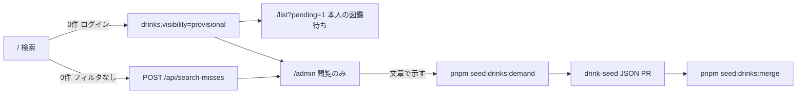

---
todos:
  - id: phase-1-gate
    content: 'Phase 1: app_role migration + 自己昇格防止（deny-by-default トリガー + 列 REVOKE）+ search_miss_ranking の REVOKE/security_invoker + local_admin.sql + /admin ゲート + 静的ルート。Go 読み取り API は作らない'
    status: pending
  - id: phase-2-overview
    content: 'Phase 2: admin.IsAdmin + GET /api/admin/overview（1クエリ）+ /admin にライブ件数 + admin layout サブナビ。RequireAdmin は auth.go に置かない'
    status: pending
  - id: phase-3-search-misses
    content: 'Phase 3: GET /api/admin/search-misses（export-demand と同じ集計 + sample_query_raw）+ local_admin.sql に決定的 UUID の miss フィクスチャ。一般 /api/search-misses に GET を足さない'
    status: pending
  - id: phase-4-provisional
    content: 'Phase 4: GET /api/admin/provisional-drinks（read-only）。マージボタンなし。/list?pending=1 は触らない'
    status: pending
name: Admin Ops Console
overview: 運営がローカルで「需要が溜まる → 仮の印がある → 公開カタログは人手」を Web の `/admin` で見られる閲覧コンソールを、権限列・ゲート・静的画面から Go の read-only admin API まで4 Phase で足す。公開マスタの画面承認・自動公開はやらない。
isProject: false
---

# 運営閲覧コンソール（承認なし）

対象は **Web のみ**。技術スタックは現状踏襲（Next.js 16 App Router、RSC、Go chi、Supabase）。新規外部サービスは増やさない。既存ファイルの編集を優先する。公開カタログの正本は今どおり [`packages/drink-seed`](packages/drink-seed/README.md) の JSON → PR。画面から `visibility='published'` にしない。

このプランは [atlas_stake_merge](.cursor/plans/atlas_stake_merge_23fc369e.plan.md) / [zero_hit_exit](.cursor/plans/zero_hit_exit_b76d0d64.plan.md) / drink-seed README が却下した「管理画面で承認する」を覆さない。覆すのは「運営が需要と仮の印を見る場所が Studio / CLI しかない」点だけ。承認・監査・ロールバックは今どおり git。



---

## プロダクト決定（固定）

再議論しない。

- 対象は Web のみ。Mobile はやらない。
- `/` をダッシュボード化しない。運営は `/admin` だけ。
- `/list?pending=1` の意味は変えない（本人の図鑑待ち）。運営キューにしない。
- 公開カタログの正本は `packages/drink-seed` の JSON → PR。画面から `published` 化しない。`seed:drinks:merge` を Web から呼ばない。
- ユーザー向けゼロ件空状態は触らない。`SearchMissLogger` の契約（確定 q・フィルタなし・0件）は維持。一般向け `POST /api/search-misses` に GET を足さない。
- 管理者シードはローカル専用。`supabase:seed:prod` / `official_cocktails.sql` / `drinks.sql` に入れない。
- `official@sakehub.app` を admin に昇格しない（公式レシピ所有者のまま）。
- JWT の `role`（GoTrue の `authenticated`）と `auth.users.role` をアプリ権限に流用しない。[`CtxRole`](apps/api/internal/middleware/auth.go) を admin 判定に使わない。
- 一般ユーザーが自分を admin にできない。既存 [`users_update_own`](supabase/migrations/20260521220111_create_users.sql) が全列更新できる点を必ず潰す。
- `/admin` は sitemap に出さない。robots で Disallow。`noindex`。
- 非 admin が `/admin` を開いたとき、存在を広告しすぎない。未ログインは `/login?next=`、ログイン済み非 admin は `notFound()`。カスタム「権限がありません」ページは作らない（[`not-found.tsx`](apps/web/src/app/not-found.tsx) も新規不要。Next 既定 404）。
- Service Role Key をクライアントに出さない。search_misses / 他人の provisional の読み取りは **Go の admin API**。Next から service_role で直読みしない。
- 既存ファイル編集を優先。無関係な整形をしない。

完成定義に含めない: 画面から published 化、demand CLI の Web 実行、下書き JSON 生成、マージ HTTP、RBAC の editor 等追加、Mobile。

---

## なぜこの形か / 却下した案

**採用:** `public.users.app_role` + Web は `auth.getUser()` のあと自分の行を読む。Go は Phase 2 以降 `RequireAuth` のあと **admin フィーチャー内**で `users.app_role` を DB 参照。閲覧 UI は `/admin`。カタログ変更の実行主体は今の CLI / PR。

**却下（理由）:**

- **JWT `role` / `CtxRole` を admin 判定に使う:** 値は GoTrue の `authenticated`。全ログインユーザーが「管理者」になる。未使用のまま残し、読まない。
- **`auth.users.role` や列名 `role`:** GoTrue / JWT claim と衝突する。列名は `app_role` に固定。
- **`official@sakehub.app` を admin 化:** 公式レシピ所有者と運営 UI を混ぜる。本番シードに権限が乗る。
- **Next に service_role を置いて `search_misses` を読む:** 鍵が Route Handler / バンドル経路に漏れうる。Go は既に `DATABASE_URL`（postgres）で RLS をバイパスする正のサーバ経路。
- **一般向け `/api/search-misses` に GET を足す:** 需要ログを公開 API にする。レート制限付き POST の契約を壊す。
- **`/list?pending=1` を運営キュー化:** 本人の図鑑待ちと全ユーザー仮の印が混ざる。zero_hit / atlas の約束を壊す。
- **Phase 1 で承認ボタン / `published` 化:** drink-seed の「承認 = PR」を画面が bypass する。閲覧コンソールの完成定義外。
- **`/` を運営ダッシュボード化:** トップの約束（銘柄を特定する）を壊す。
- **proxy で admin 判定して 403 ページ:** `/admin` の存在を広告する。proxy は未ログイン redirect だけ。権限は layout の `notFound()`。
- **`RequireAdmin` を [`auth.go`](apps/api/internal/middleware/auth.go) に置き SQL を書く:** JWT 検証とアプリ権限が混ざる。`middleware` が `admin` を import すると依存が逆。`IsAdmin` は admin service / repository に置く。
- **`auth.role() IN ('authenticated','anon')` のときだけ拒否（許可が既定）:** 想定外の JWT role や空値が通る。拒否を既定にし、`postgres` / `supabase_admin` / `service_role` だけ許可する。
- **`search_miss_ranking` を `security_invoker` だけに頼る:** 意図は正しいが、Studio 用 view の「一般 SELECT 不可」は **REVOKE が本体**。invoker は GRANT し直されたときの第二層。
- **Phase 3 一覧を view の SELECT だけにする:** view に元クエリが無い。運営は [`export-demand.ts`](packages/drink-seed/src/export-demand.ts) と同じ集計（`sample_query_raw` 付き）を見る。

---

## データモデル

新規 migration（既存ファイルは書き換えない）。想定名: [`supabase/migrations/20260814220000_add_users_app_role.sql`](supabase/migrations/20260814220000_add_users_app_role.sql)（タイムスタンプは実装時に `supabase migration new`）。

`public.users` に:

- `app_role TEXT NOT NULL DEFAULT 'member'`
- `CHECK (app_role IN ('member', 'admin'))`（名前例: `chk_users_app_role`）
- 既存行は DEFAULT で `member`（`official@` も rater も member）

[`handle_new_user()`](supabase/migrations/20260521220111_create_users.sql) は今どおり `id / email / login_type` だけ INSERT。`raw_user_meta_data` から `app_role` を読まない。signup で admin を名乗れない。

### 自己昇格防止（必須・二重）

RLS の `users_update_own` は行単位だけで、列を制限しない。このままだと:

```sql
UPDATE users SET app_role = 'admin' WHERE id = auth.uid();
```

が通る。

**1. 列 GRANT（PostgREST の第一層）**

```sql
REVOKE UPDATE (app_role) ON public.users FROM anon, authenticated;
```

`display_name` 等の UPDATE は残る。`service_role` / `postgres` の GRANT は触らない。

**2. トリガー（拒否が既定。SQL / 将来の RPC 用）**

`handle_new_user` に合わせ `search_path` を空にし、`auth.role()` はスキーマ修飾する。

```sql
CREATE OR REPLACE FUNCTION prevent_client_app_role_change()
RETURNS TRIGGER
LANGUAGE plpgsql
SET search_path = ''
AS $$
BEGIN
  IF NEW.app_role IS DISTINCT FROM OLD.app_role THEN
    IF current_user NOT IN ('postgres', 'supabase_admin')
       AND COALESCE(auth.role(), '') IS DISTINCT FROM 'service_role' THEN
      RAISE EXCEPTION 'app_role cannot be changed by clients';
    END IF;
  END IF;
  RETURN NEW;
END;
$$;

CREATE TRIGGER users_app_role_immutable_for_clients
  BEFORE UPDATE ON users
  FOR EACH ROW
  EXECUTE FUNCTION prevent_client_app_role_change();
```

- PostgREST（ユーザー JWT）: `current_user` は `authenticated` → 拒否。列 REVOKE でも失敗する。
- seed / Studio / Go（`postgres`）: 許可。`local_admin.sql` の `UPDATE ... SET app_role = 'admin'` は通る。
- `users_update_own` は `display_name` 等のために残す。ポリシー自体は書き換えない。
- INSERT ポリシーは今も無い。クライアントからの admin 自称 INSERT はできない。`handle_new_user` は DEFAULT `'member'`。

### RLS / 露出（このプランで変えないもの）

- `users_select_authenticated` の `USING (true)` は据え置き。認証済みなら他人の `app_role`（と email）が見える。リスクに書く。Phase 1 のゲートは「自分の行を読む」だけで足りる。`app_role` の SELECT は Web ゲートに必要なので REVOKE しない。
- `search_misses` に SELECT ポリシーは無い（現状どおり）。Go の postgres 接続だけが読む。
- `drinks_select_own_provisional` は所有者だけ。admin の Supabase クライアントでは他人の仮の印は見えない → Phase 4 も Go API 必須。

### `search_miss_ranking` のクライアント露出（Phase 1 で塞ぐ）

PostgreSQL の view は既定で **owner 権限**で下表を読む。owner が `postgres`（BYPASSRLS）だと、PostgREST の `authenticated` に view への GRANT があるだけで ranking が読める。コメントの「Studio 用・一般 SELECT 不可」は未実装。

同じ migration で:

```sql
REVOKE ALL ON TABLE search_miss_ranking FROM anon, authenticated;
ALTER VIEW search_miss_ranking SET (security_invoker = true);
```

- **REVOKE が本体。** Studio / `postgres` / Go は読める。
- **`security_invoker` は第二層。** 後から `GRANT SELECT` し直しても、invoker が `authenticated` なら下表 RLS（SELECT ポリシーなし）で落ちる。
- [`export-demand.ts`](packages/drink-seed/src/export-demand.ts) は view を使わず `DATABASE_URL` で `search_misses` を集計する。壊さない。

### モック管理者（ローカル専用）

新規 [`supabase/seeds/local_admin.sql`](supabase/seeds/local_admin.sql)。`local_demo` の後、既存順を崩さず **最後**:

`official_cocktails` → `drinks` → `local_demo` → `local_zero_hit` → **`local_admin`**

最後に置く理由: Phase 3 の miss フィクスチャが rater の決定的 UUID を直書きできる。`local_zero_hit` の杭（Phase 4 の一覧）より後でも害はない。

- ログイン: `admin@sakehub.local` / `password123`（rater と同じパスワード）
- UUID 決定的: `a2000000-0000-4000-8000-000000000001`（rater の `a1000000-...` / zero-hit の `b1`/`b2` と衝突しない）
- `auth.users` + `auth.identities` は [`local_demo.sql`](supabase/seeds/local_demo.sql) と **同じ列セット**（GoTrue が列を足して落ちたら、先に直すのは `local_demo` と同じ修正）。`role` 列は GoTrue の `'authenticated'` のまま
- `email_confirmed_at` を入れる（`local_demo` と同じ。確認メールなしでログインできる）
- `WHERE NOT EXISTS (email = 'admin@sakehub.local')` で idempotent（`official@` と同じ形）
- トリガーが `public.users` を `member` で作ったあと `UPDATE public.users SET app_role = 'admin', display_name = 'ローカル運営' WHERE email = 'admin@sakehub.local'`
- `rater*` は member のまま。`official@` は触らない
- 先頭コメントにログイン手順と「本番 / `supabase:seed:prod` に入れない」を書く

配線: [`supabase/config.toml`](supabase/config.toml) の `[db.seed].sql_paths` とルート [`package.json`](package.json) の `supabase:seed` だけ。`supabase:seed:shared` / `supabase:seed:prod` には足さない。

本番の最初の admin はシードしない。postgres / Studio で対象行を `UPDATE` する（要確認 1）。

---

## 権限判定

**Web（Phase 1 から）**

新規 [`apps/web/src/lib/auth/app-role.ts`](apps/web/src/lib/auth/app-role.ts)。`react` の `cache()` で **1 リクエスト 1 回**。

Header は今 [`getUser()` だけ](apps/web/src/components/layouts/header.tsx)を呼ぶ。`app_role` 用に `getUser` を二重にしない。ヘルパーが `{ user, appRole }` を返し、Header はこれに寄せる。

```ts
export const getAuthProfile = cache(async () => {
  const supabase = await createClient();
  const {
    data: { user },
  } = await supabase.auth.getUser();
  if (!user) return { user: null, appRole: null as const };

  const { data, error } = await supabase
    .from('users')
    .select('app_role')
    .eq('id', user.id)
    .maybeSingle();

  // Header を 500 にしない。読めなければ member 扱い（運営リンクを出さない）
  if (error || data?.app_role !== 'admin') {
    return { user, appRole: 'member' as const };
  }
  return { user, appRole: 'admin' as const };
});
```

- **Header:** 上記の fail-soft。migration 未適用や一時エラーでサイト全体を落とさない
- **`admin/layout` の `requireAdminPage()`:** 未ログインは `redirect('/login?next=/admin')`（未ログインの主経路は proxy がフルパス `next` を付ける）。`appRole !== 'admin'` なら `notFound()`（fail-closed。エラー時も member 扱いなので 404）
- JWT claim は見ない。`select('*')` しない

**proxy**

- [`apps/web/src/proxy.ts`](apps/web/src/proxy.ts) の `protectedRoutes` に `/admin` を足す。未ログインだけ `/login?next=`（`/admin/search-misses` も `startsWith` で拾う）。**role は見ない**（DB を叩かない、403 を出さない）

**Go（Phase 2 から）**

[`RequireAuth`](apps/api/internal/middleware/auth.go) は JWT だけ。`RequireAdmin` は **`auth.go` に足さない**。`internal/admin` が `UserID` で DB を見る。

```go
// router.go
r.Route("/admin", func(r chi.Router) {
  r.Use(middleware.RequireAuth(kf))
  adminH.Routes(r) // 内部で r.Use(h.requireAdmin) してから Get
})
```

- `UserID == ""` → **401**（403 にしない。未認証を管理者不足と混ぜない）
- 行なし / `app_role != 'admin'` → **403**（500 にしない）
- `CtxRole` は読まない
- [`GET /api/users/{id}`](apps/api/internal/user/repository.go) の JSON に `app_role` を足さない
- chi は **Use のあとで Get**（登録順を守る）
- `searchmiss` / `drink` パッケージは import しない。集約 SQL は `internal/admin/repository.go`
- テストは repository をモックした `service_test.go`（リポジトリに sqlmock は無い）

Admin の fetch は既存 [`authServerFetch`](apps/web/src/application/server-api.ts)（サーバ側 → `API_URL`）。ブラウザ CORS は使わない。[`cors`](apps/api/internal/router/router.go) は触らない。

---

## 画面（閲覧のみ）

共通 chrome は既存 [`Header`](apps/web/src/components/layouts/header.tsx) を使う。`/` は触らない。

- **ヘッダー「運営」:** `appRole === 'admin'` のときだけ。メインナビ（リストの右）。一般ナビに常時出さない
- **`/admin`:** パイプライン概要。Phase 1 は静的説明 + 下層へのテキストリンク（ゲート確認用）。Phase 2 で layout サブナビとライブ件数
- **`/admin/search-misses`:** Phase 1 は「需要ログの見方」と CLI。Phase 3 で一覧
- **`/admin/provisional`:** Phase 1 は「全ユーザーの仮の印。`/list?pending=1` とは別」と CLI。Phase 4 で一覧。マージボタンなし

各カードに「今の正の運用」を文章で示す。ボタンで実行しない:

- 需要: `DATABASE_URL=... pnpm seed:drinks:demand`
- 正本: `packages/drink-seed/data/drinks/*.json` を fact-check して PR
- 投入後の杭付け替え: `pnpm seed:drinks:merge`（公開 HTTP なし）

UI は既存 shadcn（[`card`](apps/web/src/components/ui/card.tsx) / [`heading`](apps/web/src/components/ui/heading.tsx) / [`badge`](apps/web/src/components/ui/badge.tsx)）。RSC。`'use client'` を layout に付けない。`"use cache"` は使わない（権限付きページ）。

**SEO**

- [`robots.ts`](apps/web/src/app/robots.ts): `disallow: '/admin'`（プレフィックス。`/admin/search-misses` も含む）
- [`sitemap.ts`](apps/web/src/app/sitemap.ts): 静的ルートに `/admin` を足さない（編集不要なら触らない）
- `admin/layout.tsx` の `metadata.robots = { index: false, follow: false }`

ユーザー向け `SearchMissLogger` / ゼロ件 UI / `/list?pending=1` は変更しない。

---

## データ読み取り

- Phase 1: API なし。静的コピー。件数なしでゲート確認
- Phase 2: `GET /api/admin/overview` → `/admin` に件数
- Phase 3: `GET /api/admin/search-misses` → 需要一覧
- Phase 4: `GET /api/admin/provisional-drinks` → 仮の印の運営一覧

すべて `RequireAuth` + admin フィーチャーの `requireAdmin`。Web は [`authServerFetch`](apps/web/src/application/server-api.ts) + [`getOptionalAccessToken`](apps/web/src/application/require-access-token.ts)。新規 [`apps/web/src/application/admin-api.ts`](apps/web/src/application/admin-api.ts)。`packages/types` の `User` には `appRole` を足さない。DTO は `admin-api.ts` に閉じる。

**overview（1 ラウンドトリップ）**

```sql
SELECT
  (SELECT COUNT(*) FROM search_misses
    WHERE scope = 'drink' AND result_count = 0) AS drink_miss_rows,
  (SELECT COUNT(DISTINCT query_normalized) FROM search_misses
    WHERE scope = 'drink' AND result_count = 0) AS drink_miss_queries,
  (SELECT COUNT(*) FROM drinks WHERE visibility = 'provisional') AS provisional_drinks,
  (SELECT COUNT(*) FROM drinks WHERE visibility = 'published') AS published_drinks;
```

`drinklog` 経由の miss INSERT も需要なので含める（除外しない）。

**search-misses 一覧:** view を SELECT しない。[`export-demand.ts` の集計](packages/drink-seed/src/export-demand.ts) に揃える。

- `scope = 'drink' AND result_count = 0`
- `query_normalized`, `sample_query_raw`（`ARRAY_AGG(query_raw ORDER BY created_at DESC)[1]`）, `miss_count`, `unique_searchers`, `last_seen_at`
- `ORDER BY miss_count DESC, unique_searchers DESC`
- limit 100
- `user_id` / email は返さない
- cocktail / ingredient は出さない（要確認 2）

**provisional 一覧:** `visibility = 'provisional' AND merged_into_id IS NULL`。`name`, `name_normalized`, `created_at`, `submitted_by`, `submitter_display_name`, `saved_status`（email は返さない）。slug は返しても `/drinks/{slug}` にリンクしない（所有者でも 404）。limit 100、`created_at DESC`。ローカルは [`local_zero_hit.sql`](supabase/seeds/local_zero_hit.sql) の rater01/02「禅人未登録ラベル」で埋まる。

---

## Phase 境界とファイル

todos と一致させる。後の Phase の Go API を先に作らない。

### Phase 1 — ゲート + 静的 `/admin`

Go の新しい読み取り API は作らない。

**新規**

- `supabase/migrations/20260814xxxxxx_add_users_app_role.sql`（列・CHECK・列 REVOKE・deny-by-default トリガー・ranking の REVOKE + `security_invoker`）
- `supabase/seeds/local_admin.sql`
- `apps/web/src/lib/auth/app-role.ts`（`getAuthProfile` + `requireAdminPage`）
- `apps/web/src/app/admin/layout.tsx`（`requireAdminPage` + noindex。サブナビは Phase 2）
- `apps/web/src/app/admin/page.tsx`
- `apps/web/src/app/admin/search-misses/page.tsx`
- `apps/web/src/app/admin/provisional/page.tsx`
- `apps/web/src/components/admin/ops-runbook.tsx`（CLI 説明の共通 RSC。ボタンなし）

**編集**

- `supabase/config.toml`（`sql_paths` 末尾）
- `package.json` の `supabase:seed` のみ
- `supabase/README.md`（シード表・「本番に入れない」）
- `apps/web/src/proxy.ts`（`/admin`）
- `apps/web/src/components/layouts/header.tsx`（`getAuthProfile` に寄せて運営リンク）
- `apps/web/src/app/robots.ts`
- `packages/drink-seed/README.md`（「管理画面を後回し」を「閲覧コンソールは `/admin`。承認は PR のまま」に1段落更新。本文の歴史は書き換えない）

**触らない:** `official_cocktails.sql`, `drinks.sql`, `supabase:seed:prod`, `apps/api/**`, Mobile, `SearchMissLogger`, `/list`, `packages/types` の `User`, `apps/api/internal/user` の SELECT 列, `AGENTS.md`

### Phase 2 — admin `IsAdmin` + overview

**新規**

- `apps/api/internal/admin/model.go`
- `apps/api/internal/admin/repository.go`
- `apps/api/internal/admin/service.go`
- `apps/api/internal/admin/handler.go`（`Routes` 内で `requireAdmin` → その後 `Get`）
- `apps/api/internal/admin/service_test.go`（`IsAdmin`: member / 欠落 / admin。repository モック）
- `apps/web/src/application/admin-api.ts`
- `apps/web/src/components/admin/admin-nav.tsx`（概要 / 需要 / 仮の印）

**編集**

- `apps/api/internal/router/router.go`（`/api/admin` に `RequireAuth` だけ付けて `adminH.Routes`）
- `apps/web/src/app/admin/layout.tsx`（サブナビ）
- `apps/web/src/app/admin/page.tsx`（ライブ件数。API 失敗時は静的説明を残し件数は「取得できない」。401 でも login へ落とさず、件数欄だけ失敗表示）

**触らない:** `apps/api/internal/middleware/auth.go`（`RequireAdmin` を足さない）

### Phase 3 — search miss 一覧 + ローカル miss フィクスチャ

**編集 / 追記**

- `apps/api/internal/admin/*`（`GET /api/admin/search-misses`）
- `apps/web/src/application/admin-api.ts`
- `apps/web/src/app/admin/search-misses/page.tsx`
- `supabase/seeds/local_admin.sql` 末尾に `search_misses` INSERT（本番シードには出さない）

フィクスチャ（空画面にしない。再実行で増殖させない）:

- 決定的 UUID + `ON CONFLICT (id) DO NOTHING`（または `WHERE NOT EXISTS`）
- `scope='drink'`, `result_count=0`
- 同じ `query_normalized` を複数行（`miss_count` が見える）
- 1本は既存ゼロ件 q `xqzt9zeroHitNoCatalog`。正規化は [`normalize.Query`](apps/api/pkg/normalize/normalize.go) と同じで **`xqzt9zerohitnocatalog`** を SQL に直書き
- もう1本はカタログに無い造語。`user_id` は rater01（`a1000000-0000-4000-8000-000000000001`）と NULL+決定的 `client_hash` を混ぜ `unique_searchers` が見えるようにする
- `official@` は使わない

ユーザー向けゼロ件 UI と `SearchMissLogger` は触らない。

### Phase 4 — 仮の印の運営一覧

**編集**

- `apps/api/internal/admin/*`（`GET /api/admin/provisional-drinks`）
- `apps/web/src/application/admin-api.ts`
- `apps/web/src/app/admin/provisional/page.tsx`

マージボタン・HTTP・`merged_into_id` 書き込みなし。新規 drink フィクスチャは足さない（`local_zero_hit` の杭で足りる）。

---

## ローカル確認手順

1. Docker → `supabase start`（migration + `[db.seed]` が `local_admin` まで流れる）
2. 既存 DB なら migration 適用後に seed。`local_demo` 再実行は UNIQUE で落ちる。その場合は `supabase stop --no-backup` → `supabase start`（この VM では `db reset` が `supabase-go` 不足で落ちることがある）
3. `pnpm dev:web`。Phase 2 以降は `cd apps/api && air`（`DATABASE_URL` に `?sslmode=disable`）
4. `admin@sakehub.local` / `password123` でログイン → ヘッダーに「運営」→ `/admin` が見える（Phase 1 は静的説明）
5. `rater01@example.com` / `password123` で `/admin` → **404**。ヘッダーに「運営」が無い。`/list?pending=1` は今どおり本人の図鑑待ち
6. 未ログインで `/admin` → `/login?next=/admin`。`/admin/search-misses` は `next` にフルパス
7. 自己昇格: anon key + rater JWT で `UPDATE users SET app_role='admin'` が失敗する（REVOKE またはトリガー）。Studio の postgres では admin を付けられる
8. `pnpm supabase:seed:prod` のコマンド文字列に `local_admin.sql` が無いこと
9. 未ログインの `/` が Header の `app_role` 問い合わせで 500 にならないこと
10. Phase 3: `/admin/search-misses` が空でなく、元クエリ（`sample_query_raw`）が見える。Phase 4: 「禅人未登録ラベル」がユーザー横断で見える。公開棚・sitemap に仮行が出ない

検証コマンド: `pnpm lint` / `pnpm type-check`。Phase 2 以降は `cd apps/api && go vet ./...` と `go test ./internal/admin`。

---

## リスク

- **`users` SELECT で他人の `app_role` が見える:** `users_select_authenticated` が `USING (true)`。email も既に見える。このプランでは締めない。admin 判定をクライアント信頼にしない（Web は Server、Go は DB）。
- **admin API の取り違え:** 一般 `POST /api/search-misses` に GET を足さない。`/api/admin/*` だけ。Go は RLS をバイパスするので `requireAdmin` を `Routes` の **Get より前**に付け忘れると全 miss / 全仮の印が漏れる。
- **seed の本番混入:** `local_admin.sql` を `seed:prod` / `official_cocktails` / `drinks.sql` に入れない。パスワードはローカル既知（`password123`）。本番に流れたらそのメールで運営 API が開ける。
- **本番に admin がゼロ:** ゲートは全員 404。初回は Studio の `UPDATE`（要確認 1）。自動昇格は作らない。
- **Header の追加 SELECT:** ログイン済みの全ページで `users.app_role` を1回読む。`cache()` で layout と共有。失敗時はリンクを隠すだけ。

---

## 既存プランとの差分

既存プランの本文は書き換えない。

- drink-seed README / atlas / zero_hit の「承認キューと RBAC への先行投資をしない」は、**公開マスタの承認**について継承する。
- 本プランが足すのは **閲覧コンソール** と `member|admin` の2値だけ。editor ロールも承認ボタンも足さない。
- `/list?pending=1`・仮の印の lifetime・`cmd/mergeprovisional`・需要 CLI は継承。

---

## 要確認

本文の決定は緩めていない。実装時に目視で食い違う点だけ。

1. **本番の最初の admin** は `local_admin.sql` では作らない。誰のメールを Studio で `UPDATE` するかは運用次第。ローカル確認は `admin@sakehub.local` で足りる。
2. **miss 一覧は `scope='drink'` 固定**（cocktail / ingredient の需要は cocktail-seed 側）。後から `?scope=` を足す余地は残すが、このプランの完成定義には入れない。
3. **`auth.identities` の列セット**は `local_demo.sql` をコピーする。GoTrue が列を増やして seed が落ちたら、admin シードだけ独自列を足さず `local_demo` と同じ修正にする。

---

## 保存時レビューで固定した実装

Cursor 上の初稿からの差分。本文の歴史は書き換えず、採用した改善だけをここに固定する。

- 自己昇格防止を「authenticated のとき拒否」から **拒否既定 + 列 REVOKE** に変更した。
- ranking の露出止めを `security_invoker` 単体から **REVOKE 本体 + invoker 第二層** にした。
- Go の admin 判定を `auth.go` に置かず、**`internal/admin` の `IsAdmin`** にした（空 UID は 401）。
- Header は `getAuthProfile` に寄せ、`app_role` が読めなくても **サイトを 500 にしない**。
- Phase 3 一覧は view ではなく **export-demand と同じ集計**（`sample_query_raw`、`unique_searchers` 順）。
- overview は **SELECT 4 本ではなく 1 クエリ**。
- miss フィクスチャは決定的 UUID で **再 seed しても増殖しない**。正規化値は `xqzt9zerohitnocatalog`。
