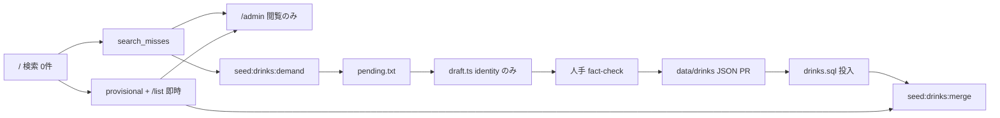

# 運営コンソール書き込みは入れない（案 A）

対象は **判断だけ**。コードは書かない。[`admin_ops_console_bfa733de.plan.md`](.cursor/plans/admin_ops_console_bfa733de.plan.md) の本文は歴史として残し、上書きしない。閲覧（`/admin` + search miss + provisional の read-only）は完了前提。

完成定義: **admin に POST / PATCH / PUT / DELETE を足さない。** フラグ列も `published` 直入れもやらない。実装 PR は出さない。

---

## 選んだ案 / 捨てた案

**採用: A。** 画面はキュー閲覧のまま。書き込みは今の CLI / PR。本プランは「やらない」で閉じる。

**捨てた B（無視 / 対応済みフラグだけ。カタログは PR）。** 安く見えるが、需要ログに disposition が無い今、列・書き込み API・誰がいつ閉じたか・`export-demand` との二重状態が要る。公開品質は 1 ミリも上がらない。週次の新規 SKU が数十件未満で、承認者はエンジニア前提なら、ノイズは `pending.txt` の `# スキップ` で足りる。

**捨てた C（画面から JSON/PR を作らず DB に published を直入れ。drink-seed 正本を捨てる）。** 監査・粒度・fact フィールド・seed UPSERT を同時に壊す。コストは「フォーム 1 枚」ではなく正本の付け替え一式。今の件数では払う理由が無い。

B は「キューが騒がしくなったら再開する候補」。C は「正本を git から外す」と明示しない限り再開しない。A から C へ飛ばない。

---

## なぜ今 A か

- 公開正本は [`packages/drink-seed/README.md`](packages/drink-seed/README.md) の `data/drinks/*.json`（約 1330 件）。承認 = PR、差分 = `git diff`、却下 = ファイル削除、ロールバック = revert。
- README の投資閾値: **非エンジニアが承認に入る、または週次が数十件を超えて PR が回らなくなるまで、管理画面 + 承認 RBAC はしない。** 閲覧用 `users.app_role` は既にある。公開承認の editor ロールは無い。
- [`data/pending.txt`](packages/drink-seed/data/pending.txt) はヘッダのみ。actionable 行は 0。`data/drafts/` も空。需要バッチの既定は Top 20、人手・週次。
- [`draft.ts`](packages/drink-seed/src/draft.ts) は identity のみ。`abv` / `manufacturer` / `originCountry` / `description` は人手。画面公開はここを bypass する。
- 仮の印のマージ一致は [`normalize.Query`](apps/api/pkg/normalize/normalize.go) の完全一致だけ（[`saveddrink/match.go`](apps/api/internal/saveddrink/match.go)）。trgm は `export-demand` の「要確認」コメント専用。付け替えに使わない。
- [`/list?pending=1`](apps/web/src/app/admin/provisional/page.tsx) は本人の図鑑待ち。申請承認待ちにしない。atlas / zero_hit を覆さない。
- 閲覧 API は GET のみ。[`admin/handler.go`](apps/api/internal/admin/handler.go) は `overview` / `search-misses` / `provisional-drinks`。書き込みは 405。Go は `DATABASE_URL` で RLS をバイパスする。書き込み口を足すと `requireAdmin` 忘れが全件破壊になる。
- JWT `role` と `official@sakehub.app` の特権化はしない（閲覧プランと同じ）。

---

## 監査（誰がいつ何を公開したか）

**A の正本は git のまま。** 公開の「誰」は PR author / merger、「いつ」は commit / merge 時刻、「何」は `data/drinks/{slug}.json` の diff。revert で戻せる。DB の `submitted_by` は provisional 専用。published は `submitted_by IS NULL`。

**B を将来やるなら** 公開監査は git のまま。足すのは ops 監査だけ（誰がいつどの `query_normalized` を無視 / 対応済みにしたか）。公開の代替にはしない。

**C をやるなら git を捨てる。** 最低限の代替:

- `catalog_audit`（誰 / いつ / slug / 操作 / before-after JSON / 理由）
- 公開の 4 目（レビュア）。自己承認しない
- ロールバック UI または「1 世代前に戻す」
- `validate.ts` 相当を API に移植（manufacturer 品質、aliases 上限、image 契約、slug 一意）
- `supabase:seed:prod` の UPSERT を止めるか、DB → JSON の逆同期を正にする。片方だけ残すと次の seed で画面編集が消える

C の監査だけで、フラグ（B）より大きい。件数閾値を超えても、先に「PR を代行する bot」か B を見る。

---

## 非エンジニアが週何件で B / C が要るか

計測対象は **需要のユニーク行数ではなく、週次の新規 published SKU（JSON を 1 本足す件数）**。miss は打ち間違い・粗い杭・既登録の別名で膨らむ。

- **今（A で足りる）:** 承認者はエンジニア。週次の新規 SKU は数十件未満（pending が空、初期 1330 は投入済み）。`/admin` で見て CLI で出す。
- **B を再開:** 非エンジニアが **同じ需要キューを毎週** 見始め、かつ「既に pending / PR にしたクエリ」が一覧を埋め、人が二重作業する。目安は週次ユニーク drink miss のうち、ローカル完全一致スキップ後も残る行が **20 を安定して超える**、またはオペが 2 人以上で「誰が触ったか」が口頭で回らないとき。カタログは PR のまま。
- **C を再開:** 非エンジニアが **公開そのもの** を画面でやり、週次の新規 published SKU が **数十件（目安 30+）** で PR + validate + build + seed + merge が回らない、かつ git 監査を捨てると決めたとき。SKU 粒度と fact 4 欄をフォームで保証するコストを先に見積もる。今はその数字も「捨てる」決断も無い。

B の件数を超えても C には自動で進まない。C は正本変更であり、キュー UX ではない。

---

## `export-demand` / `mergeprovisional` との役割分担

変えず、画面から呼ばない。

- **`pnpm seed:drinks:demand`**（[`export-demand.ts`](packages/drink-seed/src/export-demand.ts)）: `search_misses`（drink・0 件）を集計して `pending.txt` を書く。ローカル JSON の正規化完全一致は `# スキップ`。DB trgm は `# 要確認`（自動除外しない）。カタログも `merged_into_id` も触らない。`/admin/search-misses` は同じ集計の閲覧。
- **`pnpm seed:drinks:draft`**: pending から identity 下書き。fact 4 欄は空。
- **JSON → validate → build → PR → seed:** 公開の唯一の書き込み。
- **`pnpm seed:drinks:merge`**（[`cmd/mergeprovisional`](apps/api/cmd/mergeprovisional/main.go)）: 入力は `visibility='provisional' AND merged_into_id IS NULL`。miss は見ない。`normalize.Query(name|aliases)` が仮行 `name_normalized` と **ただ 1 件の published** に完全一致したときだけ付け替え。曖昧は skip。公開 HTTP なし。`/admin/provisional` は未マージ杭の閲覧。
- **需要とマージは直列にしない。** 公開行が DB に入ったあと、明示で merge する。

B を将来やるとき: フラグは **需要キューの UX** に閉じる。`export-demand` が無視キーを読むかは再開時に決める。マージ CLI には繋がない（miss をマージ入力にしない）。

---

## Phase 境界（やるなら。今は着手しない）

A の完成 = Phase 0 で止まる。

1. **フラグだけ（B）** — `search_misses` を書き換えず、`(scope, query_normalized)` への ignore / handled。GET 一覧が開ける。カタログ・merge・draft は今のまま。公開監査は git。
2. **下書き** — 画面が pending / `drafts/*.json` 相当を出す。identity のみ。fact 4 欄は人手。`visibility='published'` にしない。`/list` 即時掲載は変えない。
3. **公開（C）** — DB 直 published。drink-seed 正本を捨て、監査代替と seed 停止を同 PR でやる。**採用しない。**

Phase 2 を「承認待ち申請」にして `/list` 即時を覆さない。Phase 3 を「仮行を published にする」にしない（自動公開の禁止）。

---

## セキュリティ（書き込みを開けない理由）

Go admin は RLS をバイパスする。今は SELECT だけなので漏れは読み取り。書き込み口は破壊的になる。

- **破壊的操作:** published INSERT/UPDATE、provisional DELETE、`merged_into_id`、`saved_drinks` 付け替え。`requireAdmin` を Get より前に付け忘れると、ログイン済みなら誰でもカタログを壊せる。既存テストの「書き込み 405」を維持する。
- **CSRF:** Go に CSRF トークンは無い。呼び出しは Next RSC → [`authServerFetch`](apps/web/src/application/server-api.ts) の Bearer。Cookie セッションを Go に足さない。将来 B でも Server Action / サーバ fetch に閉じ、ブラウザから `/api/admin` へ POST しない。CORS 許可オリジンは localhost のまま広げない。
- **service_role:** Web に置かない。Next から miss / 他人の provisional / フラグを直書きしない。書き込みも Go + `DATABASE_URL`。
- **JWT `role` / `official@`:** 使わない。判定は `users.app_role`。signup メタデータから昇格しない。
- **既存 [`POST /api/drinks`](apps/api/internal/drink/handler.go):** 一般 Create。admin に繋がない。C の「公開 API」にも流用しない。
- **PII:** provisional 一覧は既に `submitter_email` を admin に返す。書き込みログに本文を増やさない。

B を再開するときも、上を満たすフラグ API 以外は足さない。

---

## 壊してはいけない前提（継承）

- 1 レコード = SKU / expression（[AGENTS.md](AGENTS.md)）。粗い「獺祭」を expression に trgm 寄せしない。
- `draft.ts` は identity のみ。fact 4 欄は人手。
- 承認の正本は `data/drinks/*.json` + PR。
- マージ一致は `normalize.Query` 完全一致だけ。
- 申請承認待ちにせず、`/list` 即時掲載を覆さない。`/list?pending=1` を運営キューにしない。
- JWT `role` を使わない。`official@sakehub.app` を特権化しない。

---

## 既存プランとの関係

- [`admin_ops_console_bfa733de.plan.md`](.cursor/plans/admin_ops_console_bfa733de.plan.md): 閲覧 4 Phase は完了。本ファイルは書き込み判断だけ。本文は書き換えない。
- [`atlas_stake_merge_23fc369e.plan.md`](.cursor/plans/atlas_stake_merge_23fc369e.plan.md): 自動公開禁止、公開 merge HTTP 禁止、完全一致マージ。継承。
- [`zero_hit_exit_b76d0d64.plan.md`](.cursor/plans/zero_hit_exit_b76d0d64.plan.md): 申請キュー禁止、ログイン後すぐ `/list`。継承。
- drink-seed README の「RBAC 基盤ゼロ」は、閲覧用 `app_role` 追加後も **公開承認の RBAC は無い** と読む。README 本文の歴史は、この判断のために書き換えない。

---

## 要確認

本文の A は緩めない。目視で食い違う点だけ。

1. **本番の週次件数は未計測。** 再開は「非エンジニアが承認に入る」または「週次の新規 published SKU が数十件」を数字で見てから。今の `pending.txt` は actionable 0 行。
2. **非エンジニアがカタログ承認に入るかは未確定。** 入るまでは B も開かない。閲覧は今の `/admin` で足りる。
3. **本番の最初の admin** は既存閲覧プランどおり Studio の `UPDATE`。本プランは権限付与の自動化も書かない。
