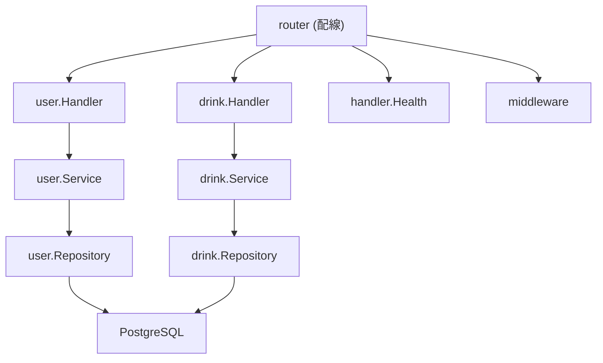

# API internal/ フィーチャーベース ディレクトリ リファクタリング

## 現状

[`apps/api/internal/`](apps/api/internal/) には実コードが 2 ファイルのみ:

- [`internal/router/router.go`](apps/api/internal/router/router.go) -- chi ルート定義 + ミドルウェア
- [`internal/handler/health.go`](apps/api/internal/handler/health.go) -- ヘルスチェック

[`apps/api/AGENTS.md`](apps/api/AGENTS.md) のセクション 3 にはレイヤベースの構成が記載されているが、実装はまだ存在しない。今がディレクトリ方針を切り替える最適なタイミング。

---

## 新ディレクトリ構成

```
apps/api/
├── cmd/server/main.go
├── internal/
│   ├── user/                    # user フィーチャー (今回は空ディレクトリ or .gitkeep)
│   │   ├── handler.go
│   │   ├── model.go
│   │   ├── service.go
│   │   └── repository.go
│   ├── drink/                   # drink フィーチャー (今回は空ディレクトリ or .gitkeep)
│   │   ├── handler.go
│   │   ├── model.go
│   │   ├── service.go
│   │   └── repository.go
│   ├── middleware/              # 共有: 認証・ロギング等 (フィーチャー化しない)
│   │   └── auth.go
│   ├── router/                  # 共有: ルート定義 (フィーチャー化しない)
│   │   └── router.go
│   └── handler/                 # 共有: インフラ系ハンドラ (フィーチャー化しない)
│       └── health.go
├── pkg/                         # 変更なし
│   ├── config/
│   ├── response/
│   └── validator/
```

### フィーチャーベースにするもの (handler / model / service / repository)

ドメインロジックを持つ機能単位ごとにディレクトリを切る。各フィーチャーディレクトリの Go パッケージ名はフィーチャー名そのもの (`package user`, `package drink`)。

- **`internal/user/`** -- ユーザープロフィール、フォロー等
- **`internal/drink/`** -- お酒の CRUD、カテゴリ、レビュー等

各フィーチャー内のファイル命名規則:

- `handler.go` -- HTTP ハンドラ (入出力のみ)
- `service.go` -- ビジネスロジック
- `repository.go` -- インターフェース定義 + SQL 実装
- `model.go` -- ドメインモデル / DTO

ファイルが大きくなった場合は `handler_create.go`, `handler_get.go` のようにサフィックスで分割。

### フィーチャーベースにしないもの (共有関心事)

- **`internal/router/`** -- 全フィーチャーのルートを集約する場所。各フィーチャーの handler をインポートして配線する
- **`internal/middleware/`** -- 認証 (JWT 検証)、ロギング等。複数フィーチャーで共有される横断的関心事
- **`internal/handler/`** -- health check のようなドメインロジックを持たないインフラ系ハンドラ

### pkg/ (変更なし)

- `pkg/config/`, `pkg/response/`, `pkg/validator/` はフィーチャーに属さない共有ユーティリティとして現行維持

---

## レイヤ依存ルール

フィーチャーベースでも依存方向は維持する:



- フィーチャー間の直接 import は原則禁止。フィーチャー間連携が必要な場合は service 層で interface を定義してインジェクトする
- `router` は各フィーチャーの handler を import する唯一の集約ポイント
- `middleware` はどのフィーチャーからも import 可能 (ただしフィーチャーが middleware を import するのは handler 層のみ)

---

## import パス例

```go
// internal/router/router.go
import (
    "github.com/sakehub/api/internal/user"
    "github.com/sakehub/api/internal/drink"
    "github.com/sakehub/api/internal/handler"
    "github.com/sakehub/api/internal/middleware"
)

// internal/user/service.go
import (
    "github.com/sakehub/api/pkg/response"  // OK: pkg は共有
)
// import "github.com/sakehub/api/internal/drink"  // NG: フィーチャー間直接 import 禁止
```

---

## DI の配線変更

`router.New()` のシグネチャを拡張し、`*sql.DB` や `*zap.Logger` を受け取って各フィーチャーの Repository -> Service -> Handler を構築する。

```go
func New(logger *zap.Logger, db *sql.DB) *chi.Mux {
    // user feature
    userRepo := user.NewRepository(db)
    userSvc  := user.NewService(userRepo)
    userH    := user.NewHandler(userSvc)

    // drink feature
    drinkRepo := drink.NewRepository(db)
    drinkSvc  := drink.NewService(drinkRepo)
    drinkH    := drink.NewHandler(drinkSvc)

    r := chi.NewRouter()
    // ... middleware ...

    r.Route("/api", func(r chi.Router) {
        r.Get("/health", handler.Health)
        r.Route("/users", userH.Routes)
        r.Route("/drinks", drinkH.Routes)
    })
    return r
}
```

`main.go` で `sql.Open` + `db.PingContext` を行い、`router.New(logger, db)` に渡す。

---

## 変更の実施方針

現時点では実コードが `health.go` と `router.go` のみなので、破壊的変更はゼロ。実施内容は:

1. AGENTS.md のディレクトリ構成セクションをフィーチャーベースに書き換える
2. `internal/user/`, `internal/drink/` のスケルトンファイルを作成 (コンパイルが通る最小限のコード)
3. `router.go` を新構成に合わせて更新 (DB 引数追加、フィーチャーハンドラの配線)
4. `main.go` で DB 接続を追加し `router.New` に渡す
5. `go vet ./...` で検証
