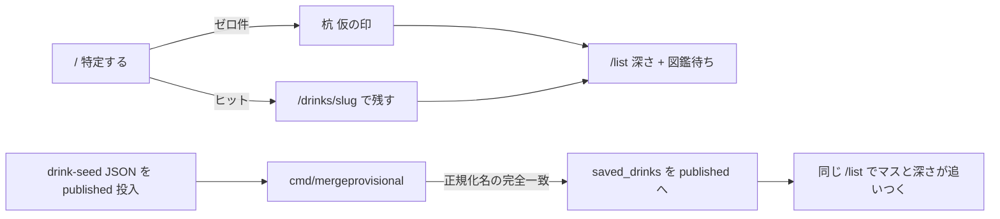

---
todos:
  - id: copy-pending-ui
    status: in_progress
    content: ゼロ件コピー・バッジ「図鑑待ち」・ListDepth.provisionalCount・GET ?visibility=provisional・/list?pending=1・概要の図鑑待ちN・redirectと最近残した href
  - id: merge-data
    content: saveddrink の正規化完全一致マッチと衝突ルール、cmd/mergeprovisional、公開HTTPなし、go test
    status: pending
  - id: local-repro
    content: 'local_zero_hit コメント拡張と local_stake_merge_published.sql、seed:drinks:merge、画面でリンクと深さ+1。マージ実装前に始めない'
    status: pending
name: Atlas Stake Merge
overview: ゼロ件の杭を図鑑のマスとして見返し、運営が同じ正規化名の published を足したあと `merged_into_id` で付け替え、`/list` の行がリンクになり深さが 1 進む閉路を Web だけで閉じる。自動公開・管理画面・曖昧マージはやらない。
isProject: false
---
# 杭を打ち、図鑑のマスになり、深さを見返す

対象は **Web のみ**。技術スタックは現状踏襲（Next.js 16 App Router、Server Actions、Go API、Supabase）。新規外部サービスは増やさない。既存ファイルの編集を優先する。`zero_hit_exit` のゼロ件出口・仮の印・`list_depth_map` の深さ分数は壊して作り直さない。



---

## プロダクト決定（固定）

再議論しない。

- トップの約束は「銘柄を特定する」。未ログインで完結。ログイン後にダッシュボード化しない。深さマップは `/list`。`/` をダッシュボードにしない。
- ログイン後の約束は「特定した銘柄を自分のリストに残す」。日記でも、レビュー投稿が主目的でもない。
- 意図は 2 値だけ: `drank` / `want`。無印「リストに残す」を復活させない。
- リストの正は `saved_drinks`。`ratings` は公開の注釈。`drink_logs` はリストの正にしない（DROP しない）。
- 1人1銘柄。評価するとリストに入る、等の既存不変条件は壊さない。
- 対象は Web のみ。グローバル前提。カクテルをリストに残すのは次フェーズ。ゼロ件出口もカクテルに広げない。
- 仮の印は公開検索・詳細 URL・sitemap・JSON-LD・未ログイン一覧に出さない。星は付けられない。
- 申請承認待ちにしない。ログイン後は今すぐ `/list` に載る。名前は今の検索クエリ。
- 公開カタログの自動生成・自動公開はやらない。SKU の事実確認は人手（`drink-seed` の JSON → PR）。
- 日記 UI は主経路に戻さない。

今回の追加（固定）:

- 杭打ちは貢献である。ゼロ件の主コピーを救済（「リストにだけ残します」）から、図鑑のマスを先に押さえる文言へ替える。
- published の深さ分数は変えない。分子・分母に `visibility='provisional'` を入れない。
- マージはこの PLAN で実装する。`merged_into_id` を使う。ユーザー向けマージ UI・運営管理画面は作らない。
- 一致は `normalize.Query` と仮行 `name_normalized`、published の name / aliases 正規化結果の **完全一致だけ**。`pg_trgm` で付け替えない。粗い杭「獺祭」を「獺祭 純米大吟醸45」へ自動で寄せない。
- 同じ正規化名の杭は所有者ごと（部分 UNIQUE）なので、全員分 `saved_drinks.drink_id` を published へ移す。
- 既に同じ published を残している人は二重行にしない。既存 `saved_drinks` を優先し、仮の印側は捨てる。
- マージ後、ユーザーがすることは無い。通知基盤は作らない。行がリンク付き published になり、深さが 1 進むのがフィードバック。
- 需要パイプライン（`search_misses` → `seed:drinks:demand`）は維持する。マージの入力は仮の印であり、miss ログではない。
- コピーは「図鑑」「マス」「まだ無い」に寄せる。「投稿する」「申請する」「みんなで編集」「Wikipedia」は使わない。

---

## データモデル決定（1案）

**仮の印は今どおり `drinks.visibility='provisional'` + `saved_drinks`。マージは公開 HTTP を増やさず、Go のオペレーションコマンドが `merged_into_id` を書いて `saved_drinks` を付け替え、参照が無くなった仮行を DELETE する。published の `name_normalized` 列は埋めない。深さ分数の SQL は触らない。**

選んだ形:

- スキーマ追加はしない。`merged_into_id` は [20260813220000_drinks_visibility_provisional.sql](supabase/migrations/20260813220000_drinks_visibility_provisional.sql) に既にある。
- 実行主体は [`apps/api/cmd/mergeprovisional`](apps/api/cmd/mergeprovisional)（新規。`cmd/server` 以外のオペレーション入口）。ロジックは [`apps/api/internal/saveddrink`](apps/api/internal/saveddrink) に閉じる。`drink` パッケージは import しない。
- 公開エンドポイントは増やさない。Web Server Action からマージしない。
- ルートに発見用フックだけ足す: `pnpm seed:drinks:merge` → `go run ./cmd/mergeprovisional`。`export-demand.ts` / `draft.ts` / `build-seed.ts` は触らない。demand をトリガーにしない。
- published 側の正規化はマージ実行時に Go の [`pkg/normalize.Query`](apps/api/pkg/normalize/normalize.go) で name と aliases を畳む。列には書かない。
- 仮行の寿命: アクティブな仮行は今どおり「`saved_drinks` が指している間だけ」。付け替え後は参照が消えるので **Unsave と同じ orphan DELETE** をマージが行う。tombstone としては残さない。
- 杭の見返し: `/list` 概要に分数の外で「図鑑待ち N」。行の一覧は薄い入口 `/list?pending=1`。カテゴリ詳細と published の drank 分数には混ぜない。

### 却下した案

- **自動公開**（仮行を `visibility='published'` にする）: 人手の SKU 確認を bypass する。禁止。
- **曖昧 trgm マージ**: `zero_hit_exit` の類似（閾値 0.3）を付け替えに使うと、粗い杭が別 expression に吸われる。SKU 粒度（AGENTS.md）に反する。
- **仮行を深さの `drank / total` に入れる**: `list_depth_map` の分数を壊す。杭は分数の外。
- **管理画面 / RBAC**: `public.users` に role が無く、Go の `CtxRole` も未使用。承認は今どおり PR。
- **ユーザー申請フォーム / 承認キュー**: ログイン後すぐリストに載る、を覆す。
- **通知テーブル / 「カタログに載りました」バナー基盤**: リスト行の変化で足りる。
- **published INSERT/UPDATE トリガー**: seed の 1330 件 upsert のたびに走る。SQL に NFKC・カタカナ畳み込みを第三実装することになり、[`testdata/normalize-cases.json`](testdata/normalize-cases.json) と契約を共有できない。
- **`packages/drink-seed` をマージ実行主体にする**: カタログ JSON→SQL の正本に、ユーザー表 `saved_drinks` の書き換えを混ぜる。正規化は `normalizeJa` で足りるが、Unsave lifetime と衝突処理が Go と二重になる。フックは pnpm 1 本までに留める。
- **仮行を `merged_into_id` 付きで残す（tombstone）**: 参照が無い仮行を残すと、Unsave の「参照が無ければ消す」と矛盾する。部分 UNIQUE の改定と COUNT 除外が要る。今回はやらない。
- **`saved_drinks.drink_id` を nullable にして custom_name を持つ**: `zero_hit_exit` で却下済み。リストの正を二系統にする。
- **`/list?status=want` だけを杭の見返しにする**: drank の杭が見えない。published の want と混ざる。
- **カテゴリ詳細（`?category=other`）に杭を混ぜる**: 仮行は `category='other'` 固定だが、カテゴリ詳細は published drank union。分数と行が割れる。
- **published に `name_normalized` を埋める**: aliases は複数。1列では突き合わせ不足。seed upsert と同期が要る。マージ時に畳む。
- **`name_en` も突き合わせる**: プロンプトは name / aliases だけ。英語名での誤爆を増やす。
- **公開 `POST /api/.../merge`**: 管理画面相当。作らない。

---

## マージの一致・複数ユーザー・衝突・寿命

### 一致条件

入力は `visibility='provisional' AND merged_into_id IS NULL` の仮行。miss ログは見ない。

published 1件のキー集合:

- `normalize.Query(name)`
- 各 `aliases[i]` の `normalize.Query(alias)`
- 空文字は捨てる。同じ drink 内の重複キーは1つ。

突き合わせ: `provisional.name_normalized` がキー集合に **完全一致**。1 published だけが持つキーなら付ける。**2件以上の published が同じキーを持つなら、そのキーはスキップ**（ログに slug を出す。勝手に選ばない）。

これで「獺祭」（→ `獺祭`）は「獺祭 純米大吟醸 磨き四割五分」（→ `獺祭純米大吟醸磨き四割五分`）に付かない。`dassai-23` の alias `だっさい` への完全一致は alias データの話であり、粗い漢字名の自動寄せではない（要確認 2）。

### 複数ユーザー

仮行は `(submitted_by, name_normalized)` 部分 UNIQUE。同じ正規化名でも行は所有者ごと。マージは仮行を1件ずつ処理し、その `saved_drinks` を同じ published へ移す。結果として全員分が付く。

### 既存 `saved_drinks` との衝突（1案）

**published 側の既存行を完全優先。仮側の `status` / `note` / `created_at` を published にコピーしない。** 仮行に星は無い（`ratings_reject_provisional`）。`drink_logs` も仮行を参照できない。

```sql
-- 1件の仮行 $prov → 一意の published $pub
UPDATE drinks
SET merged_into_id = $pub
WHERE id = $prov
  AND visibility = 'provisional'
  AND merged_into_id IS NULL;

-- まだ published を持たない人だけ付け替え（status/note/created_at は行ごと移動）
UPDATE saved_drinks s
SET drink_id = $pub
WHERE s.drink_id = $prov
  AND NOT EXISTS (
    SELECT 1 FROM saved_drinks x
    WHERE x.user_id = s.user_id AND x.drink_id = $pub
  );

-- 既に published を持つ人の杭は捨てる（上書きしない）
DELETE FROM saved_drinks WHERE drink_id = $prov;
-- saved_drinks DELETE トリガーで ratings も消える（仮行には元々無い）

-- Unsave と同じ orphan 規則
DELETE FROM drinks
WHERE id = $prov
  AND visibility = 'provisional'
  AND NOT EXISTS (SELECT 1 FROM saved_drinks s WHERE s.drink_id = drinks.id)
  AND NOT EXISTS (SELECT 1 FROM drink_logs l WHERE l.drink_id = drinks.id);
```

1仮行は1トランザクション。再実行は idempotent（残っている未マージ仮行だけ対象。`merged_into_id` が書いて参照が無い残骸があれば DELETE だけして終わる）。

衝突の結果:

- 杭だけ `drank` → published の `drank` になる。深さが 1 マス進む（成功の主ケース）。
- 杭だけ `want` → published の `want`。深さは増えない。行はリンク付きになり `/list?status=want` に出る。
- 既に published を `want` で持ち、杭が `drank` → published の `want` を維持。深さは増えない。

### 仮行の寿命

アクティブ仮行: Unsave が `saved_drinks` を消し、参照が無ければ `drinks` を消す（現状の [`DeleteByDrinkAndUser`](apps/api/internal/saveddrink/repository.go)）。マージ後も同じ規則を適用するので、tombstone を残さない。`merged_into_id` は付け替え中の書き込み（列を使い始める）であり、DELETE で消える。監査はコマンドの標準出力（付けた件数・捨てた件数・曖昧スキップの slug）で足りる。

`MaxProvisionalPerUser=100` は触らない。マージで仮行が消えると枠が空く。

---

## 正規化の single source

- 正本: [`apps/api/pkg/normalize.Query`](apps/api/pkg/normalize/normalize.go)
- 契約: [`testdata/normalize-cases.json`](testdata/normalize-cases.json)（Go `pkg/normalize` と TS `normalizeJa`）
- 仮行 INSERT は既に `normalize.Query` で `name_normalized` を埋めている
- マージは **同じ関数** で published の name / aliases を畳む。SQL 内で畳まない。TS でマージしない
- `name_en` は見ない
- ケースを足したら `go test ./pkg/normalize` と `pnpm check:normalize-sync`

---

## 実行主体と API 契約

**マージ: 公開エンドポイントを増やさない。** `cmd/mergeprovisional` が `DATABASE_URL` を読み、saveddrink の `MergeExactNames` を一度呼んで終了する。認証ミドルウェアも chi も使わない。

発見用（1コマンドまで）:

- ルート `package.json`: `seed:drinks:merge`
- [`packages/drink-seed/README.md`](packages/drink-seed/README.md) に「published を DB に入れたあと明示実行」。`demand` の次には置かない

**見返し用に既存 API を薄く足す（マージ API ではない）:**

- `GET /api/auth/saved-drinks/depth` の `ListDepth` に `provisionalCount: number`（そのユーザーの `saved_drinks` × `visibility='provisional'`。分数の SQL は変更しない）
- `GET /api/auth/saved-drinks?visibility=provisional`（`published` | `provisional` 以外は 400）。`union=drank` や `category` と同時なら visibility を無視せず 400。`maxListLimit=100` は触らない
- 既存の `POST /provisional` / PATCH / DELETE / 通常 POST は変えない

型は [`packages/types/src/saved-drink.ts`](packages/types/src/saved-drink.ts) と mapper を追随。

---

## Web

既存のゼロ件分岐・仮印バッジ・非リンク・深さマップは残す。作り直さない。

### ゼロ件 `/`（[`search-zero-exit.tsx`](apps/web/src/components/drinks/search-zero-exit.tsx)）

- 見出し「『{q}』は見つかりませんでした」は維持
- 「カタログにはまだありません。リストにだけ残します」を捨てる
- 飲んだ / 飲みたい、未ログイン CTA、`SearchMissLogger`、類似カードは維持
- `saveProvisionalDrink` の redirect を `/list?pending=1` にする（概要の空状態に消えない）

### `/list` の杭の見返し（[`list/page.tsx`](apps/web/src/app/list/page.tsx)）

概要（`category` も `status=want` も `pending` も無し）:

- 深さブロックは今どおり published 分数だけ（[`list-depth.tsx`](apps/web/src/app/list/list-depth.tsx) の分数計算は触らない）
- **分数の外**に `provisionalCount > 0` のときだけ「図鑑待ち N」→ `/list?pending=1`
- `overviewEmpty` は「published の drank カテゴリが 0 **かつ** `provisionalCount === 0`」に変える。杭だけの人を「まだ記録した銘柄がありません」で消さない
- 「飲みたいを見る」は維持

`/list?pending=1`:

- want ビューと同じ薄さ。H1「図鑑待ち」。深さマップは出さない（分数を壊さない）
- `GET ...?visibility=provisional&limit=100`
- 行は既存 [`saved-drink-row.tsx`](apps/web/src/app/list/saved-drink-row.tsx)（非リンク・星なし・意図切替・外す）
- カテゴリ詳細には混ぜない

マージ後（同じコンポーネント、データが published になる）:

- 名前が `/drinks/{slug}` になる
- バッジが消える
- `drank` なら該当カテゴリの分子が 1 増え、分母は published 追加分だけ増える
- pending 一覧から消える。`provisionalCount` が減る

### `/` の「最近残した」（[`page.tsx`](apps/web/src/app/page.tsx)）

- 仮の印: `/list?pending=1`（詳細 404 にしない。概要ではなく杭の見返しへ）
- マージ後（`visibility='published'`）: `/drinks/{slug}`
- トップの骨格は変えない

---

## コピー案

使わない: 投稿する、申請する、みんなで編集、Wikipedia、コンプリート、図鑑を埋めた人数、お酒博士、マイスター、ストリーク、リストにだけ残します。

- ゼロ件注記: 図鑑にはまだ無いマスです。先に押さえておけます
- 類似があるとき: どれでもない場合は、この名前でマスを押さえる
- 未ログイン CTA: ログインしてこのマスを押さえる
- ボタン: 飲んだ / 飲みたい（維持）
- バッジ: 図鑑待ち（「カタログ未登録」を置換）
- 概要リンク: 図鑑待ち {N} → `/list?pending=1`
- 概要の補足（N>0 のとき、分数の下）: 図鑑待ちのマスは分数に入れていません
- pending 見出し: 図鑑待ち
- pending 補足: 図鑑にまだ無いマス
- pending 空: 図鑑待ちのマスはありません
- 深さ空（杭も published drank も 0）: まだ記録した銘柄がありません（維持）

分母が増えても称号やコンプリートを煽らない（既存の `{drank} / {total}` のまま）。

---

## ローカル再現

本番 [`drinks.sql`](supabase/seeds/drinks.sql) には混ぜない。`supabase:seed:prod` にも入れない。

1. 既存 [`local_zero_hit.sql`](supabase/seeds/local_zero_hit.sql) を維持（類似用 ZH、rater01 の杭「禅人未登録ラベル」/`禅人未登録らべる`、再現 q）。先頭コメントにマージ手順を足す。任意で rater02 に同じ正規化名の杭を足し、複数ユーザー付け替えを同じシードで見られるようにする。
2. **自動 seed には載せない** 投入ファイル [`supabase/seeds/local_stake_merge_published.sql`](supabase/seeds/local_stake_merge_published.sql)（この再現のためだけ。config.toml の `sql_paths` に入れない）:
   - published。`name = '禅人未登録ラベル'`（正規化が杭と完全一致）
   - `category = 'whisky'`、slug `zh-unlisted-label`、古い `created_at`（棚の先頭を占領しない）
   - aliases は空。`name_en` に頼らない
3. 手順（README と SQL コメントに固定）:
   - seed 後、`rater01` で `/list` → 図鑑待ち 1、行は非リンク。ゼロ件 q `xqzt9zeroHitNoCatalog` は維持
   - `psql` で `local_stake_merge_published.sql` を流す（検索するとヒットするようになる。それが「図鑑に載った」）
   - `pnpm seed:drinks:merge`
   - `/list` でバッジ消失・名前が銘柄ページへ。Whisky の分子が 1 増える（新 published なので分母も 1 増える）
   - 「最近残した」が `/drinks/zh-unlisted-label` になる

`local_demo` の ratings CROSS JOIN は **この PLAN では改変しない**（要確認 1）。

---

## やらないこと

- ユーザーが published を直接 INSERT する投稿フォーム、承認キュー、RBAC、運営管理画面
- 仮の印の自動公開、曖昧マージ、仮の印同士を公開候補に出すこと
- 仮の印を深さの `drank / total` に入れること
- 称号、バッジ棚、公開プロフィール、リーダーボード、「図鑑を埋めた人数」
- 通知メール / プッシュ / 「カタログに載りました」バナー基盤
- カメラ、OCR、Mobile、i18n、場所
- カクテルのゼロ件・リスト化
- `/my-logs` 一覧の復活、日記を主経路に戻す
- `/` のダッシュボード化
- `MaxProvisionalPerUser=100` の拡張をマージと同時にやること
- demand パイプラインの作り直し、AI 下書きの仕様変更（フックは `seed:drinks:merge` 1 本まで）
- `name_en` でのマージ、tombstone 仮行、公開マージ API

---

## 受け入れ条件

ユーザー操作:

- ログインして `/?q=xqzt9zeroHitNoCatalog`（またはシードコメントの類似なし q）でゼロ件 → コピーが「図鑑にはまだ無いマス…」。飲んだで残すと `/list?pending=1` にその名前があり、バッジは「図鑑待ち」。行は詳細に行かない。概要に「図鑑待ち 1」があり、published の分数に混ざらない
- 未ログイン CTA は「ログインしてこのマスを押さえる」→ `/?q=` に戻れる
- ヒットする検索・カテゴリ付きゼロ件・カクテル UI は今のまま
- `/` の「最近残した」の仮の印は `/list?pending=1`。トップはダッシュボードにならない
- 「カタログにはまだありません。リストにだけ残します」「カタログ未登録」が主経路に残っていない
- コンプリート煽り・申請・投稿のコピーが無い

マージを 1 回走らせる操作:

- `local_stake_merge_published.sql` を流し、`pnpm seed:drinks:merge` を 1 回実行する
- `rater01` の `/list` で「禅人未登録ラベル」が `/drinks/zh-unlisted-label` になり、バッジが消え、Whisky の分子が 1 増える
- 同じ正規化名の杭を持つ別デモユーザーがいれば、その行も同じ published を指す
- 既にその published を残している人を用意した場合、その `want` / `note` は変わらず、杭側の行だけ消える
- コマンド再実行は追加変更なし（idempotent）
- 粗い名前「獺祭」の杭を手動で作っても、既存の獺祭 SKU には付かない
- 仮行 slug 直打ちは 404 のまま。公開棚・sitemap に仮行が出ない
- `pnpm seed:drinks:demand` は従来どおり動く（マージを起動しない）

---

## 実装順

2 が無い状態で 3 を始めない。ゼロ件出口と深さマップを作り直さない。

1. **コピーと杭の見返し** — ゼロ件文言、バッジ「図鑑待ち」、`ListDepth.provisionalCount`、`GET ?visibility=provisional`、`/list?pending=1`、概要の「図鑑待ち N」、`saveProvisionalDrink` の redirect、最近残した href。マージ無しでも杭の見返しが閉じる。
2. **マージの正（データ）** — `saveddrink` の Match + Merge SQL、`cmd/mergeprovisional`、衝突ルール、`go test ./internal/saveddrink` と `./pkg/normalize`。公開ルートは足さない。
3. **ローカル再現** — `local_zero_hit.sql` コメント（+ 任意の rater02 杭）、`local_stake_merge_published.sql`、README / `seed:drinks:merge`。画面でリンクと深さ +1 を確認する。

検証: `pnpm lint` / `pnpm type-check` / `cd apps/api && go vet ./...` / `go test ./internal/saveddrink ./pkg/normalize`。

---

## 既存不変条件を壊さない確認

- ratings INSERT → `saved_drinks` UPSERT `drank`、既存 status/note は触らない。unsave → ratings DELETE。ratings DELETE では印を消さない
- provisional は公開検索・詳細・sitemap・JSON-LD・未ログイン一覧に出ない。通常 POST の `DrinkExists` は published のみ。仮行に星を付けられない
- 深さ分数は published のみ（`drankUnionCTE` を変えない）
- `/my-logs` exact は `/list`。サブルート直打ちは残す。主 CTA にしない
- `/` をログイン後ダッシュボードにしない
- 1人1銘柄。無印 CTA を復活させない
- SKU 粒度: 正規化完全一致のみ。trgm で寄せない。曖昧キーはスキップ
- `MaxProvisionalPerUser=100` を広げない

---

## 既存プランとの差分

既存プランの本文は書き換えない。

- [zero_hit_exit_b76d0d64.plan.md](.cursor/plans/zero_hit_exit_b76d0d64.plan.md): 「マージ処理は実装しない（`merged_into_id` は列だけ）」を、**この PLAN が拾う**。ゼロ件出口・類似・仮の印・Unsave lifetime・ローカルゼロ件 q は継承。コピーだけ「リストにだけ残す」救済から図鑑のマスへ替える。
- [list_depth_map_1b590ec1.plan.md](.cursor/plans/list_depth_map_1b590ec1.plan.md): published の `drank / total` とカテゴリ詳細は継承。今回足すのは分数の外の「図鑑待ち N」と pending ビューだけ。仮行を分子・分母に入れない判断は維持。
- [identify_save_list_98da0e7a.plan.md](.cursor/plans/identify_save_list_98da0e7a.plan.md) / [intent_list_status_note_6b916cd3.plan.md](.cursor/plans/intent_list_status_note_6b916cd3.plan.md): リストの正が `saved_drinks`、意図 2 値、`/` は特定、は継承。
- 日記プラン群は引き続き主経路にしない。
- カタログ投入は `drink-seed` JSON → PR のまま。マージはその後の明示コマンド。

---

## 要確認

本文の決定は緩めていない。実装時に目視で食い違う点だけ。

1. **`local_demo` の ratings が published 全件 CROSS JOIN** のため、`rater01` の既存カテゴリはほぼ満杯。デモシードの改変はこの PLAN ではやらない。深さ +1 の目視は、マージ用に **あとから足す** published（`zh-unlisted-label`）で分子と分母が同時に 1 増えることで行う。空の深さマップが 0/N → 1/N になる絵ではない。
2. **`dassai-23` の alias に `だっさい` がある**。杭「だっさい」は完全一致で 23 に付く。これは trgm 寄せではなく、既存 alias データ。この PLAN で alias を削らない。漢字の粗い杭「獺祭」はどの獺祭 SKU にも付かない（正規化が一致しない）。
3. **[`testdata/normalize-cases.json`](testdata/normalize-cases.json) のコメント**はまだ `searchmiss.NormalizeQuery` と書いている。正本は `pkg/normalize`。マージ実装時にコメントだけ直す（ケース追加は必須にしない）。
4. 現状 `saveProvisionalDrink` は `/list` へ飛ばし、概要は行を描かない。杭だけのユーザーは「まだ記録した銘柄がありません」に見える。本 PLAN の pending と `provisionalCount` で閉じる（マージ前の (1) で直す）。
