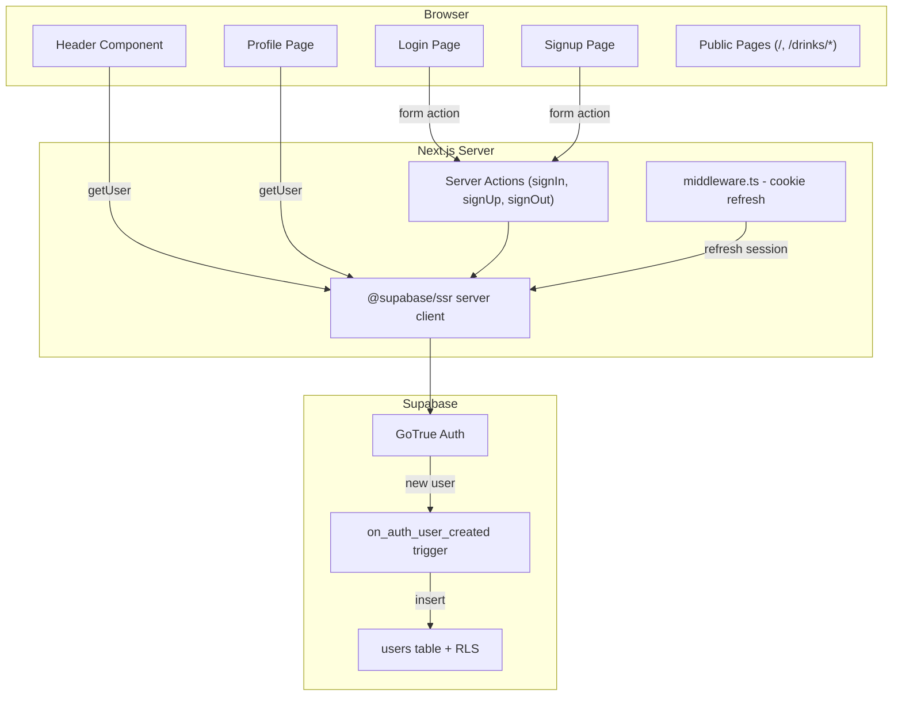

# Authentication Implementation Plan

## Architecture Overview

## Layer-by-layer plan

---

### 1. Database: `users` table migration

Create via `supabase migration new create_users` then write SQL.

**Table schema** (`public.users`):
- `id` UUID PK, references `auth.users(id)` ON DELETE CASCADE
- `email` TEXT UNIQUE NOT NULL
- `display_name` TEXT NOT NULL DEFAULT ''
- `avatar_url` TEXT
- `login_type` TEXT NOT NULL DEFAULT 'email' (CHECK: 'email', 'google', 'apple', 'github')
- `created_at` / `updated_at` TIMESTAMPTZ with defaults and auto-update trigger

**Trigger**: `handle_new_user()` -- on `auth.users` INSERT, auto-creates a `public.users` row extracting `id`, `email`, and determining `login_type` from `raw_app_meta_data->>'provider'`.

**RLS Policies**:
- `SELECT`: authenticated users can read any user (`USING (true)` for authenticated role)
- `UPDATE`: only own row (`USING (auth.uid() = id)`)
- No INSERT from client (trigger handles it)
- No DELETE from client

---

### 2. Web: `middleware.ts`

Create [`apps/web/src/middleware.ts`](apps/web/src/middleware.ts) following the Supabase SSR pattern.

Purpose: refresh the Supabase auth session cookie on every request. This prevents stale sessions and ensures `getUser()` works correctly in Server Components.

Match all routes except static assets (`_next/static`, `_next/image`, `favicon.ico`).

**Key**: Use `@supabase/ssr` `createServerClient` with `request`/`response` cookie handling (not `next/headers` cookies). Call `supabase.auth.getUser()` to trigger token refresh. For protected routes (`/profile`), redirect to `/login` if no user.

---

### 3. Web: Auth Server Actions

Create [`apps/web/src/app/(auth)/actions.ts`](apps/web/src/app/(auth)/actions.ts) with `'use server'` directive:

- **`signIn(prevState, formData)`** -- calls `supabase.auth.signInWithPassword()`, redirects to `/` on success, returns `{ ok: false, error }` on failure
- **`signUp(prevState, formData)`** -- calls `supabase.auth.signUp()`, redirects to `/` on success, returns error object on failure
- **`signOut()`** -- calls `supabase.auth.signOut()`, redirects to `/login`

All actions use the server Supabase client from [`apps/web/src/lib/supabase/server.ts`](apps/web/src/lib/supabase/server.ts). Return value pattern follows AGENTS.md: `{ ok: true }` / `{ ok: false, error: string }`.

---

### 4. Web: Auth Pages (route group `(auth)`)

**Layout** -- [`apps/web/src/app/(auth)/layout.tsx`](apps/web/src/app/(auth)/layout.tsx):
- Server Component, checks `getUser()` -- if user exists, redirect to `/`
- Minimal centered layout wrapper (no Header/Footer, clean auth form presentation)

**Login page** -- [`apps/web/src/app/(auth)/login/page.tsx`](apps/web/src/app/(auth)/login/page.tsx):
- Client Component form using `useActionState(signIn, initialState)`
- Email + password inputs using existing shadcn `Input` and `Button`
- Link to `/signup`
- Add shadcn `label` component (needed for form fields)

**Signup page** -- [`apps/web/src/app/(auth)/signup/page.tsx`](apps/web/src/app/(auth)/signup/page.tsx):
- Same pattern as login, calls `signUp` action
- Email + password + confirm password
- Link to `/login`

---

### 5. Web: Header update

Convert [`apps/web/src/components/layouts/header.tsx`](apps/web/src/components/layouts/header.tsx) to an **async Server Component** that calls `getUser()`:

- **Logged out**: Show a "Login" button/link pointing to `/login`
- **Logged in**: Show a circular avatar using `https://ui-avatars.com/api/?name=${displayName}&background=random` wrapped in a `<Link href="/profile">`. Extract the user's display name or email for the avatar initials.

Since the root layout already renders `<Header />` as a Server Component, this works without `'use client'`.

---

### 6. Web: Profile page

Create [`apps/web/src/app/profile/page.tsx`](apps/web/src/app/profile/page.tsx):

- **Server Component** -- calls `getUser()`, redirects to `/login` if not authenticated
- Fetch user data from `users` table via Supabase server client
- Display basic info: email, display name, login type, member since
- Sign out button (a small client component that calls the `signOut` action)
- Minimal design per user request ("I work on later")

---

### 7. Go API: Auth middleware (future-ready, not blocking)

Create [`apps/api/internal/middleware/auth.go`](apps/api/internal/middleware/auth.go) following the pattern already documented in `apps/api/AGENTS.md` section 8:

- Add `golang-jwt/jwt/v5` dependency
- Implement `RequireAuth` middleware and `UserID(ctx)` helper
- Pass `JWTSecret` from config (instead of reading `os.Getenv` in middleware)
- Update [`apps/api/internal/router/router.go`](apps/api/internal/router/router.go) to accept config and wire auth middleware to user routes

Update [`apps/api/internal/user/model.go`](apps/api/internal/user/model.go) to match the `users` table schema (add `login_type`, rename `username` to `display_name`).

Update [`apps/api/internal/user/repository.go`](apps/api/internal/user/repository.go) to query `public.users` table (already named `users` in SQL, just update columns).

---

### 8. Shared types alignment

Update [`packages/types/src/user.ts`](packages/types/src/user.ts):
- Add `loginType` field to `User` type
- Ensure field names match the API JSON (camelCase in TS, snake_case from Go API)

---

### 9. Verification

- Run `pnpm lint` and `pnpm type-check` from repo root
- Run `go vet ./...` in `apps/api`
- Verify Supabase migration applies cleanly with `supabase db reset`

---

## Files created/modified summary

| Action | File |
|--------|------|
| Create | `supabase/migrations/YYYYMMDD_create_users.sql` |
| Create | `apps/web/src/middleware.ts` |
| Create | `apps/web/src/app/(auth)/layout.tsx` |
| Create | `apps/web/src/app/(auth)/actions.ts` |
| Create | `apps/web/src/app/(auth)/login/page.tsx` |
| Create | `apps/web/src/app/(auth)/signup/page.tsx` |
| Create | `apps/web/src/app/profile/page.tsx` |
| Create | `apps/api/internal/middleware/auth.go` |
| Modify | `apps/web/src/components/layouts/header.tsx` |
| Modify | `apps/web/src/app/layout.tsx` (no change needed -- Header is already a Server Component) |
| Modify | `apps/api/internal/user/model.go` |
| Modify | `apps/api/internal/user/repository.go` |
| Modify | `apps/api/internal/user/service.go` |
| Modify | `apps/api/internal/router/router.go` |
| Modify | `apps/api/go.mod` (add `golang-jwt/jwt/v5`) |
| Modify | `packages/types/src/user.ts` |
| Add    | shadcn `label` component via CLI |
