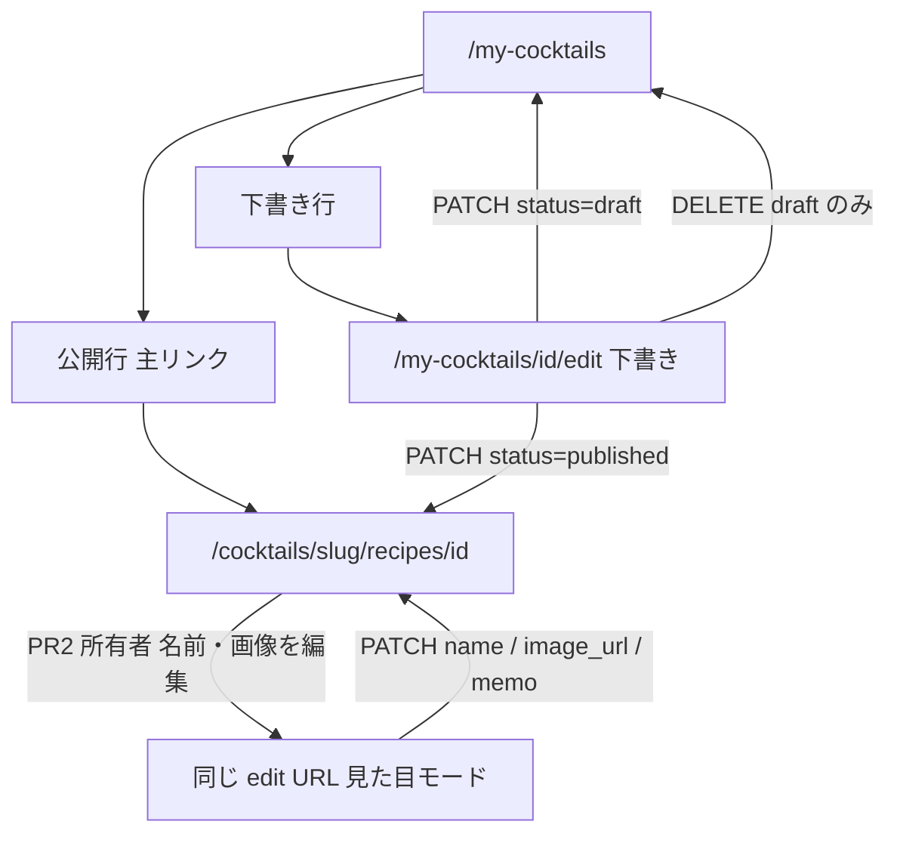

# カクテルレシピの下書き編集・公開と公開後メタデータ

対象は **Web + 既存 Go API のみ**（`apps/mobile` は触らない）。技術スタックは現状踏襲（Next.js 16 App Router、Server Actions、Go API、Supabase、shadcn/ui v4 + Tailwind v4 CSS-first）。新規外部サービス・新テーブル（バージョン表）は作らない。既存ファイルの編集を優先する。

関連プラン（本文は書き換えない。参照のみ）:

- [レシピ作成の一次導線 + プロフィールハブ](recipe_create_primary_and_profile_hub.plan.md) — 一覧・投稿後 redirect・ハブは完了。既知の欠落が「レシピ編集・削除 UI」「draft 専用 GET」
- [カクテルレシピ登録ページ](cocktail_recipe_page_f90258ea.plan.md) — Create フォームと `POST /api/cocktail-recipes` の原点
- [プロフィール編集・退会](web_profile_edit_and_delete.md) — 公開レシピは残す。削除・SET NULL は退会の話。今回公開削除はしない

---

## 調査結果

実装前にコードで確認したこと。スコープを広げない。推測のギャップは書かない。

### 所有者の単体 GET / PATCH / DELETE が無い

[`AuthMineRoutes`](apps/api/internal/cocktail/handler.go) は `GET /mine` のみ。[`router.go`](apps/api/internal/router/router.go) はそれを `/api/auth/cocktail-recipes` に載せている。`POST /api/cocktail-recipes` は別グループ（`AuthRecipeRoutes`）のまま。単体の所有者 GET・PATCH・DELETE は存在しない。

### 公開 GET は published のみ。draft は 404

[`GetRecipeByID`](apps/api/internal/cocktail/service.go) → [`FindPublishedRecipeByID`](apps/api/internal/cocktail/repository.go)（`status = 'published'`）。draft は `ErrNotFound`。`is_official` フィルタは無いので公式の公開詳細は読める。Web の公開詳細は [`fetchCocktailRecipeServer`](apps/web/src/application/cocktails-api.server.ts) がこの公開 GET を使う。下書きをここに載せない。

### Create の slug JOIN は既にある

[`Insert`](apps/api/internal/cocktail/repository.go) は同一 tx 内で `SELECT slug FROM cocktails WHERE id = $1` して `CocktailSlug` を埋める。[`createCocktailRecipe`](apps/web/src/app/my-cocktails/new/actions.ts) は 201 の `id` / `status` / `cocktail_slug` で redirect する。PATCH 後も Web が `cocktail_id` から slug を推測しない。Create の JOIN は維持し、PATCH も同じように返す。

### mine は公式を除外済み。下書き行は非リンク

[`ListMine`](apps/api/internal/cocktail/repository.go) は `user_id = $1 AND NOT is_official`。draft + published。[`MyRecipeRow`](apps/web/src/app/my-cocktails/my-recipe-row.tsx) は published かつ slug ありだけ公開詳細へ。draft は `href = null`（コメント: 編集が無い）。一覧ヘッダーの投稿 CTA・空状態・proxy の `/my-cocktails` 保護はハブプランどおり動いている。

### バリデーション（Create）は公開時だけ材料1+・手順1+

[`validate`](apps/api/internal/cocktail/service.go): `cocktail_id` UUID 必須、name 必須（1–100）、memo 最大 1000、status は `draft` | `published`。`published` のとき ingredients / steps が空ならエラー。draft は空配列可。単位・数量・手順本文のルールは status 共通。Web の [`actions.ts`](apps/web/src/app/my-cocktails/new/actions.ts) も同じ公開時チェック。下書きからの公開はこれと同じにする。

### CORS に PATCH が無い

[`router.go`](apps/api/internal/router/router.go) の `AllowedMethods` は `GET, POST, PUT, DELETE, OPTIONS`。PATCH は無い。Server Action は Next サーバーから Go を叩くのでブラウザ CORS は通らないが、方針どおり足す。

### RLS は owner 更新可。Go は RLS をバイパスする

[`cocktail_recipes_update`](supabase/migrations/20260523003250_create_cocktail_recipes.sql) は `auth.uid() = user_id`。status や本体カラムの制限は無い。ingredients / steps は INSERT + DELETE ポリシーのみ（UPDATE ポリシーは無い）。Go は RLS をバイパスするので、所有者判定は SQL の `user_id` を **JWT の user_id だけ** で縛る。編集の書き込みは Go。`from('cocktail_recipes').update` を編集に使わない。Service Role も編集に使わない。

退会の draft DELETE は今どおりセッション RLS（[`profile/actions.ts`](apps/web/src/app/profile/actions.ts) の `.eq('status', 'draft')`）。今回触らない。

### 評価は `recipe_id` 単位。バージョン表は無い

[`cocktail_recipe_ratings`](supabase/migrations/20260724020000_create_cocktails.sql) は `UNIQUE (recipe_id, user_id)`。`recipe_id` への FK は `ON DELETE CASCADE`。公開レシピを消すと評価も消える。材料・手順を変えると、同じ `recipe_id` の評価対象が入れ替わる。バージョニングは無い。

### 公式はユーザー編集対象外

`is_official` は Create の INSERT 列から意図的に除外（DB DEFAULT false）。mine は `NOT is_official`。公開詳細は `showRatings = !recipe.isOfficial`。公式アカウントでも mine に公式行は出ない（ハブプランの仕様）。

### 公開後の `user_id` は SET NULL（退会）

[`cocktail_recipes_user_id_set_null.sql`](supabase/migrations/20260817232524_cocktail_recipes_user_id_set_null.sql) で公開レシピは残る。所有者 GET は `user_id = JWT` なので、退会後の行は所有者 API に出ない。

### フォームは作成専用。画像は Web が Storage に上げて URL を渡す

[`cocktail-recipe-form.tsx`](apps/web/src/app/my-cocktails/new/cocktail-recipe-form.tsx) は `createCocktailRecipe` 固定。初期値 props は `cocktails` と `defaultCocktailId` のみ。Go に multipart は無い。この経路を編集でも使う。

### 公開詳細に所有者向け編集入口は無い

[`cocktails/[slug]/recipes/[id]/page.tsx`](apps/web/src/app/cocktails/[slug]/recipes/[id]/page.tsx) は公開 GET + 評価。`user` は評価ウィジェット用。編集リンクは無い。

### ルートと sitemap

`/my-cocktails/new` は静的セグメント。[`proxy.ts`](apps/web/src/proxy.ts) の `protectedRoutes` は `/my-cocktails` プレフィックスなので `/my-cocktails/[id]/edit` も保護される。ページ側も proxy 任せにせず `loginHref` する（`new/page.tsx` と同じ）。[`sitemap.ts`](apps/web/src/app/sitemap.ts) は `/`・`/cocktails`・銘柄/カクテルマスタのみ。認証ページは足さない（既存どおり。レシピ詳細 URL も sitemap に無い）。

### 削除確認 UI の既存パターン

[`delete-account-section.tsx`](apps/web/src/app/profile/delete-account-section.tsx) が shadcn `Dialog`（Base UI の `DialogTrigger render={<Button />}`）を使う。`components/ui/dialog.tsx` は既にある。Empty / Sidebar / Item は未導入のまま足さない。

### 既存投稿ループ（変えない）

- ヘッダー「レシピを投稿」→ `/my-cocktails/new`（未ログインは `recipeComposeHref`）
- 投稿成功: published → `/cocktails/{slug}/recipes/{id}`、draft → `/my-cocktails`。slug 欠落は `/my-cocktails`
- `revalidatePath` は `redirect` より前
- ハブ「カクテルレシピ」→ `/my-cocktails`

### コピーと type 規約

フォーム見出し・公開ボタンは既に「投稿」「アレンジ」。編集 UI でも「登録」「オリジナル」は使わない。オブジェクト形は `interface`、Union は `type`。ファイルは kebab-case。`'use client'` はリーフ。Server Action は throw せず結果オブジェクト（成功時の `redirect` は Next の例外で、Create と同じ）。Go は handler → service → repository。SQL はプレースホルダ `$1`。

---

## プロダクト決定（固定）

再議論して覆さない。

1. **下書きは本体まで自由に編集できる。** name / image / memo / ingredients / steps / 親 `cocktail_id`。同じフォームから **公開** できる。公開時の検証は Create と同じ（材料1+・手順1+、name 必須、親必須）。
2. **公開後は見た目だけ。** 許可: **name / image_url / memo**。禁止: ingredients / steps / `cocktail_id` / status を draft に戻す / `is_official`。
   - 評価は `recipe_id` に付く。材料・手順を変えると評価対象が入れ替わる。
   - 親カクテルを動かすと「みんなのレシピ」と評価の文脈が壊れる。
   - memo はコツであり手順本体ではないので公開後も可。
3. **公開は一方通行。** published → draft は不可。評価 0 件でも本体ロック（ルールを二つにしない）。
4. **公開レシピの削除はしない。** 下書き削除は PR1 に含める（評価が無く個人データ）。公開削除は次 PLAN。
5. **公式（`is_official`）は GET/PATCH/削除の対象外。** 404 相当。mine に公式が混ざらない現状を維持。
6. **公開 GET は published のまま。** draft を `GET /api/cocktail-recipes/{id}` で読まない。所有者用の auth GET を新設する。
7. **コピー:** 「登録」「オリジナル」禁止。作成側と同じく「投稿」「アレンジ」。
8. **確認 Modal なし。** 下書き削除だけ確認（既存退会 Dialog パターン。新規 shadcn コンポーネントは足さない）。
9. **編集 UI は既存フォームの再利用を優先。** 公開後モードでは材料・手順・親セレクトを「disabled で見せる」のではなく **出さない**（直せるように見えない）。
10. ハブやヘッダーの一次導線、投稿成功後 redirect（published → 詳細、draft → `/my-cocktails`）は変えない。

---

## 却下（本線にしない）

- レシピバージョニング、評価リセット、評価の付け替え
- 公開後の材料・手順編集、「評価 0 件なら本体も可」
- 非公開に戻す
- 公開レシピ削除、公式レシピ編集
- 親なしオリジナル
- tombstone / 新テーブル
- Mobile、i18n 一括、計測基盤
- Service Role を編集に使う、フロントから PostgREST 直で他人の draft を読む
- `POST /api/cocktail-recipes` を `/api/auth/...` へ引っ越す
- shadcn Empty / Sidebar / Item の新規追加
- 下書き用の公開 GET
- `/my-cocktails/new` を `[id]/edit` に吸収する
- 公開行の主リンクを編集ページに差し替える
- 画像差し替え時の Storage 旧オブジェクト削除（Create も残している）
- published ロックを RLS まで合わせる migration（書き込みの正は Go。hardening は別）

---

## API 方針

コードと矛盾したらコードを優先する。以下は現状コードに合わせて固定する。

### パス

| メソッド | パス | 役割 |
| --- | --- | --- |
| GET | `/api/auth/cocktail-recipes/{id}` | 所有者。draft + published。ingredients / steps / `cocktail_slug` を含む |
| PATCH | 同じ | フィールドマスク。handler 薄く、検証は service、SQL は repository |
| DELETE | 同じ | **draft のみ**（PR1） |
| GET | `/api/auth/cocktail-recipes/mine` | 変更しない |
| GET | `/api/cocktail-recipes/{id}` | published のまま。draft を載せない |
| POST | `/api/cocktail-recipes` | 作成のまま。auth 配下へ引っ越さない |

chi では `/mine` を `/{id}` より先に登録する（既存 `ListMine` を壊さない）。

### 認可と 404

- JWT の `user_id` のみ。ボディの `user_id` は見ない。
- `WHERE id = $1 AND user_id = $2 AND NOT is_official`。他人・公式・欠落は **404**（存在漏洩を減らす）。403 にしない。
- 無効 UUID は公開 GET と同じ **400**。
- Bearer なしは既存どおり 401（`RequireAuth`）。

### PATCH フィールドマスク

JSON を **キー集合として** 見る（通常の struct `Decode` だけだと omit と `null` が消える）。handler は raw object を service に渡す。**無視して部分適用しない。**

- **常に拒否:** `is_official` がキーとして存在する、未知キー。
- **現在 draft:** 本体は **フル置換**（Create と同じキー: `cocktail_id`, `name`, `status`, `ingredients`, `steps`）。省略した `ingredients` / `steps` は空配列として検証する（既存維持にしない。部分 PATCH で古い材料が残ると公開検証をすり抜ける）。`status` を `published` にできる。検証は既存 `validate` と同等（公開時は材料1+・手順1+）。`cocktail_id` の FK 違反（`23503`）は Create と同じ 400。
- **現在 published（PR1）:** キーの有無を問わず **PATCH 全体を 400**。本体も見た目もまだ開けない。
- **現在 published（PR2）:** 許可キーは `name` / `image_url` / `memo` のみ。`ingredients` / `steps` / `cocktail_id` / `status` / `is_official` が来たら 400。クライアントが古いフルフォームを投げても本体が黙って残らない。`name` は Create と同じ 1–100（空は 400。DB CHECK に当てて 500 にしない）。`memo` は最大 1000。

### `image_url` / `memo` の省略（例外とその理由）

Create はキー無し＝画像なし／memo なし。PATCH で同じにすると、再アップロード無しの保存で画像が消え、空 memo を JSON から省くと **コツを消せない**。

| JSON | `image_url` / `memo` |
| --- | --- |
| キー省略 | 既存を維持 |
| `null` | クリア |
| 文字列 | セット |

Web は新規ファイルがあれば Storage に上げて URL を渡し、触っていなければ `image_url` キー省略、プレビュー削除なら `null`。memo を空にしたら `null` を明示する（`undefined` 省略で Create の body をコピーしない）。Go に multipart を足さない。

### PATCH 後のレスポンス

Create と同じく `Recipe` JSON。同一 tx 内で親 `cocktails.slug` を JOIN する。失敗は PATCH 失敗。Web は推測しない。slug が空なら Web は fail-closed で `/my-cocktails`。

### DELETE

公開直後の競合で published を消さない。`DELETE ... WHERE id = $1 AND user_id = $2 AND status = 'draft' AND NOT is_official` を **1 文**にする。find してから id だけで DELETE しない。

- 1 行消えた → **204**（drink-log と同じ。Web は `authServerFetch` が 204 を空として扱う）
- 0 行 → 所有者 GET と同じ条件で再読込。無ければ 404。`published` なら **400**（公開削除はしない。所有者には「無い」と嘘をつかない）
- 子行は FK CASCADE。draft に ratings は通常無い。

### トランザクション

draft PATCH は Create の Insert と同じ: `BeginTx` → 親 UPDATE → ingredients / steps を DELETE して入れ直す → slug JOIN → `Commit`。プレースホルダ `$1`。文字列結合で値を埋め込まない。`updated_at` は既存トリガーに任せる。`is_official` を SET しない。

並行の取り違えを避けるため、PATCH tx 先頭で所有者行を `SELECT ... FOR UPDATE` してから status で分岐する。

---

## UI 方針

### ルート

**`/my-cocktails/[id]/edit`** を採用する。`/my-cocktails/new` は静的のまま残す。フォームコンポーネントだけ共有する。

理由: `new` は `cocktail_id` query・未ログイン `loginHref(recipeComposePath)`・Create POST がある。動的ルートに吸収すると作成と編集の redirect / Action が混ざる。Next は `new/` と `[id]/` を同時に置ける。

同じ edit URL を status で切り替える。PR1 は published なら公開詳細へリダイレクト（フォームを出さない）。PR2 で published モードを同じ URL に載せる。見た目専用の第二 URL は作らない。

### 一覧

- 下書き行 → `/my-cocktails/[id]/edit`（今の非リンクを入口にする）
- 公開行の主リンクは今どおり公開詳細。編集ページに差し替えない

### 未ログイン

edit ページは `loginHref(\`/my-cocktails/${id}/edit\`)`（`encodeURIComponent` 済み）。proxy 任せにしない。`new/page.tsx` と同じ。

### 保存後 redirect

- 下書き保存後 → `/my-cocktails`
- 下書きから公開成功 → `/cocktails/{slug}/recipes/{id}`
- 公開後メタデータ保存（PR2）→ 公開詳細
- slug 欠落は fail-closed で `/my-cocktails`

`revalidatePath` は `redirect` より前。`/my-cocktails` は常に。公開した／公開メタを保存したときは詳細と親カクテル `/cocktails/{slug}` も。

### 公開詳細の入口（PR2）

所有者かつ `!isOfficial` かつ `userId` が自分のときだけ。入口コピーは **「名前・画像を編集」**（指定どおり。レシピ本体を編集しているように見えない。「レシピを編集」「材料を変更」は使わない）。評価ウィジェットやヘッダー CTA は変えない。公開行の主リンクは一覧のまま詳細。一覧に第二ボタンは足さない（入口は詳細の1つ）。

コツ（memo）も直せるが、入口文言に「コツ」を足して本体編集に見せない。編集画面の説明文でカバーする。

### フォームモード

| モード | 出す | 出さない | ボタン |
| --- | --- | --- | --- |
| create（既存） | 全部 | — | 下書き保存 / レシピを投稿する |
| draft（PR1） | 全部（初期値あり） | — | 同じ + 削除（Dialog） |
| published（PR2） | name / image / memo | 親セレクト・材料・手順（disabled でも出さない） | 見た目の保存のみ。下書き保存・公開・削除は出さない |

**説明文（確認 Modal ではない。一方通行を知らずに投稿すると材料ミスを直せない）:**

- 共有フォームの「レシピを投稿する」付近（create と draft）: 「投稿すると材料・作り方・親カクテルは変えられません。」redirect / 一次導線は変えない。
- published モードの先頭: 「名前・写真・コツを直せます。材料と作り方は公開後は変更できません。」材料が消えたように見えないようにする。

edit ページ先頭に `/my-cocktails` へ戻るリンク（プロフィールドリルインと同じ。公開詳細の「レシピ一覧に戻る」に合わせる）。

`'use client'` はフォームと Dialog リーフのまま。edit `page.tsx` は RSC。

### sitemap

認証ページを足さない。edit URL も足さない。

---

## やむを得ない例外（なぜか）

1. **Create の raw `fetch` は `new/actions.ts` に残す。** POST を `/api/auth/...` へ引っ越さない方針のため、編集だけ `authServerFetch`（saved-drinks / drink-logs と同じ）にする。Create をこの PR で寄せない。
2. **PATCH の `image_url` / `memo` 省略は維持、`null` でクリア。** Create の「キー無し＝なし」をそのまま使うと既存画像が消える／空 memo が省略されコツを消せない。
3. **`new/` を動的ルートに吸収しない。** 作成ループ（query・POST・redirect）を編集と混ぜない。
4. **PR1 の published PATCH は全拒否。** マスクの「許可フィールド開放」は PR2。PR1 時点で name まで通すと、UI 無しで本体ロックがテストしづらく、フル更新事故の穴が残る。
5. **公開 DELETE の 400 と、他人/公式の 404 を分ける。** 漏洩低減は「他人の有無」に対して。自分の公開行を消そうとした所有者には、次 PLAN まで削除できないことを 400 で返す。

---

## Step 1 — 所有者 GET / PATCH / DELETE（PR1 API）

### 目的

下書きを材料・手順つきで読み、フル更新と公開ができ、下書きだけ消せる。公開行は PR1 では更新できない。

### 現状ギャップ

所有者の単体 GET/PATCH/DELETE が無い。公開 GET は draft を返さない。CORS に PATCH が無い。

### 実装方針

- [`AuthMineRoutes`](apps/api/internal/cocktail/handler.go) に `GET /{id}`・`PATCH /{id}`・`DELETE /{id}`。handler は invalid JSON と `middleware.UserID` と status マップのみ。PATCH ボディは struct に落とし切らず raw のキー集合を service へ（omit / `null` 判定のため）。
- 肥大化したら既存 [`handler_rating.go`](apps/api/internal/cocktail/handler_rating.go) と同じく `handler_mine.go` に分ける。
- service: UUID、所有者取得、status でマスク。draft は既存 `validate` 相当。published は 400。`is_official` キーは常に 400。
- repository: `FindOwnedRecipeByID`（draft+published、`NOT is_official`、children + slug JOIN）。`UpdateDraft`（tx + 子の入れ替え + slug）。`DeleteDraft`。公開 GET の `FindPublishedRecipeByID` は触らない。
- エラー: `ErrNotFound` → 404、`ErrValidation` → 400（`clientValidationMessage`）、`ErrInvalidUUID` → 400。新規の 403 は使わない。
- CORS `AllowedMethods` に `"PATCH"`。
- フィールドマスクの取り違えが本体ロックを壊すので、`service_test.go` で repository をモックし「published に ingredients が来たら 400」「draft から published は材料1+必須」を固定する。統合テストは必須にしない（既存どおり `go test` はファイルがあれば回す）。

### 対象ファイル

- [`apps/api/internal/cocktail/model.go`](apps/api/internal/cocktail/model.go) — `PatchInput`（または同等）
- [`apps/api/internal/cocktail/repository.go`](apps/api/internal/cocktail/repository.go)
- [`apps/api/internal/cocktail/service.go`](apps/api/internal/cocktail/service.go)
- [`apps/api/internal/cocktail/handler.go`](apps/api/internal/cocktail/handler.go)（必要なら `handler_mine.go`）
- [`apps/api/internal/router/router.go`](apps/api/internal/router/router.go) — CORS のみ。マウント先は既存 `AuthMineRoutes`
- [`apps/api/internal/cocktail/service_test.go`](apps/api/internal/cocktail/service_test.go)（新規。マスク用）

### 受け入れ

- Bearer なし → 401
- 他人 / 公式 / 欠落の GET・PATCH・DELETE → 404
- 自分の draft GET に ingredients / steps / `cocktail_slug` がある
- 自分の published GET は 200（UI は PR1 で使わないが、PR2 用に draft+published で切る）
- draft PATCH で親・材料・手順・名前を更新できる。`status=published` かつ材料1+・手順1+で公開できる
- 材料 0 のまま published は 400
- 自分の published に対する PATCH → 400（name だけでも不可）
- 自分の draft DELETE → 204 で mine から消える。published DELETE → 400
- `POST /api/cocktail-recipes` と `GET /mine` と公開 GET が回帰しない
- `go fmt ./...` / `go vet ./...`

---

## Step 2 — 共有型と Web の所有者 fetch（PR1）

### 目的

edit ページが公開 GET に頼らない。

### 現状ギャップ

[`fetchCocktailRecipeServer`](apps/web/src/application/cocktails-api.server.ts) は公開 GET のみ。[`fetchMyCocktailRecipes`](apps/web/src/application/cocktails-api.server.ts) は一覧 summary。単体の所有者 GET クライアントが無い。

### 実装方針

- `packages/types` に PATCH 入力用 `interface` を足す。`CocktailRecipe` の GET 形は流用可。
- `fetchMyCocktailRecipe(accessToken, id)` を `authServerFetch` で `/api/auth/cocktail-recipes/{id}` に。失敗は throw せず Result（一覧の fail-closed に合わせ、ページ側で 404 / login を分岐）。
- mapper は既存 `toCocktailRecipe`（`ApiRecipe`）を使う。新規 mapper ファイルは作らない。

### 対象ファイル

- [`packages/types/src/cocktail-recipe.ts`](packages/types/src/cocktail-recipe.ts)
- [`apps/web/src/application/cocktails-api.server.ts`](apps/web/src/application/cocktails-api.server.ts)
- [`apps/web/src/application/cocktail-mappers.ts`](apps/web/src/application/cocktail-mappers.ts) — 型が足りなければ最小限

### 受け入れ

- 所有者 GET が `CocktailRecipe`（ingredients / steps / `cocktailSlug` / `status`）になる
- 公開 `fetchCocktailRecipeServer` のパスを変えていない

---

## Step 3 — 下書き編集ページと一覧入口（PR1 Web）

### 目的

下書きが一覧から編集でき、同じフォームから公開できる。新規投稿ループは壊れない。

### 現状ギャップ

下書き行が非リンク。フォームは Create 専用。edit ルートが無い。

### 実装方針

- 新規 [`apps/web/src/app/my-cocktails/[id]/edit/page.tsx`](apps/web/src/app/my-cocktails/[id]/edit/page.tsx)（RSC）。`params` は Promise。
- 未ログイン: `redirect(loginHref(\`/my-cocktails/${id}/edit\`))`
- `getOptionalAccessToken` → 所有者 GET。404 相当は `notFound()`。公式は API が 404。
- **PR1:** `status === 'published'` なら slug ありで公開詳細へ `redirect`。slug 欠落は `/my-cocktails`。フルフォームを published に出さない。
- 親セレクト用に `fetchCocktailItemsServer({ limit: 200 })`（`new/page.tsx` と同じ）。
- フォームを [`apps/web/src/app/my-cocktails/cocktail-recipe-form.tsx`](apps/web/src/app/my-cocktails/cocktail-recipe-form.tsx) へ移し、`new/` と `edit/` が import する。`new/page.tsx` の H1・metadata・Create Action は残す。
- モード `create` | `draft`（PR2 で `published`）。draft は初期値を props で渡す。材料・手順の `useState` 初期値はサーバーから。
- 新規 [`apps/web/src/app/my-cocktails/[id]/edit/actions.ts`](apps/web/src/app/my-cocktails/[id]/edit/actions.ts)。`updateCocktailRecipe`: hidden の recipe `id`（クライアントの id を信じず、所有者 PATCH のパスに載せる）→ FormData 検証（Create と同じ公開時ルール）→ 画像 upload（Create と同じ bucket）→ `authServerFetch` PATCH（memo 空は `null`、画像未変更は `image_url` キー省略）→ `revalidatePath` → redirect。throw しない。成功時 `redirect` は Create と同じ。
- FormData パースの重複が厚いなら `my-cocktails/recipe-form-data.ts` に純関数を1つ。`new/actions.ts` まで無理に書き換えない（Create POST を巻き込まない）。
- [`my-recipe-row.tsx`](apps/web/src/app/my-cocktails/my-recipe-row.tsx): draft の `href` を `/my-cocktails/${id}/edit`。published の主リンクは変更しない。
- metadata title は「アレンジレシピを投稿」に寄せる。「登録」禁止。
- ページ先頭に `/my-cocktails` へ戻るリンク。投稿ボタン付近に一方通行の一文（上記 UI 方針）。
- 公開済み行への PATCH が 400 のときは日本語（例: 「公開済みのレシピの材料・作り方は変えられません。」）。API 英語のままなら Web Action でマップ。
- sitemap を触らない。

### 対象ファイル

- [`apps/web/src/app/my-cocktails/[id]/edit/page.tsx`](apps/web/src/app/my-cocktails/[id]/edit/page.tsx)（新規）
- [`apps/web/src/app/my-cocktails/[id]/edit/actions.ts`](apps/web/src/app/my-cocktails/[id]/edit/actions.ts)（新規）
- [`apps/web/src/app/my-cocktails/cocktail-recipe-form.tsx`](apps/web/src/app/my-cocktails/cocktail-recipe-form.tsx)（`new/` から移動）
- [`apps/web/src/app/my-cocktails/new/page.tsx`](apps/web/src/app/my-cocktails/new/page.tsx) — import 先のみ
- [`apps/web/src/app/my-cocktails/new/cocktail-recipe-form.tsx`](apps/web/src/app/my-cocktails/new/cocktail-recipe-form.tsx) — 削除（移動後）
- [`apps/web/src/app/my-cocktails/new/actions.ts`](apps/web/src/app/my-cocktails/new/actions.ts) — **変更しない**（投稿ループ維持）
- [`apps/web/src/app/my-cocktails/my-recipe-row.tsx`](apps/web/src/app/my-cocktails/my-recipe-row.tsx)

### 受け入れ

- 下書き行から edit に行き、材料・手順・親・名前が初期表示される
- 一覧へ戻るリンクがある。投稿ボタン付近に一方通行の一文がある（確認 Dialog は削除だけ）
- 下書き保存 → `/my-cocktails` に更新後の行がある。公開詳細 404 に飛ばない
- 公開（材料1+・手順1+）→ `/cocktails/{slug}/recipes/{id}`。みんなのレシピにすぐ出る（revalidate）
- `/my-cocktails/new` からの新規投稿 redirect が今と同じ
- 未ログインで edit URL → `/login?next=` がエンコードされている
- 自分の published の edit URL（PR1）→ 公開詳細（または slug 欠落なら一覧）。本体フォームが無い
- 他人の id / 公式 id → 404
- 「登録」「オリジナル」が編集画面に無い
- sitemap.xml に `/my-cocktails/` が無い

---

## Step 4 — 下書き削除（PR1）

### 目的

評価の無い個人下書きを、確認のうえで消せる。公開は消えない。

### 現状ギャップ

削除 UI が退会時の一括 draft DELETE しか無い。

### 実装方針

- 同じ `edit/actions.ts` に `deleteDraftCocktailRecipe`。id は FormData。所有者 DELETE。204 以外は `{ ok: false, error }`。成功時 `revalidatePath('/my-cocktails')` のあと `redirect('/my-cocktails')`。
- 確認は既存 `Dialog`。退会のようなチェックボックスは不要（アカウント破壊ではない）。Trigger は destructive。コピー例: 「この下書きを削除しますか？取り消せません。」新規 shadcn は足さない。
- Dialog の削除 `<form>` はレシピ編集 `<form>` の **外**に置く（HTML の form ネスト禁止。内側の submit が更新側に吸われる）。`'use client'` はリーフのまま。page は RSC。一覧行には付けない（入口は edit）。
- DELETE は `emptyResponse: true` でもよい。204 は `authServerFetch` が既に空扱い（drink-log と同じ）。
- published モードでは出さない（PR1 は published フォーム自体が無い）。

### 対象ファイル

- [`apps/web/src/app/my-cocktails/[id]/edit/actions.ts`](apps/web/src/app/my-cocktails/[id]/edit/actions.ts)
- [`apps/web/src/app/my-cocktails/cocktail-recipe-form.tsx`](apps/web/src/app/my-cocktails/cocktail-recipe-form.tsx)（または同ディレクトリの小さな `delete-draft-dialog.tsx`。page をクライアント化しない）
- [`apps/web/src/components/ui/dialog.tsx`](apps/web/src/components/ui/dialog.tsx) — 再利用のみ

### 受け入れ

- 下書きを確認後に削除 → 一覧から消える
- Dialog を閉じるだけでは消えない
- 公開レシピは UI からも API からも消えない
- 退会フロー（draft 一括 DELETE → SET NULL → `deleteUser`）が回帰しない

---

## Step 5 — 公開後メタデータの API 開放（PR2）

### 目的

published の name / image_url / memo だけを更新する。本体キーが来たら 400。

### 現状ギャップ

PR1 の service が published PATCH を全拒否している。

### 実装方針

- service の published 分岐だけ変える。許可キー以外が JSON にあれば 400。部分適用しない。
- repository に `UpdatePublishedMeta`（親行の3列のみ。ingredients / steps / `cocktail_id` / `status` / `is_official` を SET しない）。slug JOIN して返す。
- draft のフル PATCH と DELETE は変えない。
- service_test に「published + ingredients → 400 で DB 相当の update が呼ばれない」「published + name のみ → 通る」を足す。

### 対象ファイル

- [`apps/api/internal/cocktail/service.go`](apps/api/internal/cocktail/service.go)
- [`apps/api/internal/cocktail/repository.go`](apps/api/internal/cocktail/repository.go)
- [`apps/api/internal/cocktail/service_test.go`](apps/api/internal/cocktail/service_test.go)

### 受け入れ

- published の name / image_url / memo が更新される。詳細に反映される
- 同じリクエストに `ingredients` / `steps` / `cocktail_id` / `status` があると 400。材料・手順・親・status が変わらない
- `status: "draft"` は 400。評価 0 件でも同じ
- draft のフル更新・公開は PR1 のまま

---

## Step 6 — 公開後 UI（PR2）

### 目的

所有者が公開詳細から見た目だけ直せる。本体フィールドが見えない。

### 現状ギャップ

公開詳細に入口が無い。フォームに published モードが無い。PR1 の edit は published をリダイレクトしている。

### 実装方針

- edit ページ: published のリダイレクトをやめ、`mode="published"` でフォームを出す。親一覧 fetch は published モードではしない（セレクトを出さない）。
- フォーム: 材料・手順・親をマウントしない。hidden で `cocktail_id` / ingredients / steps / status を送らない（API が 400 にするため）。
- `updateCocktailRecipe`: published のときは PATCH ボディを `name` / `image_url` / `memo` のみ。下書き保存ボタンは出さない。保存成功 → 公開詳細。slug 欠落 → `/my-cocktails`。
- 公開詳細: `user?.id === recipe.userId` かつ `!recipe.isOfficial` のときだけ「名前・画像を編集」→ `/my-cocktails/{id}/edit`。`getOptionalAccessToken` は既にある。
- 一覧の公開行主リンクは公開詳細のまま。
- 削除ボタンは published で出さない。
- H1 / ボタンコピーは見た目編集に限定。「レシピを編集」禁止。先頭に「名前・写真・コツを直せます。材料と作り方は公開後は変更できません。」
- 保存ボタン例: 「保存する」（「レシピを投稿する」を使い回さない）。

### 対象ファイル

- [`apps/web/src/app/my-cocktails/[id]/edit/page.tsx`](apps/web/src/app/my-cocktails/[id]/edit/page.tsx)
- [`apps/web/src/app/my-cocktails/[id]/edit/actions.ts`](apps/web/src/app/my-cocktails/[id]/edit/actions.ts)
- [`apps/web/src/app/my-cocktails/cocktail-recipe-form.tsx`](apps/web/src/app/my-cocktails/cocktail-recipe-form.tsx)
- [`apps/web/src/app/cocktails/[slug]/recipes/[id]/page.tsx`](apps/web/src/app/cocktails/[slug]/recipes/[id]/page.tsx)
- [`apps/web/src/app/my-cocktails/my-recipe-row.tsx`](apps/web/src/app/my-cocktails/my-recipe-row.tsx) — 公開主リンクは変更しない

### 受け入れ

- 所有者の公開詳細に「名前・画像を編集」がある。他人・公式には無い
- その先に材料・手順・親セレクトが **無い**（disabled 表示でも不合格）。代わりに「材料と作り方は公開後は変更できません」が見える
- 名前・画像・コツを保存すると公開詳細に戻る。評価ウィジェットは残る。入口は「名前・画像を編集」のまま（コツは画面内で直せる）
- ヘッダー「レシピを投稿」、投稿成功 redirect、ハブは変わらない
- 下書きの edit（材料まで）は PR1 のまま

---

## Step 7 — 品質（各 PR の完了条件）

- `pnpm lint`
- `pnpm type-check`（web に script が無いのは既存どおり。mobile / types / utils）
- Go 変更時: `cd apps/api && go fmt ./... && go vet ./...`。`service_test.go` があるので `go test ./...`
- 回帰:
  - 新規投稿（下書き / 公開、redirect、`cocktail_id` query）
  - mine 一覧（公式が混ざらない、公開行は詳細）
  - 公式レシピ詳細（評価ウィジェット無し、編集入口無し）
  - 非公式の評価ウィジェット（一覧・自分の評価・未ログイン）
  - 退会（確認 Dialog、公開レシピ SET NULL、draft 一括削除）
  - ハブ（リスト / カクテルレシピ / 表示名 / 退会ドリルイン）
- 認証ページを sitemap に足していないこと

---

## PR 分割（採用）

1 本にまとめない。下書き公開と公開後メタデータ UI を同一 PR にしない。バージョニングを混ぜない。

| PR | 含む Step | 関心事 | 含める | 含めない |
| --- | --- | --- | --- | --- |
| **PR1** | 1–4 + 7 | 下書きの読み・編集・公開 + 下書き削除 | auth GET/PATCH（draft フル + publish）、published PATCH の **全拒否**、編集ページ（draft のみ描画）、一覧の下書き行を入口に、削除（draft のみ）、CORS PATCH | 公開後の name/image/memo、公開詳細の編集入口、フォームの published モード |
| **PR2** | 5–7 | 公開後の見た目 | PATCH の published マスク、公開詳細からの入口、フォームの published モード（本体フィールドを出さない） | 下書きフローの作り直し、公開削除、`new/` の再設計 |

PR1 の PATCH が published 行をフル更新できてはいけない。ロックは PR2 を待たず service に入れる。PR2 は UI と許可フィールドの開放。

**PR1 単独で本番に出した場合のユーザー範囲:** 下書きを完成・公開・破棄できる。公開済みの誤字・画像・コツはまだ直せない。公開詳細に編集入口を出さない（壊れた「編集」に見えない）。PR2 まで「公開後は見た目だけ直せる」を約束しない。

同一 PR にしてはいけない: 下書き公開と公開後メタデータ UI。バージョニング。

崩さない理由: 公開後メタは評価対象（`recipe_id`）を動かさない別関心事。下書き公開は Create と同等の検証と redirect。混ぜるとレビューで本体ロックを見落としやすい。

---

## 成功の見方（計測基盤は作らない。受け入れに落と済み）

- 一覧の下書きを開き、材料まで直して投稿すると公開詳細に着く。評価ウィジェットがある
- 下書きを確認のうえで消すと一覧から無くなる。公開行の削除ボタンは無い
- 投稿ボタン付近で、材料・作り方・親が一方通行だと分かる（確認 Modal は出ない）
- PR2 後: 所有者の公開詳細 →「名前・画像を編集」→ 材料・手順が出ない → 名前／写真／コツだけ保存 → 同じ詳細に戻る。他人の評価は残る
- 公開後に材料を変えようとしても UI に出ず、API でも 400。評価 0 件でも同じ

---

## 既知の欠落（次 PLAN）

- **公開レシピ削除**（評価 CASCADE と「みんなのレシピ」欠落。退会の SET NULL とは別）。誤投稿の救済は本 PLAN では「投稿前の説明」まで。公開後に消す・非公開に戻す UI は出さない
- 一覧の公開行から見た目編集へ行く第二ボタン（入口は公開詳細の1つに固定）
- バージョニング / 評価の付け替え / 評価 0 件だけ本体編集
- 親なしオリジナル
- Mobile の同等導線
- 下書き用の公開 GET（作らない。所有者 auth GET が本線）
- PostgREST 経由で owner が published 本体を直接 UPDATE できる RLS のまま（本線書き込みは Go）
- Storage 上の旧画像 GC
- 公式アカウントが mine を開いても公式行は出ない（除外仕様の維持）

---

## 実際の実装との差分

PR1（`feat/web-cocktail-recipe-draft-edit`）時点。本文の方針は変えていない。

- 所有者 GET/PATCH/DELETE は肥大化回避のため `handler_mine.go` / `service_owned.go` に分割した。マウントは計画どおり既存 `AuthMineRoutes`（`/mine` を `/{id}` より先）。
- PATCH の draft フル置換は `DraftUpdateInput` を足し、検証は既存 `validate`（`asCreateInput()`）に寄せた。
- Web の FormData 検証は `recipe-form-data.ts`、結果型は `recipe-form-state.ts`。`new/actions.ts` の Create ループは未変更。
- edit の metadata title は「アレンジレシピを編集」（「登録」は使わない）。
- PR2（公開後メタ / 公開詳細の入口 / フォーム published モード）は未着手。published PATCH は service で全拒否のまま。

PR2（`feat/web-cocktail-recipe-published-meta`）時点。本文の方針は変えていない。

- published PATCH は `allowedPublishedPatchKeys`（name / image_url / memo）以外を 400。`UpdatePublishedMeta` は親行の3列のみ SET。slug JOIN は同一 tx。レスポンスは commit 後に `FindOwnedRecipeByID` で再読込。
- `service_test.go` の PR1「published + name は 400」を「name のみは通る」に置き換え、ingredients / status / cocktail_id は 400 のまま（`UpdatePublishedMeta` も呼ばない）。
- Web の公開後保存は `updatePublishedCocktailRecipe` を分離。draft のフル PATCH を巻き込みたくないため。保存前に所有者 GET で status を確認する（フォームの mode を信じると、draft へ meta-only PATCH したとき材料が空置換される）。
- フォームは discriminated union（`create` | `draft` | `published`）。published では親セレクト・材料・手順をマウントしない。公開詳細の入口コピーは「名前・画像を編集」。
