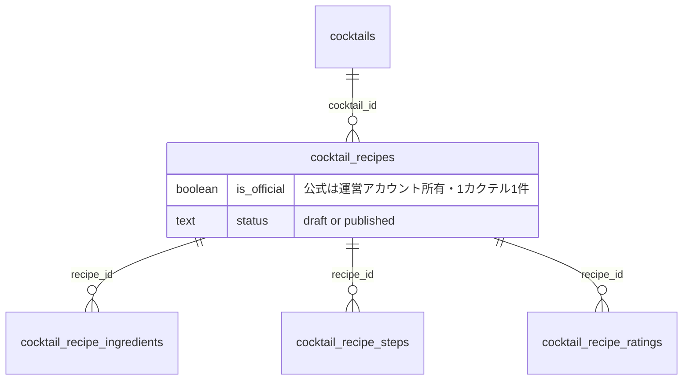
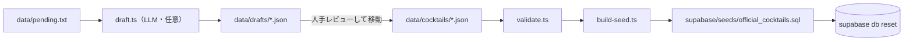

# カクテルレシピ MVP 基盤

「カクテルをクリックすると基本レシピが出て、下にユーザー投稿レシピが並び、クリックすると評価できる」という MVP を成立させるための土台を作る。3 つの関心事に依存関係があるため 1 本にまとめる。

## 現状とのギャップ

- `cocktails` マスタは説明文しか持たず、**基本レシピを入れる場所がない**
- 作り方の**手順が構造化されていない**（`memo` の自由テキスト 1 本に押し込む前提）
- 公式レシピを 300 件規模で投入する手段がない

## 完成後のデータモデル




公式レシピは専用テーブルを作らず、`cocktail_recipes` の通常行として `is_official` で区別する。材料・手順・表示コンポーネント・構造化データを投稿レシピと完全に共有でき、将来の「公式レシピをアレンジして投稿」導線も自然に作れる。

---

## Step 1: マイグレーション 2 本

関心事が別なのでファイルを分ける（同一 PR）。`supabase migration new` で作成。

### 1-a. 公式レシピ対応

```sql
ALTER TABLE cocktail_recipes
  ADD COLUMN is_official BOOLEAN NOT NULL DEFAULT false;

-- 公式が draft になると詳細ページから基本レシピが消えるため DB で禁止
ALTER TABLE cocktail_recipes ADD CONSTRAINT chk_official_is_published
  CHECK (NOT is_official OR status = 'published');

-- 1 カクテル 1 公式。cocktails.official_recipe_id による循環 FK を避ける
CREATE UNIQUE INDEX uq_cocktail_recipes_official
  ON cocktail_recipes (cocktail_id) WHERE is_official;

-- 一覧クエリは公式を除外するので部分インデックスに差し替え
DROP INDEX idx_cocktail_recipes_cocktail_id;
CREATE INDEX idx_cocktail_recipes_cocktail_id
  ON cocktail_recipes (cocktail_id, created_at DESC)
  WHERE status = 'published' AND NOT is_official;
```

公式レシピは**評価対象外**にする（平均点の歪みと運営レシピが荒れるのを避ける）。[20260724020000_create_cocktails.sql](supabase/migrations/20260724020000_create_cocktails.sql) の `cocktail_recipe_ratings_insert_own` / `_update_own` を DROP して作り直し、`EXISTS` に `AND NOT r.is_official` を追加する。

あわせて **RLS の不整合を解消**する。現状 `cocktail_recipe_ratings_select_public` は anon にも開いているのに、`cocktail_recipes_select` と `cocktail_recipe_ingredients_select` は `TO authenticated` 限定になっている。`drinks_select_public` と同じ「読み取りは anon 含め開放」に揃える（`TO authenticated` を外すだけ。anon では `auth.uid()` が NULL 評価になるため draft は漏れない）。

### 1-b. 手順テーブル

```sql
CREATE TABLE cocktail_recipe_steps (
  id         UUID PRIMARY KEY DEFAULT gen_random_uuid(),
  recipe_id  UUID NOT NULL REFERENCES cocktail_recipes(id) ON DELETE CASCADE,
  sort_order INTEGER NOT NULL DEFAULT 0,
  body       TEXT NOT NULL,
  created_at TIMESTAMPTZ NOT NULL DEFAULT now()
);

ALTER TABLE cocktail_recipe_steps ADD CONSTRAINT chk_step_body_length
  CHECK (char_length(body) >= 1 AND char_length(body) <= 500);

CREATE INDEX idx_cocktail_recipe_steps_recipe_id
  ON cocktail_recipe_steps (recipe_id, sort_order);
```

RLS は `cocktail_recipe_ingredients` と完全に同型（1-a で anon 開放するのでそちらに揃える）。

判断事項:

- `**UNIQUE (recipe_id, sort_order)` は付けない。** 将来の並び替え UPDATE で一時的な重複が起きて衝突する。既存 `cocktail_recipe_ingredients` にも無いのでそちらに揃える
- `**image_url` 列は入れない。** 手順写真の UI を今回作らないため。後から `ADD COLUMN` は無害
- **取得は `ORDER BY sort_order, id` で安定化する。** 現在の材料取得は `ORDER BY sort_order` だけで同値時の順序が不定。手順は順序が壊れると意味を失うので必須。既存の材料側も同時に直す

---

## Step 2: Go API

### [model.go](apps/api/internal/cocktail/model.go)

- `RecipeSummary` / `Recipe` に `IsOfficial bool`
- `Step` 構造体と `Recipe.Steps []Step`（`RecipeSummary` には入れない。一覧に手順は不要）
- `CocktailDetail` に `OfficialRecipe *Recipe \`json:"official_recipe,omitempty"`
- `CreateInput` に `Steps []StepInput`
- 投稿者表示用に `AuthorName *string`（後述）

`**CreateInput` に `is_official` は追加しない。** `Insert` の INSERT 文にも列を並べず DB の `DEFAULT false` に任せる。こうすると投稿エンドポイント経由で公式レシピを作る手段が存在しなくなり、**管理者ロールや管理 API を一切作らずに済む**。公式レシピの投入は Step 4 のパイプラインのみ。

### [repository.go](apps/api/internal/cocktail/repository.go)

- `cocktailRecipeCountJoin`（20-24 行）に `AND NOT r.is_official`。**これを忘れると「投稿レシピ 1 件」と表示されるのに一覧が空になる**。`recipe_count` は見出しとページネーション表示の両方に使われている
- `ListPublishedRecipes` の `WHERE` に `AND NOT r.is_official`
- `FindPublishedRecipeByID` の材料取得部（172-197 行）を `findIngredients` として切り出し、対称に `findSteps` を追加。新設する `FindOfficialRecipeByCocktailID`（`WHERE r.cocktail_id = $1 AND r.is_official`）と共有する
- `PublishedRecipeExists` を `RatableRecipeExists` に改名し `AND NOT is_official`
- `UpsertRating`（342 行）の `WHERE` にも `AND NOT r.is_official`。既存コメントの「published チェックを同一文に入れて TOCTOU を避ける」方針を維持
- `Insert` のトランザクション内、材料 INSERT ループの直後に手順 INSERT ループを追加
- レシピ取得系で `public.users` を JOIN して `display_name` を返す。`**email` は絶対に含めない**

### [service.go](apps/api/internal/cocktail/service.go)

- 詳細取得で `FindOfficialRecipeByCocktailID` を呼ぶ。`**ErrNotFound` はエラーにせず `OfficialRecipe = nil` にする。** 公式レシピを 300 件投入し切るまで「未登録のカクテル」が大量にあるのが正常状態で、ここを 404 にすると全ページが落ちる
- `published` で保存するときのみ、手順 1 件以上・材料 1 件以上を検証（`draft` では 0 件を許す）。DB の CHECK では別テーブルの件数を表現できないため service 層で行う

手順を必須にする理由は SEO。手順のないレシピは `recipeInstructions` を持てず、Google のレシピリッチリザルトの対象外になり、そのページが検索資産にならない。

---

## Step 3: Web

### 型

[packages/types](packages/types) と `apps/web/src/application/cocktails-api.server.ts` に `isOfficial` / `steps` / `officialRecipe` / `authorName` を反映。

### [カクテル詳細](apps/web/src/app/cocktails/[slug]/page.tsx)

ヘッダー → **基本レシピ（公式バッジ + 材料表 + 手順）** → `Separator` → 「みんなのレシピ」の順。公式レシピには `StarRatingDisplay` も評価ウィジェットも出さない。基本レシピの下に「このレシピをアレンジして投稿する」を置き `/my-cocktails/new?cocktail_id=...` へ渡す。

レシピカード（178-213 行）が API から返っている `image_url` を使っていないので、**写真グリッドにする**。レシピサービスは写真が生命線。投稿者名も表示する。

公式レシピがあるカクテルは、このページにも `Recipe` の JSON-LD を出す。

### [レシピ詳細](apps/web/src/app/cocktails/[slug]/recipes/[id]/page.tsx)

材料セクションの下に「作り方」セクション（番号付きリスト）を追加。`memo` は**「コツ・ポイント」に役割変更**し、材料・手順の後ろへ移す。

[JsonLd](apps/web/src/components/json-ld.tsx) をそのまま使って `schema.org/Recipe` を出力する。

```ts
{
  '@context': 'https://schema.org',
  '@type': 'Recipe',
  name: recipe.name,
  ...(recipe.imageUrl && { image: [recipe.imageUrl] }),
  ...(recipe.memo && { description: recipe.memo }),
  author: recipe.isOfficial
    ? { '@type': 'Organization', name: 'SakeHub' }
    : { '@type': 'Person', name: recipe.authorName ?? 'SakeHub ユーザー' },
  datePublished: recipe.createdAt,
  recipeCategory: 'カクテル',
  recipeYield: '1杯',
  recipeIngredient: recipe.ingredients.map((i) =>
    i.amount != null ? `${i.name} ${i.amount}${i.unit ?? ''}` : `${i.name} 適量`,
  ),
  recipeInstructions: recipe.steps.map((s, idx) => ({
    '@type': 'HowToStep', position: idx + 1, text: s.body,
  })),
  ...(recipe.totalRatings > 0 && {
    aggregateRating: {
      '@type': 'AggregateRating',
      ratingValue: recipe.averageRating, ratingCount: recipe.totalRatings,
      bestRating: 5, worstRating: 1,
    },
  }),
}
```

**必ず踏む落とし穴が 2 つある。**

`aggregateRating` は評価 1 件以上のときだけ含める。`ratingCount: 0` を出すと構造化データが丸ごと無効扱いになるリスクがあり、新規レシピは全て評価 0 件から始まる。

`image` は実在するときだけ含める。カテゴリ別のプレースホルダ画像を入れてはいけない（完成写真でない画像を入れるのはポリシー違反）。`image` を省いた `Recipe` は構造化データとしては有効で、リッチリザルトの対象外になるだけ。

補足として、年齢確認のインタースティシャルをクローラーに出すとリッチリザルトが機能しなくなる可能性がある。導入する場合はコンテンツを HTML に出力したうえでのオーバーレイにする。

### [投稿フォーム](apps/web/src/app/my-cocktails/new/cocktail-recipe-form.tsx)

材料セクション（201-265 行）の動的行 UI をそのまま手順に流用する。`IngredientRow` に対応する `StepRow`（`id`, `body`）を作り、`serializedIngredients` と同形で `serializedSteps` を hidden input に載せる。行は `Textarea`（`rows={2}`, `maxLength={500}`）で行頭に番号を表示。

`memo` のラベルを「コツ・ポイント」に、placeholder を「氷は大きめのものを使うと薄まりにくい...」等に変更。

---

## Step 4: 公式レシピ投入パイプライン

JSON データファイルを単一情報源とし、決定的な生成スクリプトで冪等な SQL を出力する。




LLM は「データを作る工程」でありパイプラインの一部にはしない。`build-seed.ts` は外部通信ゼロ・決定的で、同じ入力から常に同じ SQL を出す。

### 新規ワークスペース `packages/cocktail-seed`

[pnpm-workspace.yaml](pnpm-workspace.yaml) は既に `packages/*` を含むので追加設定不要。[packages/types/package.json](packages/types/package.json) を雛形にする。

**ランタイム依存はゼロにする。** Node.js 24 はネイティブに TypeScript を型剥がしで実行できるため `tsx` 等は不要。tsconfig に `erasableSyntaxOnly` を入れて enum などを禁じる。

```
packages/cocktail-seed/
├── data/{cocktails,drafts}/  # 1 カクテル 1 ファイル
├── data/pending.txt
├── src/{schema,validate,build-seed,draft,uuid,sql}.ts
├── package.json
└── tsconfig.json
```

### データファイル

```jsonc
{
  "slug": "gin-tonic",
  "id": null,                    // 通常 null（slug から導出）。既存 8 件のみ明示
  "name": "ジントニック",
  "nameEn": "Gin and Tonic",
  "description": "...",
  "baseSpirit": "Gin",
  "abv": 10.0,
  "originCountry": "United Kingdom",
  "aliases": ["ジン・トニック", "G&T"],
  "officialRecipe": {
    "name": "ジントニック（基本レシピ）",
    "memo": "氷はたっぷり、炭酸は最後に静かに注ぐ。",
    "ingredients": [{ "name": "ジン", "amount": 45, "unit": "ml" }],
    "steps": ["グラスに氷をたっぷり入れる。"]
  }
}
```

`aliases` は対応する列がまだないので **SQL には出力しない**。検索（`search_vector`）を作る回で使うため、LLM 生成のついでに作っておく。

### 決定的 UUID（`src/uuid.ts`）

300 件を手で採番するのは不可能なので `slug` から UUIDv5 を導出する。固定 namespace を定数化し `crypto.createHash('sha1')` で自前実装（依存追加なし）。カクテルは `uuidv5(slug)`、公式レシピは `uuidv5(slug + ':official')`。同じ slug なら常に同じ UUID になり、再生成しても差分が出ず本番でも一致する。

**既存 8 件は `c0c00000-0000-4000-8000-00000000000N` を維持する。** [seed.sql](supabase/seed.sql) 609 行以降のデモレシピがこの UUID を参照しているため、データファイルの `id` に明示して上書きする。

### バリデーション（`src/validate.ts`）

DB の CHECK 制約と同じ内容をスクリプト側でも検証する。**意図的な二重化**で、`supabase db reset` が途中で失敗して DB が中途半端になるのを防ぐ。

slug 形式と横断ユニーク性、name 1-100 文字、memo 1000 文字以内、abv 0-100、unit が `ml, g, piece, tsp, tbsp, dash, drop, oz, cl` のいずれか、amount は null か正の数、ingredients と steps が各 1 件以上、step 本文 1-500 文字、description が空でないこと。失敗時はファイル名とフィールドを列挙して非ゼロ終了。

### SQL 生成（`src/build-seed.ts`）

出力先 `supabase/seeds/official_cocktails.sql`（生成物だが git 管理する）。冒頭に「自動生成。直接編集せず再生成すること」のヘッダ。

運営ユーザーの参照方法を、当初案の `OFFICIAL_USER_ID` 環境変数から **email 固定のサブクエリに変更する**。生成 SQL に UUID をハードコードすると本番と食い違うため。

```sql
(SELECT id FROM auth.users WHERE email = 'official@sakehub.app')
```

これで環境変数が不要になり SQL が環境非依存になる。ユーザー作成は `INSERT ... SELECT ... WHERE NOT EXISTS (...)` で冪等にし、本番で Auth 経由で先に作ってあれば no-op になる（[seed.sql](supabase/seed.sql) 428 行以降のデモユーザー生成パターンを流用）。`display_name` は「SakeHub公式」。

`cocktails` は `ON CONFLICT (id) DO UPDATE`、公式レシピも upsert。材料と手順は差分更新せず `DELETE FROM ... WHERE recipe_id = ...` してから全件 INSERT する（子テーブルの差分計算は複雑さに見合わない）。

`src/sql.ts` に `quoteLiteral()` を用意しシングルクォートを二重化する。**"Bee's Knees" のようなアポストロフィを含む英名は実在するので必ず踏む。**

### 実行順序

依存は「運営ユーザー → カクテルマスタ → デモレシピ」。生成ファイルが運営ユーザー作成まで内包するので **seed.sql の分割は不要**で、生成ファイルを先に流すだけでよい。

[config.toml](supabase/config.toml) に追加:

```toml
[db.seed]
enabled = true
sql_paths = ["./seeds/official_cocktails.sql", "./seed.sql"]
```

[seed.sql](supabase/seed.sql) から既存 8 件の `INSERT INTO cocktails`（523-607 行）を削除して `data/cocktails/` へ移す。デモユーザーのレシピ（609 行以降）は seed.sql に残すが、`memo` に手順が書かれているものは Step 1-b の役割変更に合わせて書き直す。

[package.json](package.json) の `supabase:seed` は 1 ファイル指定なので 2 ファイル順次実行に更新する。

### LLM 下書き（`src/draft.ts`）

任意実行。`data/pending.txt` を読み `data/drafts/*.json` を出力する。人がレビューして `data/cocktails/` へ移す工程が品質ゲート。

`OPENAI_API_KEY` を素の `fetch` で使い依存を増やさない（[.env.example](.env.example) に既にコメント行がある）。構造化出力でスキーマを強制、10 件ずつのバッチ、レート制限時リトライ、temperature 低め。プロンプトの品質指示は「実在するレシピのみ・知らないものは創作しない・分量は標準的なレシピに従う・単位は ml に統一（IBA の cl 表記を避ける）・手順は 3-5 ステップ・日本語」。

AGENTS.md の「LLM 呼び出しは Go API 側」は本番ランタイムの規約なので、オフライン開発ツールである旨を README に明記する。

### 最初の投入範囲

いきなり 300 件を作らず、**まず既存 8 件の移行 + 主要 20 件程度でパイプラインを一周させる**。ここで手順の粒度と説明文のトーンを確定してから LLM 下書きで規模を上げる。

---

## 検証

`supabase db reset` 後に確認する。

- 公式レシピが「みんなのレシピ」一覧に出ず、`recipe_count` と一覧の実件数が一致する
- 公式レシピ未登録のカクテル詳細が 200 で描ける
- 公式レシピ ID への評価 API が 404 になる
- 同一カクテルへの 2 件目の公式 INSERT が一意制約で落ちる
- `is_official = true` かつ `status = 'draft'` の INSERT が CHECK で落ちる
- `/my-cocktails` に公式レシピが混ざらない
- 未ログインで公式レシピ・投稿レシピ・レビューが全て閲覧できる
- 手順が投稿順に表示され、`sort_order` が全て 0 のレコードでも順序が安定する
- published で手順 0 件の POST が 400、draft では通る
- 評価 0 件のレシピの JSON-LD に `aggregateRating` が無い / 画像なしレシピに `image` が無い
- 生成 SQL を 2 回流しても件数が増えず内容が更新される（冪等）
- 既存 8 件の UUID が変わらずデモレシピの紐づきが保たれる
- 不正な `unit` で `validate` が非ゼロ終了する

最後に `pnpm lint`、`pnpm type-check`、`cd apps/api && go vet ./...`。ページのソースを Google のリッチリザルトテストに貼り `Recipe` として認識されることも確認する。

## 今回のスコープ外

- `/cocktails` 一覧ページ、`cocktails.search_vector` による検索、ゼロ件検索ログ（次の PR。スキーマ依存がないので独立して進められる）
- [カクテル詳細](apps/web/src/app/cocktails/[slug]/page.tsx) 71 行のパンくず `/?category=cocktail` が必ず 0 件に着地する既存バグ。`/cocktails` 一覧を作る回で同時に直す
- 手順写真、材料からの逆引き検索、ユーザーによるカクテル種別のリクエストフォーム

