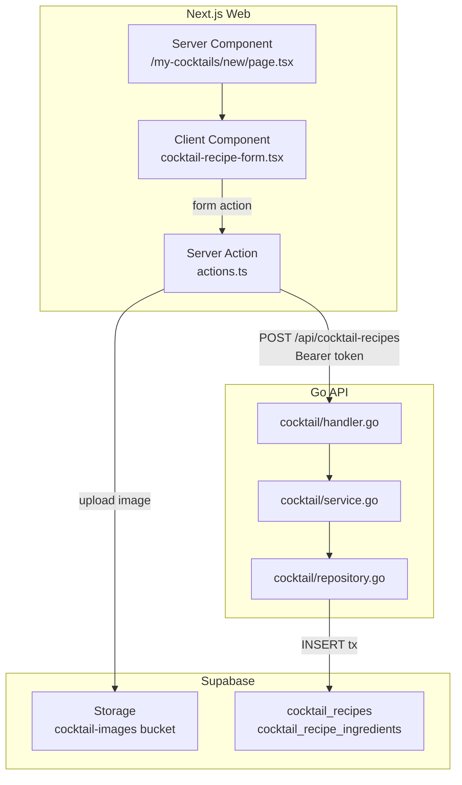

# Cocktail Recipe Registration Page

## Architecture



## Data Model

Two new tables with a parent-child relationship. Created via Supabase migration.

**`cocktail_recipes`** -- the recipe itself, owned by a user:

- `id` UUID PK
- `user_id` UUID FK -> auth.users (cascade delete)
- `name` TEXT NOT NULL (max 100 chars via CHECK)
- `memo` TEXT (max 1000 chars via CHECK)
- `image_url` TEXT (optional, Supabase Storage public URL)
- `status` TEXT ('draft' | 'published'), default 'draft'
- `created_at`, `updated_at` TIMESTAMPTZ

**`cocktail_recipe_ingredients`** -- each ingredient row:

- `id` UUID PK
- `recipe_id` UUID FK -> cocktail_recipes (cascade delete)
- `name` TEXT NOT NULL (max 100 chars)
- `amount` NUMERIC(10,2) (nullable for unmeasured ingredients)
- `unit` TEXT (nullable; values: 'ml', 'g', 'piece', 'tsp', 'tbsp', 'dash', 'drop', etc.)
- `sort_order` INTEGER NOT NULL DEFAULT 0
- `created_at` TIMESTAMPTZ

RLS policies: authenticated users can SELECT all published recipes; users can INSERT/UPDATE/DELETE their own; service_role bypasses.

## Layers

### 1. Database Migration

New file: [`supabase/migrations/<timestamp>_create_cocktail_recipes.sql`](supabase/migrations/)

### 2. Shared Types

New file: [`packages/types/src/cocktail-recipe.ts`](packages/types/src/cocktail-recipe.ts)

- `CocktailRecipe` interface (camelCase)
- `CocktailRecipeIngredient` interface
- `INGREDIENT_UNITS` const array (ml, g, piece, tsp, tbsp, dash, drop)
- `CocktailRecipeStatus` type ('draft' | 'published')

Update: [`packages/types/src/index.ts`](packages/types/src/index.ts) -- add `export * from './cocktail-recipe'`

### 3. Go API -- `internal/cocktail/` feature

Follow the existing `drink` feature pattern (handler/service/repository/model).

- **[`model.go`](apps/api/internal/cocktail/model.go)**: `CocktailRecipe`, `CocktailRecipeIngredient`, `CreateRecipeInput` structs
- **[`repository.go`](apps/api/internal/cocktail/repository.go)**: `Repository` interface with `Insert(ctx, recipe)` using a **transaction** (`BeginTx` -> insert recipe -> insert ingredients -> `Commit`)
- **[`service.go`](apps/api/internal/cocktail/service.go)**: validation (name length, at least 1 ingredient) + calls repo
- **[`handler.go`](apps/api/internal/cocktail/handler.go)**: `POST /` handler, extracts `user_id` from `middleware.UserID(ctx)`, decodes JSON body

Wire into [`internal/router/router.go`](apps/api/internal/router/router.go):

```go
cocktailH := cocktail.NewHandler(cocktail.NewService(cocktail.NewRepository(db)))

r.Group(func(r chi.Router) {
    r.Use(middleware.RequireAuth(cfg.JWTSecret))
    r.Route("/users", userH.Routes)
    r.Route("/cocktail-recipes", cocktailH.Routes)  // <-- add
})
```

The endpoint is auth-protected; `user_id` is extracted from the JWT context.

### 4. Web Frontend

**Add shadcn components** (via CLI): `textarea`, `select`

**New files under `apps/web/src/app/my-cocktails/new/`**:

- [`page.tsx`](apps/web/src/app/my-cocktails/new/page.tsx) -- Server Component, auth guard via `getUser()`, renders the form
- [`cocktail-recipe-form.tsx`](apps/web/src/app/my-cocktails/new/cocktail-recipe-form.tsx) -- `'use client'` form component:
  - Image drop zone / file input (preview with `URL.createObjectURL`)
  - Cocktail name input (required, maxLength 100)
  - Memo textarea (optional, maxLength 1000)
  - Dynamic ingredient list (add/remove rows, min 1 required):
    - Ingredient name input (required, maxLength 100)
    - Amount number input (optional)
    - Unit select dropdown (ml, g, piece, tsp, tbsp, dash, drop)
  - "Save Draft" and "Register Recipe" buttons (set hidden `status` field)
  - Uses `useActionState` for submit handling + error display
  - Ingredient rows use JSON-encoded hidden input to pass structured data via FormData
- [`actions.ts`](apps/web/src/app/my-cocktails/new/actions.ts) -- `'use server'` Server Action:
  - Parse FormData (name, memo, status, ingredients JSON, image File)
  - If image present: upload to Supabase Storage `cocktail-images` bucket via server client, get public URL
  - Get Supabase access token via `supabase.auth.getSession()`
  - POST to Go API `POST /api/cocktail-recipes` with Bearer token
  - Return `{ ok, error }` result object (never throw)
  - On success: `redirect('/my-cocktails')` or `redirect('/')` (for now redirect to home since my-cocktails list page is not yet built)

**New file**: [`apps/web/src/application/cocktail-recipes-api.server.ts`](apps/web/src/application/cocktail-recipes-api.server.ts) -- server-side API client for cocktail recipes, following the `drinks-api.server.ts` pattern

**Update**: [`apps/web/src/middleware.ts`](apps/web/src/middleware.ts) -- add `/my-cocktails` to `protectedRoutes`

### 5. Supabase Storage

Create a `cocktail-images` bucket (public). This can be done via Supabase dashboard or a migration. The Server Action will upload images to `cocktail-images/{user_id}/{uuid}.{ext}`.

### 6. Design Notes

The form follows the dark-themed SakeHub design from the screenshot:

- Dark background with warm amber/gold accent for the primary CTA button
- Dashed border on the image drop zone
- Clean spacing between form sections
- Responsive layout (single column, max-width container)
- Gold gradient or solid `primary` color for the "Register" button
- Outline variant for the "Save Draft" button
- Use existing `Input`, `Label`, `Button` components; add `Textarea` and `Select` via shadcn CLI
