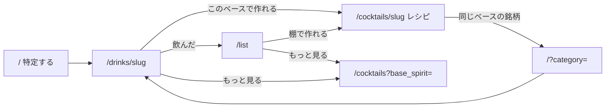

---
todos:
  - id: map-drink-detail
    status: in_progress
    content: マップ定数（category↔base_spirit）と銘柄詳細の「このベースで作れる」（未ログイン・上限 4・既存 CocktailCard）
  - id: cocktail-return
    content: カクテル詳細から `/?category=` へ戻るリンク（Cachaça は非表示）
    status: pending
  - id: list-shelf
    content: '`/list` 概要の「棚で作れる」。depth.categories の先頭マップ可能ベース + 既存 GET /api/cocktails?base_spirit= を合成。カテゴリ詳細 / pending / want には出さない'
    status: pending
  - id: lint-typecheck
    content: pnpm lint と pnpm type-check。Go は変更しない
    status: pending
name: Drink Cocktail Bridge
overview: 銘柄とカクテルを `drinks.category` ↔ `cocktails.base_spirit` の固定マップだけで繋ぐ。Web の 3 面（銘柄詳細・カクテル詳細・`/list` 棚）だけを足し、API・マスタ・リストの正は触らない。
isProject: false
---
# 銘柄とカクテルをベースで繋ぐ

対象は **Web のみ**。技術スタックは現状踏襲（Next.js 16 App Router、Server Actions、Go API、Supabase）。新規外部サービスは増やさない。既存ファイルの編集を優先する。Go・migration・seed・Mobile は触らない。

横道: `/list` の棚はログイン後だけ。主経路（未ログインの特定 → 銘柄 → 同じベースの公式カクテル → レシピ）はログイン壁を置かない。

---

## プロダクト決定（固定）

再議論しない。

- トップの約束は「銘柄を特定する」。未ログインで完結。`/` をダッシュボードにしない。ホームにカクテル棚を常設しない。
- ログイン後の約束は「特定した銘柄を自分のリストに残す」。日記でも、レビュー投稿が主目的でもない。
- 意図は 2 値だけ: `drank` / `want`。無印「リストに残す」を復活させない。
- リストの正は `saved_drinks`。`ratings` は公開の注釈。`drink_logs` はリストの正にしない（DROP しない）。
- 1人1銘柄。評価するとリストに入る、等の既存不変条件は壊さない。
- 対象は Web のみ。グローバル前提。日本向け（器・節酒・グラム）を楔にしない。
- **カクテルをリストに残すのは次フェーズ。** `saved_cocktails` も作らない。深さ分数にカクテルを混ぜない。
- 仮の印は公開検索・詳細・カクテル橋に出さない（公開 drink 詳細は既に `visibility='published'` のみ）。
- カメラ / OCR / おすすめフィード / 公開ランキング / 公開プロフィールはやらない。`/profile` は触らない。
- フレーバー評価はやらない。UI に「近日公開」も出さない。
- `/list` のカテゴリ別セクションカード・図鑑待ちは分数の外・作り手カードはカテゴリ詳細だけ、を壊さない。
- 日記 UI は主経路に戻さない。`/my-logs` exact redirect は維持。
- **橋の粒度はベースだけ。** 材料テキスト一致、`pg_trgm`、SKU↔ingredient FK は作らない。
- **マップは明示表。** Sake → Shochu、Wine → Brandy に寄せない。
- **レコメンドと言わない。** 使わない語: おすすめ、あなたへの提案、今夜の一杯、マッチ度、%。
- **残すが主語のまま。** 橋を飲んだ／飲みたいより上に置かない。「みんなの評価」より目立つ主 CTA にしない。
- **`/list` 概要で深さカードより強くしない。** 棚は分数カードと図鑑待ちの後。カテゴリ詳細 / `?pending=1` / `?status=want` には棚を出さない。

---

## データモデル決定（1案）

**スキーマは足さない。橋は Web の固定マップ + 既存 `GET /api/cocktails?base_spirit=`。** テーブル・FK・集計エンドポイント・`saved_cocktails` は作らない。Go のフィーチャー間 import（`saveddrink` ↔ `cocktail`）は禁止。

選んだ形:

- マップ定数を [`apps/web/src/config/drink-cocktail-bridge.ts`](apps/web/src/config/drink-cocktail-bridge.ts) に置く（Web 専用。`packages/types` に上げない）。
- 銘柄詳細・棚は `fetchCocktailsServer({ baseSpirit, limit: 4 })`。フィルタ値は seed / [`BASE_SPIRIT_FILTERS`](apps/web/src/config/cocktails.ts) と同じ PascalCase（`Whisky`）。SQL は `c.base_spirit = $1` の完全一致。
- 棚の入力は **既存 depth のカテゴリ**（[`ListDepth.categories`](packages/types/src/saved-drink.ts): `drank > 0` の published。分子は `saved_drinks.drank ∪ カタログ付き drink_logs`）。`want`・仮の印は使わない。一覧 GET を概要で足さない。
- 並びは既存一覧のまま: `recipe_count DESC, name ASC`（[`apps/api/internal/cocktail/repository.go`](apps/api/internal/cocktail/repository.go)）。`recipe_count` は **公式以外の published レシピ**だけを数える。seed 164 件はすべて `officialRecipe` 付きなので、ユーザー投稿が無い初期状態では実質 `name ASC`。公式優先の別ソートは **no-op** なので API を足さない。
- 件数上限は **両面とも 4**（目安 3〜6 の中央。1 つの定数 `BRIDGE_PREVIEW_LIMIT`）。

却下した案:

- **材料テキストマッチ / `pg_trgm`**: ジン＋ベルモット＝マティーニになる。精度の主戦場になり、今回の仮説（行き来できない）から外れる。
- **SKU ↔ ingredient FK**: マスタ確定と seed 拡充が先。drink category も `base_spirit` も新設しない、と矛盾する。
- **棚専用集計 API**（「このユーザーの drank ベースで作れるカクテル」）: Web が depth のカテゴリと既存一覧を合成すれば足りる。`saveddrink` が `cocktails` を見るか、逆 import が必要になる。
- **カクテルを depth に混ぜる / `saved_cocktails`**: 次フェーズ。分数の主語がカテゴリの埋まりから外れる。
- **非対応カテゴリを近縁ベースへ寄せる**（Sake→Shochu、Wine→Brandy、Beer→ホッピー）: seed 上 Kir は `Liqueur`、Champagne Cocktail は `Brandy`、Hoppy Set は `Shochu`。Wine / Beer / Sake を寄せると嘘のヒットになる。
- **Web 新規カルーセル / カタログカードの新バリアント**: [`cocktail-card.tsx`](apps/web/src/components/cocktails/cocktail-card.tsx) をそのまま使う。
- **複数ベースを 1 レスポンスにまとめるクエリ拡張**（`base_spirit=Whisky,Gin`）: 棚は先頭のマップ可能ベース 1 つに絞るので不要。
- **公式フラグでソートする公開 API**: 全 seed が公式付き。既存 `recipe_count DESC` で足りる。

---

## category ↔ base_spirit（seed で確定）

出典: [`packages/cocktail-seed/data/cocktails`](packages/cocktail-seed/data/cocktails) 164 件。`baseSpirit` が null の公式カクテルは 0。Sake / Beer / Wine を `baseSpirit` に持つ公式カクテルは **0 件**。Cachaça 銘柄の drink category は **無い**（drink-seed に cachaça 0）。

| drinks.category | cocktails.base_spirit | 公式カクテル件数 | 橋 |
| --- | --- | --- | --- |
| whisky | Whisky | 25 | 双方向 |
| gin | Gin | 30 | 双方向 |
| vodka | Vodka | 25 | 双方向 |
| rum | Rum | 25 | 双方向 |
| tequila | Tequila | 15 | 双方向 |
| shochu | Shochu | 15 | 双方向 |
| brandy | Brandy | 12 | 双方向 |
| liqueur | Liqueur | 12 | 双方向 |
| sake | （なし） | 0 | 非対応 |
| beer | （なし） | 0 | 非対応 |
| wine | （なし） | 0 | 非対応 |
| other | （なし） | 0 | 非対応 |
| （drink category なし） | Cachaca | 5 | カクテル→銘柄は出さない |

ヘルパ（config に閉じる）:

- `baseSpiritForDrinkCategory(category): 'Whisky' | ... | null`
- `drinkCategoryForBaseSpirit(baseSpirit): Exclude<DrinkCategory, 'all'> | null`（`Cachaca` は `null`）

### 非対応の表示ルール（1案: 非表示）

空カードを並べない。静かな一文も出さない（「このベースでは作れません」は、寄せていないことを説明しきれず、欠落に見える）。

- 銘柄詳細（sake / beer / wine / other）: 橋セクションごと出さない。
- `/list` 概要: マップできる drank カテゴリが 1 つも無い（Beer だけの棚など）→ 棚ごと出さない。深さカードはそのまま。
- カクテル詳細（Cachaça など逆マップ無し）: 戻りリンクを出さない。ベース Badge は現状維持。
- マップ対象なのに API が 0 件 / 失敗: セクション非表示（drink 詳細を落とさない。`fetchCocktailsServer` は非 OK で throw するので try/catch）。

---

## API

**既存で足りる。契約を増やさない。**

| 面 | 既存呼び出し |
| --- | --- |
| 銘柄詳細 | 公開 `GET /api/cocktails?base_spirit=Whisky&limit=4`（未ログイン可） |
| `/list` 棚 | 既存 `GET /api/auth/saved-drinks/depth`（概要は既に取得済み）+ 公開 `GET /api/cocktails?base_spirit=` 1 回 |
| カクテル→銘柄 | 新規 fetch なし。`/?category=whisky` へ `Link` |

足す案（`has_official`、複数 `base_spirit`、棚専用 JOIN）は却下。公開ランキング用の集計も作らない。

Web 側の薄いラッパは既存 [`apps/web/src/application/cocktails-api.server.ts`](apps/web/src/application/cocktails-api.server.ts) に足してよい（throw せず `[]`）。Go の `cocktail` / `saveddrink` は変更しない。

棚が複数カテゴリを持つとき（1案）: `depth.categories` の既存順（件数 → 埋まり率 → 名前）で **最初のマップ可能カテゴリ 1 つ**だけを使う。例: Sake 200 + Whisky 180 なら Sake は飛ばして Whisky。もっと見るは `/cocktails?base_spirit=Whisky`。全ベースのユニオンは API 増か N 回 fetch になるのでやらない。

---

## Web 3 面の情報設計

### 1. 銘柄詳細 [`apps/web/src/app/drinks/[slug]/page.tsx`](apps/web/src/app/drinks/[slug]/page.tsx)

位置: 説明 → **残す（飲んだ／飲みたい）** → **このベースで作れる** → 評価 / みんなの評価。サイドバーの基本情報は触らない。

- 残すブロックより上に置かない。塗りボタンや大きな数字は付けない（主 CTA は残すのまま）。
- 未ログインでも出す。ログイン壁は残す側のまま。
- カードは既存 `CocktailCard`。グリッドは `grid-cols-1 sm:grid-cols-2`（[`CocktailGrid`](apps/web/src/components/cocktails/cocktail-grid.tsx) の空状態「見つかりませんでした」は流用しない）。
- 上限 4。もっと見る → `/cocktails?base_spirit={Whisky}`。
- 実装: マップ非対応なら fetch しない。対応なら公開 fetch。共有プレビューは [`apps/web/src/components/cocktails/base-cocktail-preview.tsx`](apps/web/src/components/cocktails/base-cocktail-preview.tsx)（新規 1。カルーセルではない）。

### 2. `/list` 概要 [`apps/web/src/app/list/page.tsx`](apps/web/src/app/list/page.tsx)

位置（概要のみ）:

1. カテゴリ別深さカード（既存）
2. 図鑑待ち破線カード（既存）
3. **棚で作れる**（今回）
4. 飲みたいを見る（既存テキストリンク）

- `?category=` / `?pending=1` / `?status=want` では棚を出さない（フィルタと深さ切替を壊さない）。
- 概要が空（drank も図鑑待ちも無い）でも棚は出さない。
- 深さカードを Card + 分数 + フィルで包む形を棚にコピーしない。見出し + カード 4 + テキストの「もっと見る」。
- 飲みたいはカード化しない（薄い避難口のまま）。棚をその上に置くが、飲みたいを消したり同等カードにしない。
- `ListDepth` 型・Go depth SQL は触らない。

### 3. カクテル詳細 [`apps/web/src/app/cocktails/[slug]/page.tsx`](apps/web/src/app/cocktails/[slug]/page.tsx)

- 説明 + 基本情報 dl の下、基本レシピの上に **テキストリンク 1 本**。銘柄カードも検索 API も足さない。
- 逆マップできるときだけ: `同じベースの銘柄を探す` → `/?category={whisky}`（既存ホームフィルタ。[`apps/web/src/app/page.tsx`](apps/web/src/app/page.tsx) の `?category=`）。
- Cachaça（[`caipirinha`](packages/cocktail-seed/data/cocktails/caipirinha.json) 等 5 件）: リンク無し。
- ベース Badge を `/cocktails?base_spirit=` にリンクする変更はこの PLAN ではやらない。

---

## コピー案

使わない: おすすめ、あなたへの提案、今夜の一杯、マッチ度、%、レシピ募集を橋の見出しにすること。

| 面 | 見出し | 補足 | もっと見る | 非対応 / 空 |
| --- | --- | --- | --- | --- |
| 銘柄詳細 | このベースで作れる | `{Whisky} ベースの公式カクテル`（`drinkCategoryLabel` ではなく base_spirit 表記。一覧チップと揃える） | 同じベースのカクテル | 非表示 |
| `/list` 概要 | 棚で作れる | 飲んだ `{Whisky} ベース` | 同じベースのカクテル | 非表示 |
| カクテル詳細 | （見出しなし） | 同じベースの銘柄を探す | （リンクそのもの） | 非表示 |

---

## やらないこと

- 材料逆引き、類似度、パーソナライズ並び替え
- カクテルをリストに残す、`saved_cocktails`、深さ分数へのカクテル混入
- フレーバー評価・レーダー・「近日公開」
- 公開プロフィール、共有リンク、リーダーボード
- `/` をダッシュボードにする、ホームにカクテル棚を常設する
- `/my-logs` 復活、銘柄ページから日記へ送る
- Mobile / i18n / OCR / AI
- 公式カクテル seed の追加、drink category / `base_spirit` 値の新設
- 企業向けフレーバー・マスタ確定

---

## 受け入れ条件

ユーザー操作で検証する。計測基盤は新しく作らない。

- **未ログイン**で [`/drinks/yamazaki-12`](packages/drink-seed/data/drinks/yamazaki-12.json)（`category=whisky`）を開き、「このベースで作れる」から公式カクテル詳細（例: `/cocktails/highball` または一覧の Whisky 行）へ辿り、基本レシピが見える。ログイン CTA は「残す」側にだけある。
- 同じページの「同じベースのカクテル」が `/cocktails?base_spirit=Whisky` を開き、既存ベースチップが Whisky で選ばれている。
- **未ログイン**で [`/drinks/dassai-23`](packages/drink-seed/data/drinks/dassai-23.json)（sake）および [`/drinks/kirin-lager-beer`](packages/drink-seed/data/drinks/kirin-lager-beer.json)（beer）を開き、カクテル橋が出ない。Wine / Other も同様。Shochu 寄せのヒットが無い。
- カクテル詳細 [`/cocktails/highball`](packages/cocktail-seed/data/cocktails/highball.json) から「同じベースの銘柄を探す」で `/?category=whisky` に戻り、ウイスキー銘柄が出る。
- [`/cocktails/caipirinha`](packages/cocktail-seed/data/cocktails/caipirinha.json)（Cachaca）に銘柄への戻りリンクが無い。drink category が増えていない。
- ログインし whisky を `drank` にした `/list` 概要で、深さカードと図鑑待ちの **後** に「棚で作れる」があり、カクテル詳細へ辿れる。`/list?category=whisky`・`?pending=1`・`?status=want` には棚が無い。
- beer（または sake / wine / other）だけ `drank` の `/list` に棚が出ない。深さカードは出る。
- `/list` の分数・図鑑待ちカード・作り手（カテゴリ詳細）・飲みたいテキストリンクが残っている。カクテルが分数に混ざらない。
- `/` の見出し「銘柄を特定する」と検索／カテゴリの順が変わらない。ログイン後もダッシュボードにならない。
- コピーに「おすすめ」「マッチ度」「近日公開」が無い。

---

## 実装順

棚のために先に API を増やさない。3 は 1 のマップを再利用する。

1. **マップ定数と銘柄詳細** — `drink-cocktail-bridge.ts`、cocktails-api の fail-closed ヘルパ、共有プレビュー、`/drinks/[slug]`。未ログイン経路を最初に通す。
2. **カクテル詳細から銘柄へ戻る** — 逆マップ + `/?category=`。Cachaça は出さない。
3. **`/list` 棚** — 概要のみ。`depth.categories` の先頭マップ可能ベース + 既存 `base_spirit` GET。カテゴリ詳細／pending／want は触らない。

検証: `pnpm lint` / `pnpm type-check`。Go は変更しないので `go vet` は不要。

---

## 既存不変条件を壊さない確認

- 残すが主。橋は残すの下。無印 CTA を復活させない。
- depth 分数の SQL / 型 / 並びを変えない。カクテルを分子・分母に入れない。
- 図鑑待ちは分数の外の破線カードのまま。`pending=1`。
- `/my-logs` exact は `/list`。[`apps/web/src/app/my-logs/page.tsx`](apps/web/src/app/my-logs/page.tsx) は触らない。ナビに日記を戻さない。
- `/` をダッシュボード化しない。最近残した 1 行は既存のまま。
- カクテルを残さない。`saved_cocktails` なし。
- 仮の印を公開詳細・橋に出さない（公開 slug 解決は published のみのまま）。
- `maxListLimit=100` を触らない。

---

## 既存プランとの差分

既存プランの本文は書き換えない。

- [identify_save_list](.cursor/plans/identify_save_list_98da0e7a.plan.md) / [intent_list_status_note](.cursor/plans/intent_list_status_note_6b916cd3.plan.md): 特定→残す→リストは継承。今回足すのはカタログ間のベース橋だけ。
- [list_depth_map](.cursor/plans/list_depth_map_1b590ec1.plan.md) / [list_section_cards](.cursor/plans/list_section_cards_45721bff.plan.md): 深さカード・図鑑待ち・作り手の置き場は継承。棚は概要の二次セクション。
- [cocktail_recipe_mvp_foundation](.cursor/plans/cocktail_recipe_mvp_foundation_839f535b.plan.md): 既存 `base_spirit` フィルタと公式レシピを使う。seed は増やさない。

---

## 要確認

本文の決定は緩めていない。実装時の目視メモだけ。

1. **一覧の `recipe_count` は公式レシピを含まない。** 初期 seed では橋の 4 件は日本語名順になりやすい（ウイスキーなら「アイリッシュコーヒー」等が先頭）。受け入れは「Whisky の公式詳細へ辿れる」であり、ハイボールが必ず 4 件に入ることではない。
2. **Wine 材料のカクテルはベースが Liqueur / Brandy**（Kir、Champagne Cocktail）。Beer 材料の Hoppy Set は Shochu。非対応カテゴリから出さないのは意図どおり。
3. **ローカル demo の rater はほぼ全カテゴリ `drank`。** 棚は Sake（非対応）を飛ばし、次のマップ可能（件数的に Whisky になりやすい）だけ出す。受け入れの「Beer だけ drank」は非デモユーザーか、他カテゴリを外した状態で見る。
