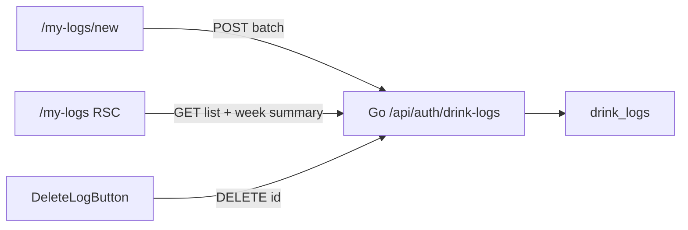

---
todos:
  - id: persist-plans
    status: in_progress
    content: AGENTS.md にプラン保存ルールを追加し、欠落している drink_volume_logs 初回プランを .cursor/plans/ に復元する
  - id: go-update
    content: 'Go drinklog に GET /{id} と PATCH /{id}（FindByID/Update、normalizeItem 再利用、stub + unit test）'
    status: pending
  - id: types-update
    content: packages/types に DrinkLogUpdateInput を追加
    status: pending
  - id: zod-actions
    content: Zod 4 を apps/web に導入し、共有スキーマ + create/update Server Action で safeParse。日付は Asia/Tokyo
    status: pending
  - id: web-edit
    content: '/my-logs/[id]/edit と共有行 UI。一覧から編集リンク'
    status: pending
  - id: web-day-sections
    content: /my-logs を 30 日取得 + 東京暦日セクション（杯数・純アル g）
    status: pending
  - id: verify
    content: go vet / go test ./internal/drinklog / pnpm lint / web type-check
    status: pending
name: Drink logs refactor
overview: 自分の飲酒記録に編集・日付セクション集計・Zod バリデーションを足す。フォームは React Hook Form ではなく既存の useActionState + 共有 Zod スキーマ（Server Action が正、クライアントは任意の事前チェック）にする。あわせてプランを `.cursor/plans/` に残す運用を AGENTS.md に固定する。
isProject: false
---

# 飲酒記録の編集・日次集計・Zod リファクタ

Request ID `aa01814c-e946-4e53-8e8c-64bd820af9d9` で入った現行実装（[`/my-logs`](apps/web/src/app/my-logs/page.tsx) / [`/my-logs/new`](apps/web/src/app/my-logs/new/new-log-form.tsx) / [`internal/drinklog`](apps/api/internal/drinklog)）を正とする。DB の UPDATE RLS と `updated_at` トリガーは既にあるが、Go / Web に更新経路がない。一覧は flat な直近 50 件。バリデーションは手書き。

## 判断: useActionState + 共有 Zod（RHF は入れない）

一次ソース:

- [Next.js 16 Forms guide](https://nextjs.org/docs/app/guides/forms)（2026-07-28）: `<form action>` + Server Action 内 Zod `safeParse` + `useActionState` でエラー表示
- [React `useActionState`](https://react.dev/reference/react/useActionState)
- 既存規約: [`apps/web/AGENTS.md`](apps/web/AGENTS.md) セクション 5（Server Actions / `useActionState` / uncontrolled 優先）
- 既存フォーム（login / signup / cocktail / drink log）はすべてこの型。`zod` / `react-hook-form` は未導入

**useActionState を選ぶ理由**

- このアプリは RSC ファーストで、ミューテーションの正は Server Action → Go API。RHF はクライアント状態マシンであり、ネイティブ `action` と相性が悪い（`preventDefault` + 手動呼び出しになりやすい）
- 記録フォームの複雑さは RHF が得意な「巨大なネスト field array」ではなく、オートコンプリート・プリセットチップ・杯数ステッパーという **既に `useState` で動いているウィジェット**。RHF を足してもこの部分は controlled のまま残る
- 編集画面は **1件** なので、新規のバッチ行より単純。RHF を入れる動機がさらに薄い
- ログイン後専用なので progressive enhancement 必須ではないが、公式デフォルトと既存コードを割るコストの方が大きい

**Zod の置き場所（SSR ではない）**

「SSR で Zod」は誤解になりやすい。ページの Server Component 描画時には検証しない。

- **正（必須）**: Server Action 内で同じスキーマを `safeParse`。ブラウザ改ざん・curl 対策。Next 公式と同じ
- **UX（推奨）**: クライアントでも同じスキーマを `safeParse` して submit 前の `canSubmit` / フィールドエラーに使う（今の手書き `canSubmit` の置き換え）
- Go API の `normalizeItem` / serving 規則は残す（換算・プリセット整合はドメインロジック）

導入: `apps/web` に **Zod 4**（`z.flattenError` / `z.treeifyError`。`.flatten()` は deprecated）。スキーマは [`apps/web/src/utils/drink-log-schema.ts`](apps/web/src/utils/drink-log-schema.ts)（fetch しないので `utils/`）。`packages/types` には置かない（FormData 変換は Web 専用）。

バッチ items はネスト配列なのでエラー整形は `z.treeifyError`。編集（フラット）は `z.flattenError`。

## 現状とギャップ

無いもの: `GET /{id}`、`PATCH /{id}`、編集 UI、日次グループ、Zod。

## 1. プラン保存の仕様（忘れ防止 + 前回分の補完）

CreatePlan は `.cursor/plans/` に書くが、前回の飲酒記録プランはリポジトリに残っていない。実装時に次を行う。

- ルート [`AGENTS.md`](AGENTS.md) に短い「プランの保存」節を追加する
  - Plan / Cloud Agent / Request ID 起点でも、成果物の markdown を **必ず** [`.cursor/plans/`](.cursor/plans/) に残す
  - Cursor UI 上だけにしない。実装後も削除しない
  - ファイルが無ければ会話内容から再作成する
- 欠落している初回プランを [`.cursor/plans/drink_volume_logs.plan.md`](.cursor/plans/drink_volume_logs.plan.md) として復元する（会話 `5dca4ab6` の CreatePlan が原典）。末尾に「実際の実装との差分」を追記する（ドリンク詳細フォームは未実装、代わりに `/my-logs/new` バッチ・カスタム銘柄・場所・杯数）

このリファクタプラン自体は CreatePlan が [`.cursor/plans/`](.cursor/plans/) に残す。

## 2. Go API: 取得と更新

[`handler.go`](apps/api/internal/drinklog/handler.go) の `/summary` より後に:

- `GET /{id}` — 所有者のみ。他人・不存在は 404（存在漏洩しない）
- `PATCH /{id}` — 1件更新

[`model.go`](apps/api/internal/drinklog/model.go) に `UpdateInput`（`CreateItemInput` + 任意の `drank_at` / `place_name` / `place_url`）。

Service は既存 `normalizeItem` + `applyServingRules` を再利用。Repository に `FindByID`（list と同じ JOIN）と `Update`（`WHERE id AND user_id`）。[`service_test.go`](apps/api/internal/drinklog/service_test.go) の stub にメソッド追加し、更新の XOR・quantity・preset をテスト。

[`packages/types/src/drink-log.ts`](packages/types/src/drink-log.ts) に `DrinkLogUpdateInput` を追加。

## 3. Zod + Server Actions

[`drink-log-actions.ts`](apps/web/src/application/drink-log-actions.ts):

- `createDrinkLogBatch`: FormData → オブジェクト化 → `drinkLogBatchSchema.safeParse`。失敗時は `{ ok: false, error, fieldErrors }`（throw しない）
- `updateDrinkLog`: 同様に `drinkLogUpdateSchema`
- 日付は `YYYY-MM-DD` を **Asia/Tokyo の暦日** として ISO 化する（現状の `new Date(y, m, d)` はサーバー TZ 依存で、Vercel 上だと日次セクションがずれる）

スキーマの要点（Go / DB 制約と揃える）:

- items 1–20、quantity 1–20、`input_unit` `ml|oz`、`input_value` > 0（ml ≤ 2000 / oz ≤ 70）
- `drink_id` XOR `custom_drink_name`
- `place_name` ≤ 200、`place_url` ≤ 2000（任意。http(s) なら URL として refine）

## 4. 編集 UI

新規 [`apps/web/src/app/my-logs/[id]/edit/page.tsx`](apps/web/src/app/my-logs/[id]/edit/page.tsx)（RSC: token → `GET /{id}` → なければ `notFound()`）。

フォームは新規バッチと **行 UI を共有**し、編集は 1 行 + 日付 + 場所。`proxy.ts` の `/my-logs` prefix で保護済み。

一覧各行に「編集」リンク。成功後 `revalidatePath('/my-logs')` して一覧へ。

## 5. 一覧を日付セクションにする

[`page.tsx`](apps/web/src/app/my-logs/page.tsx) を RSC のまま:

- 取得を「直近 50 件」から **直近 30 日**（既存 `from`/`to`）に変更し、日を途中で切らない
- `drank_at` を `Asia/Tokyo` の暦日でグループ（`Intl` に `timeZone: 'Asia/Tokyo'`）
- セクション見出し: 日付（例: 8月12日（水））+ **杯数（quantity 合計）** + **純アルコール g**（`pureAlcoholGrams(volumeMl * quantity, abv)`。ABV なしは週次と同じく未算入件数）
- 週次カードは維持。健康判定コピーは出さない

日次合計は一覧レスポンスの `drink.abv` から RSC で計算する（日ごとに summary API を叩かない）。

## スコープ外

- ドリンク詳細ページへの記録フォーム（初回プランにあったが未実装のまま）
- RHF / shadcn Form
- ページネーション、酔い自己申告、公的ガイドライン比較
- Mobile
