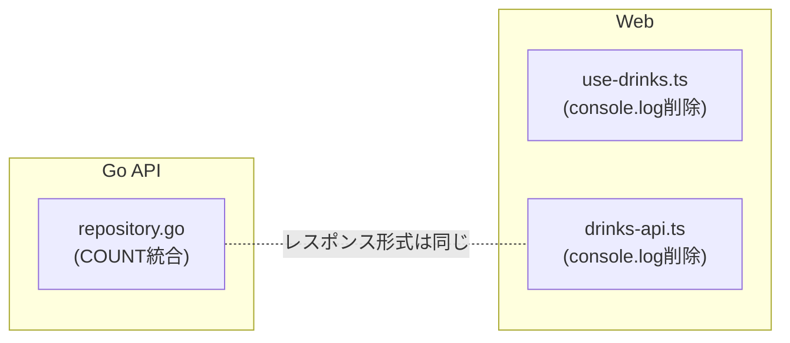

# Drink 検索リファクタリング

## 背景

現状の `List` は **COUNT クエリとデータ取得クエリの2本**を毎回発行しており、同じ重い `strpos` フィルタが2回走る。
お酒マスタは当面数千行規模なので `pg_trgm` 等の導入は時期尚早だが、COUNT の二重スキャンは今すぐ削れる無駄。

---

## 変更 1: COUNT を window function で1クエリに統合 (Go API)

**対象**: [apps/api/internal/drink/repository.go](apps/api/internal/drink/repository.go)

現状は2本のクエリを発行している:

```go
// 1本目: COUNT だけ
countQ := "SELECT COUNT(*) FROM drinks ..."
// 2本目: データ取得
q := "SELECT ... FROM drinks ... LIMIT ... OFFSET ..."
```

これを **`COUNT(*) OVER()` window function** で1本に統合する:

```sql
SELECT id, slug, name, ..., COUNT(*) OVER() AS total
FROM drinks
WHERE ...
ORDER BY created_at DESC
LIMIT $n OFFSET $m
```

変更点:

- `List` メソッドから `countQ` / `QueryRowContext` を削除
- メインクエリの SELECT に `COUNT(*) OVER() AS total` を追加
- `Scan` で `total` を各行から読み取る（全行同じ値。0件なら rows が空なので total=0）
- 戻り値の `([]Drink, int, error)` シグネチャはそのまま

**注意**: 結果が0件のとき `rows.Next()` が呼ばれないため `total = 0` のまま返る。これは現状と同じ挙動。

---

## 変更 2: Repository インターフェースへの影響

**対象**: [apps/api/internal/drink/repository.go](apps/api/internal/drink/repository.go) の `Repository` interface、[apps/api/internal/drink/service.go](apps/api/internal/drink/service.go)

シグネチャ `List(ctx, params) ([]Drink, int, error)` は変わらないため、**interface / service / handler は変更不要**。

---

## 変更 3: デバッグ用 `console.log` を削除 (Web)

**対象**:

- [apps/web/src/application/use-drinks.ts](apps/web/src/application/use-drinks.ts) --- L15 `console.log('useDrinks')`
- [apps/web/src/application/drinks-api.ts](apps/web/src/application/drinks-api.ts) --- L80-81 `console.log('fetchDrinks')` / `console.log(res)`

開発中に残った `console.log` を削除する。

---

## 変更しないもの

- **フロント最小文字数制約**: 追加しない。debounce 300ms + `TrimSpace` で空文字は弾けており、日本語は1文字でも意味ある検索語になるため不要
- **`pg_trgm` / PGroonga**: 現段階では不要。データが増えて `EXPLAIN ANALYZE` で遅延が確認できてからマイグレーションで導入する
- **`search_vector` の既存 GIN インデックス**: 英語トークン検索で引き続き有用なので残す
- **API レスポンス形式** (`data`, `total`, `limit`, `offset`): 変更なし

---

## 影響範囲



変更ファイルは **3ファイル**。API レスポンス形式に変更がないため、フロントとバックの結合に影響なし。
