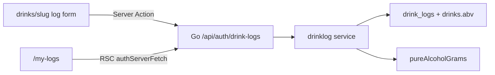

# Drink Logs（飲酒量記録）実装プラン

> 復元元: 会話 `5dca4ab6-510a-4f2c-bea6-64582f38c885` の CreatePlan。リポジトリに未保存だったため再作成。

## プロダクト決定（相談内容の固定）

- **核**: 何を・どれだけ飲んだかを正確に残し、量を可視化する（健康判定・医療アドバイスは出さない）
- **評価と分離**: `ratings`（味の好み）と `drink_logs`（摂取）は別テーブル・別 UI
- **量入力**: カテゴリ別日本語プリセット（中ジョッキ等）＋数値 Input（`ml` | `oz` トグル）
- **正規化**: 保存の正は `volume_ml`。oz は US fl oz `× 29.5735` で変換（UI に地域コピーは出さない）
- **確度**: プリセット未編集 → `estimated` / 手入力 or プリセット値の変更 → `exact`
- **対象**: Web のみ（Mobile は対象外）。Auth 必須・他人非公開
- **第1弾に含めない**: 酔い自己申告、公的ガイドライン比較、店舗別ジョッキ、カクテルレシピへのログ

## アーキテクチャ



評価と同じく **Go API + Server Actions**（BFF Route Handler は作らない）。

## 1. DB（Supabase migration）

新規: `supabase/migrations/YYYYMMDDHHMMSS_create_drink_logs.sql`

```sql
CREATE TABLE drink_logs (
  id                UUID PRIMARY KEY DEFAULT gen_random_uuid(),
  user_id           UUID NOT NULL REFERENCES auth.users(id) ON DELETE CASCADE,
  drink_id          UUID NOT NULL REFERENCES drinks(id) ON DELETE CASCADE,
  drank_at          TIMESTAMPTZ NOT NULL DEFAULT now(),
  volume_ml         NUMERIC(8,2) NOT NULL,
  input_unit        TEXT NOT NULL,          -- 'ml' | 'oz'
  input_value       NUMERIC(8,2) NOT NULL,  -- ユーザーが見た数字
  serving_key       TEXT,                   -- プリセット時のみ
  volume_precision  TEXT NOT NULL,          -- 'exact' | 'estimated'
  created_at        TIMESTAMPTZ NOT NULL DEFAULT now(),
  updated_at        TIMESTAMPTZ NOT NULL DEFAULT now(),
  CHECK (volume_ml > 0 AND volume_ml <= 2000),
  CHECK (input_value > 0),
  CHECK (input_unit IN ('ml', 'oz')),
  CHECK (volume_precision IN ('exact', 'estimated'))
);
```

- RLS: **SELECT/INSERT/UPDATE/DELETE すべて `auth.uid() = user_id` のみ**
- Index: `(user_id, drank_at DESC)`, `(drink_id)`
- `updated_at` トリガーは既存 `update_updated_at()` を再利用

## 2. 共有定数（プリセット辞書）

`packages/types` に拡張し、Web が参照。Go は同じ `serving_key` allowlist を service で検証。

純アルコール: `volume_ml × (abv/100) × 0.789`（g）。`abv` 欠損時は週次合計から除外し UI で「度数不明のため未算入」と表示。

## 3. Go API（`internal/drinklog`）

| Method | Path | 用途 |
|---|---|---|
| `GET` | `/` | 自分のログ一覧（`limit`/`offset`、任意 `from`/`to`） |
| `GET` | `/summary?from=&to=` | 期間の純アル g 合計・ログ件数（週次用） |
| `POST` | `/` | 作成 |
| `DELETE` | `/{id}` | 自分のログのみ削除 |

- 配線: `apps/api/internal/router/router.go` の `/api/auth` 配下
- Service 責務: oz→ml 変換、serving_key allowlist、precision 規則、`volume_ml` 算出、drink 存在確認、summary では `drinks.abv` JOIN

## 4. 型（`packages/types`）

- `inputUnit`, `inputValue`, `volumeMl`, `servingKey?`, `volumePrecision`, `drankAt`, 一覧用に `drink?: { id, slug, name, category, abv }`
- `DrinkLogCreateInput` / `DrinkLogSummary` を追加

## 5. Web UI

### 5.1 ドリンク詳細から記録

ドリンク詳細ページの評価ブロック近くに「飲んだ記録」セクションを想定。

### 5.2 `/my-logs`（保護ルート）

- `proxy.ts` に `/my-logs` を追加
- 今週の純アルコール合計（g）と件数
- 直近ログ一覧

## 6. 検証

- `go vet` / service unit tests
- `pnpm lint`
- 手動: 中ジョッキ → estimated 300ml / 手入力 9oz → exact ~266.2ml / 週次 g 表示

---

## 実際の実装との差分

初回実装（Request ID `aa01814c-e946-4e53-8e8c-64bd820af9d9` 周辺）では、プランから次のように逸脱・拡張した。

| プラン | 実際 |
|---|---|
| ドリンク詳細ページに記録フォーム | **未実装**。代わりに [`/my-logs/new`](apps/web/src/app/my-logs/new/) の専用登録画面 |
| `POST /` 単件作成 | **バッチ作成**（複数銘柄を同じ日時・場所で一括） |
| `drink_id` 必須 | **カスタム銘柄**（`custom_drink_name`）を許可。カタログ XOR |
| 場所フィールドなし | `place_name` / `place_url` を追加 |
| 杯数なし | `quantity`（1–20）を追加。`volume_ml` は 1杯あたり |
| UPDATE API | RLS のみ。Go / Web の編集経路は後続リファクタ（`drink_logs_refactor_*.plan.md`）で追加 |

関連 follow-up: [`.cursor/plans/drink_logs_refactor_49b49220.plan.md`](drink_logs_refactor_49b49220.plan.md)
