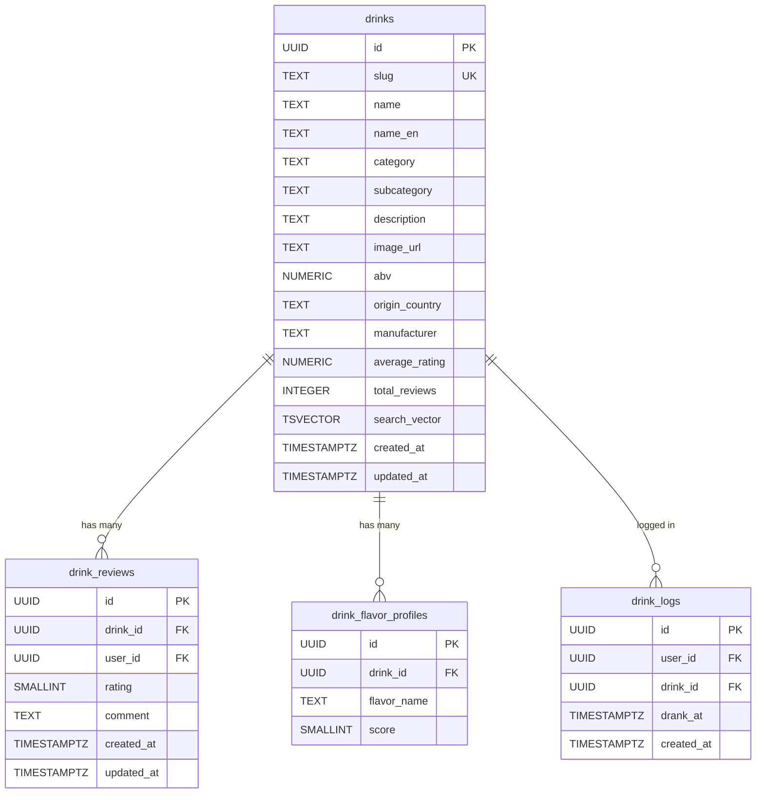

# Drinks DB Schema Design

## 現状

- `supabase/migrations/` ディレクトリが存在しない（マイグレーション未作成）
- `supabase/seed.sql` はプレースホルダのみ
- Go API の `internal/drink/repository.go` は `id, name, category, abv, created_at, updated_at` を SELECT している
- `packages/types/src/drink.ts` に `Drink` / `DrinkReview` 型が定義済み（DB 側はまだ存在しない）

---

## 1. drinks テーブル設計

`supabase migration new create_drinks` でファイル生成後、以下の SQL を記述する。

```sql
CREATE TABLE drinks (
  id              UUID PRIMARY KEY DEFAULT gen_random_uuid(),
  slug            TEXT UNIQUE NOT NULL,
  name            TEXT NOT NULL,
  name_en         TEXT,
  category        TEXT NOT NULL,
  subcategory     TEXT,
  description     TEXT NOT NULL DEFAULT '',
  image_url       TEXT,
  abv             NUMERIC(4,1),
  origin_country  TEXT,
  manufacturer    TEXT,
  average_rating  NUMERIC(3,2) NOT NULL DEFAULT 0,
  total_reviews   INTEGER NOT NULL DEFAULT 0,
  created_at      TIMESTAMPTZ NOT NULL DEFAULT now(),
  updated_at      TIMESTAMPTZ NOT NULL DEFAULT now()
);
```

### カラム設計の意図

| カラム                             | 設計判断                                                                                          |
| ---------------------------------- | ------------------------------------------------------------------------------------------------- |
| `id` (UUID)                        | auto-increment INT ではなく UUID を採用。分散環境で衝突しない、URL 推測攻撃を防ぐ                 |
| `slug` (UNIQUE)                    | SEO フレンドリーな URL `/drinks/yamazaki-12` を実現。UUID を URL に露出させない                   |
| `category` (TEXT + CHECK)          | ENUM 型ではなく TEXT + CHECK 制約。カテゴリ追加時に `ALTER TYPE` 不要でマイグレーションが楽       |
| `subcategory`                      | 別テーブルに切り出さず nullable TEXT。現段階では正規化コストに見合わない                          |
| `name_en`                          | 日英混在検索に対応。`name` は日本語表記優先                                                       |
| `abv` NUMERIC(4,1)                 | 小数点1桁（例: 43.0%）。FLOAT ではなく NUMERIC で丸め誤差を防ぐ                                   |
| `average_rating` / `total_reviews` | 非正規化した集計値。一覧画面で毎回 JOIN + AVG する N+1 を回避。レビュー追加時にトリガーで更新予定 |

### CHECK 制約

```sql
ALTER TABLE drinks ADD CONSTRAINT chk_drinks_category
  CHECK (category IN (
    'beer','wine','whisky','sake','shochu',
    'vodka','gin','rum','tequila','brandy',
    'liqueur','cocktail','other'
  ));
```

`packages/types/src/drink.ts` の `DRINK_CATEGORIES`（`'all'` を除く）と一致させる。

---

## 2. インデックス設計

```sql
-- カテゴリフィルタ: WHERE category = 'whisky'
CREATE INDEX idx_drinks_category ON drinks (category);

-- slug 検索: WHERE slug = 'yamazaki-12' (UNIQUE 制約で暗黙的に作成されるが明示)
-- → UNIQUE 制約が自動で B-tree インデックスを作るため追加不要

-- 全文検索用 generated column + GIN インデックス
ALTER TABLE drinks ADD COLUMN search_vector tsvector
  GENERATED ALWAYS AS (
    setweight(to_tsvector('simple', coalesce(name, '')), 'A') ||
    setweight(to_tsvector('simple', coalesce(name_en, '')), 'A') ||
    setweight(to_tsvector('simple', coalesce(manufacturer, '')), 'B') ||
    setweight(to_tsvector('simple', coalesce(description, '')), 'C')
  ) STORED;

CREATE INDEX idx_drinks_search ON drinks USING GIN (search_vector);
```

- `simple` 辞書を使用: 日本語/英語混在で形態素解析に依存しない分かち書きベースの検索。日本語の本格的な全文検索が必要になったら `pgroonga` 拡張に切り替える
- Weight A > B > C: 名前一致を最優先、製造者、説明文の順

---

## 3. RLS ポリシー

```sql
ALTER TABLE drinks ENABLE ROW LEVEL SECURITY;

-- 誰でも閲覧可能（SEO + 未ログインユーザーのブラウジング）
CREATE POLICY "drinks_select_public" ON drinks
  FOR SELECT USING (true);

-- 挿入/更新/削除は service_role のみ（管理者操作）
-- anon/authenticated ロールからの書き込みをブロック
CREATE POLICY "drinks_modify_service_only" ON drinks
  FOR ALL USING (false) WITH CHECK (false);
```

`SELECT` ポリシーが `true` なので anon/authenticated ともに読み取り可。書き込みは `service_role` がデフォルトで RLS をバイパスするため、明示的な許可ポリシーは不要。

---

## 4. updated_at 自動更新トリガー

```sql
CREATE OR REPLACE FUNCTION update_updated_at()
RETURNS TRIGGER AS $$
BEGIN
  NEW.updated_at = now();
  RETURN NEW;
END;
$$ LANGUAGE plpgsql;

CREATE TRIGGER drinks_updated_at
  BEFORE UPDATE ON drinks
  FOR EACH ROW EXECUTE FUNCTION update_updated_at();
```

汎用関数として作成し、将来の `drink_reviews` 等でも再利用する。

---

## 5. 将来テーブルの設計（コメントとして migration に記載）

実テーブルは作成せず、SQL コメントで設計意図を残す。

### drink_reviews（将来）

```
-- drink_reviews: ユーザーによるお酒評価（星5つ）
--   id UUID PK, drink_id UUID FK -> drinks(id) ON DELETE CASCADE,
--   user_id UUID FK -> auth.users(id), rating SMALLINT CHECK (1-5),
--   comment TEXT, created_at, updated_at
--   UNIQUE(drink_id, user_id): 1ユーザー1レビュー制約
--   → drinks.average_rating / total_reviews をトリガーで自動更新
```

### drink_flavor_profiles（将来）

```
-- drink_flavor_profiles: フレーバー評価（レーダーチャート用）
--   id UUID PK, drink_id UUID FK -> drinks(id) ON DELETE CASCADE,
--   flavor_name TEXT NOT NULL (例: 'sweetness','bitterness','body','aroma','acidity'),
--   score SMALLINT CHECK (1-5)
--   UNIQUE(drink_id, flavor_name): 1ドリンク1フレーバー軸で1レコード
--   → EAV パターンではなく正規化テーブル。フレーバー軸の数が飲み物カテゴリで異なるため
--     固定カラム（sweetness INT, bitterness INT, ...）ではなく行で持つ
```

### drink_logs（将来）

```
-- drink_logs: ユーザーの飲酒記録
--   id UUID PK, user_id UUID FK -> auth.users(id),
--   drink_id UUID FK -> drinks(id), drank_at TIMESTAMPTZ, created_at
--   → ダッシュボードの頻度分析・種類別グラフ・直近リストに使用
```

---

## 6. Seed Data

[supabase/seed.sql](supabase/seed.sql) に ~30 件のリアルなお酒データを INSERT する。

- **Beer** (4-5件): Asahi Super Dry, Sapporo Premium, Yebisu, Guinness Draught, IPA系
- **Wine** (3-4件): Opus One, Chateau Margaux, 甲州ワイン等
- **Whisky** (4-5件): Yamazaki 12, Hibiki Harmony, Macallan 12, Maker's Mark, Jameson
- **Sake** (4-5件): Dassai 23, Kubota Manju, Juyondai, Hakkaisan
- **Cocktail** (2-3件): ユーザー登録前提だが代表的なもの (Mojito, Old Fashioned等)
- **Other categories** (各1-2件): shochu, vodka, gin, rum, tequila, brandy, liqueur

各レコードに `slug`, `name`, `name_en`, `category`, `subcategory`, `description`, `abv`, `origin_country`, `manufacturer` を設定。

---

## 7. TypeScript 型の更新

[packages/types/src/drink.ts](packages/types/src/drink.ts) を DB スキーマに合わせて更新する。

```typescript
export type Drink = {
  id: string;
  slug: string;
  name: string;
  nameEn?: string;
  category: Exclude<DrinkCategory, 'all'>;
  subcategory?: string;
  description: string;
  imageUrl?: string;
  abv?: number;
  originCountry?: string;
  manufacturer?: string;
  averageRating: number;
  totalReviews: number;
  createdAt: string;
  updatedAt: string;
};
```

---

## 8. Go API モデル更新

[apps/api/internal/drink/model.go](apps/api/internal/drink/model.go) と [apps/api/internal/drink/repository.go](apps/api/internal/drink/repository.go) の SELECT/INSERT クエリを新カラムに合わせて更新する。List エンドポイント (`GET /api/drinks?category=&q=`) を追加し、handler/service/repository に検索・フィルタロジックを実装する。

---

## ER 図



実線 = 今回作成、破線テーブル (drink_reviews, drink_flavor_profiles, drink_logs) = 将来作成

---

## 実行手順

1. `supabase migration new create_drinks` でマイグレーションファイル生成
2. SQL を記述（テーブル、インデックス、RLS、トリガー、将来設計コメント）
3. `supabase/seed.sql` にダミーデータ記述
4. `packages/types/src/drink.ts` の型を更新
5. Go API の model / repository / handler を更新（List エンドポイント追加）
6. `supabase db reset` でローカル DB にマイグレーション + シード適用を確認
7. `pnpm type-check && cd apps/api && go vet ./...` で検証
