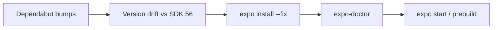

# Expo / Actions メジャー更新の修正案

## 対象になったメジャー更新

| 領域 | From → To | 根拠 PR / 状態 |
| --- | --- | --- |
| `expo` | 54 → **56** | [#12](https://github.com/tomoya07oga/sakehub/pull/12)（SDK 55 をスキップ） |
| `expo-linking` / `expo-constants` / `expo-status-bar` | 旧メジャー → **56.x** | #31–#33 |
| NativeWind | v4 → **v5 preview** + Tailwind **v4** | 設定は一部移行済み、ドキュメント未追従 |
| TypeScript (mobile) | 5.9 → **6.0.3** | #26（SDK 56 テンプレートと同系） |
| `actions/checkout` | 4 → **7** | #36 |
| `actions/setup-node` | 4 → **6** | #5 |

一次ソース:

- [Expo SDK 56 changelog](https://expo.dev/changelog/sdk-56)
- [Expo SDK 55 changelog](https://expo.dev/changelog/sdk-55)（スキップ分）
- [NativeWind v5 migrate-from-v4](https://www.nativewind.dev/v5/guides/migrate-from-v4)
- [actions/checkout v7](https://github.com/actions/checkout) / [actions/setup-node v6](https://github.com/actions/setup-node)

---

## 現状の最大問題: Expo 公式バンドルとのずれ

`apps/mobile/node_modules/expo/bundledNativeModules.json` と [`apps/mobile/package.json`](apps/mobile/package.json) を突合すると、**Dependabot が Expo 互換表を無視して上げた**結果になっている。

| パッケージ | 現状 | SDK 56 期待値 | 深刻度 |
| --- | --- | --- | --- |
| `react-native` | **0.86.0** | **0.85.3** | 高（#40 で誤バンプ） |
| `expo-router` | **~6.0.23** | **~56.2.8** | 高（バージョニングが SDK 連動に変更） |
| `expo-system-ui` | **~6.0.9** | **~56.0.5** | 高（同上） |
| `react-native-reanimated` | ~4.5.1 | 4.3.1 | 中 |
| `react-native-screens` | ~4.26.0 | 4.25.2 | 中 |
| `react-native-safe-area-context` | ~5.8.0 | ~5.7.0 | 低〜中 |
| `react-native-worklets` | **未インストール** | Reanimated 4 の peer | 高 |

公式アップグレード手順は常に次の順:

```bash
cd apps/mobile
npx expo install expo@^56.0.0 --fix
npx expo-doctor@latest
```

`pnpm add` / Dependabot の単独バンプでは ABI が壊れる。今後 mobile の RN 系は Dependabot から外すか、`expo install` 必須のルールを明記する。



---

## 修正案 A: Expo SDK 56 整合（最優先）

対象: [`apps/mobile/package.json`](apps/mobile/package.json), [`apps/mobile/app.json`](apps/mobile/app.json), [`apps/mobile/app/_layout.tsx`](apps/mobile/app/_layout.tsx)

### A1. 依存を SDK 56 にピンし直す

```bash
cd apps/mobile
npx expo install expo@^56.0.0 --fix
npx expo install react-native-reanimated react-native-worklets
```

期待される結果（抜粋）:

- `react-native` → `0.85.3`
- `expo-router` → `~56.x`（**6.x のままにしない**）
- `expo-system-ui` → `~56.x`
- `react-native-worklets` を明示追加（[Expo Reanimated docs](https://docs.expo.dev/versions/latest/sdk/reanimated/)）

### A2. `app.json` を SDK 55/56 の breaking change に合わせる

SDK 55 で:

- `newArchEnabled` は削除済み（New Arch 強制）
- `edgeToEdgeEnabled` は削除済み（edge-to-edge 強制）

SDK 55+ の推奨に合わせ、トップレベル `splash` は `expo-splash-screen` プラグインへ移す。

```json
{
  "expo": {
    "plugins": [
      "expo-router",
      [
        "expo-splash-screen",
        {
          "image": "./assets/splash-icon.png",
          "resizeMode": "contain",
          "backgroundColor": "#1a1a1a"
        }
      ]
    ]
  }
}
```

あわせて `newArchEnabled` / `android.edgeToEdgeEnabled` / トップレベル `splash` を削除。

### A3. edge-to-edge 向け Safe Area

ルート [`apps/mobile/app/_layout.tsx`](apps/mobile/app/_layout.tsx) に `SafeAreaProvider` を追加（現状未使用）。Android edge-to-edge 強制後は必須級。

### A4. Expo Router / React Navigation 分離（予防）

SDK 56 で `expo-router` は React Navigation から fork。アプリコードに `@react-navigation/*` 直接 import は現状なしだが、今後のために:

```bash
npx expo-codemod sdk-56-expo-router-react-navigation-replace app
```

を一度走らせ、差分ゼロを確認。

### A5. 影響が小さい / 現状コードでは未使用の項目

- `expo/fetch` が `globalThis.fetch` 既定 → Supabase / `api-client` は追加対応不要（問題時のみ `EXPO_PUBLIC_USE_RN_FETCH=1`）
- `@expo/vector-icons` は transitive 依存が消えた → 使う画面が出たら明示インストール
- iOS 最低 16.4 / Xcode 26.4 → EAS を使うなら image を明示、またはデフォルト追従をドキュメント化
- Expo Go for SDK 56 はストア未配信 → **development build 前提**に AGENTS を更新

---

## 修正案 B: NativeWind v5 を公式どおり完了させる

設定の大半は既に v5 形:

- [`global.css`](apps/mobile/global.css): Tailwind v4 `@import` 済み
- [`metro.config.js`](apps/mobile/metro.config.js): `withNativewind(config)` 済み
- [`babel.config.js`](apps/mobile/babel.config.js): NativeWind babel 除去済み
- [`postcss.config.mjs`](apps/mobile/postcss.config.mjs): あり
- `tailwind.config.ts` 削除済み

未完了（[公式 migrate guide Step 6](https://www.nativewind.dev/v5/guides/migrate-from-v4)）:

1. **`lightningcss@1.30.1` を pin**（未設定だと `global.css` の deserialize エラーが起きうる）

ルート [`package.json`](package.json) に pnpm overrides:

```json
{
  "pnpm": {
    "overrides": {
      "lightningcss": "1.30.1"
    }
  }
}
```

2. Reanimated **v4 は v5 の前提**（旧 AGENTS の「Reanimated v3 必須」は逆）。`react-native-worklets` 追加後に整合。
3. キャッシュクリア: `npx expo start --clear`
4. ドキュメント更新（下記 D）

プレビューであること（`5.0.0-preview.3`）は残すが、パッケージが既に v5 なので **ロールバックせず完了させる**方針とする。

---

## 修正案 C: GitHub Actions（ほぼ変更不要、確認のみ）

対象: [`.github/workflows/build-lint-check.yml`](.github/workflows/build-lint-check.yml)

現状:

```yaml
- uses: actions/checkout@v7
- uses: pnpm/action-setup@v4
- uses: actions/setup-node@v6
  with:
    node-version: 24
    cache: 'pnpm'
```

### `actions/checkout@v7`

Breaking: `pull_request_target` / `workflow_run` で fork PR の危険な checkout をデフォルト拒否。  
この workflow は `pull_request` + `push` のみ → **追加変更不要**。今後 privileged trigger を足す場合は `allow-unsafe-pr-checkout` を安易に true にしない。

### `actions/setup-node@v6`

- v5: ランタイム Node 24、自動 cache 挙動変更
- v6: npm 以外は **明示 `cache` が必要**、`always-auth` 削除

既に `cache: 'pnpm'` + Node 24 なので **現行 YAML は正しい**。`always-auth` も未使用。

任意の改善:

- `pnpm/action-setup@v4` に `version:` をルート `packageManager`（`pnpm@11.0.4`）と揃えて明示
- mobile を CI で見るなら `expo-doctor` / `pnpm --filter @sakehub/mobile lint` を別 step で追加（現状 `pnpm build` は web 中心の可能性）

---

## 修正案 D: ドキュメント同期（実装とセット）

古い記述がエージェントを誤誘導するため、依存修正と同 PR で更新:

- ルート [`AGENTS.md`](AGENTS.md): `Expo SDK 54 / RN 0.81 / NativeWind v4` → `SDK 56 / RN 0.85 / NativeWind v5 + Tailwind v4`
- [`apps/mobile/AGENTS.md`](apps/mobile/AGENTS.md):
  - スタック表・制約を SDK 56 / NW v5 向けに書き換え
  - 「Reanimated v3 必須」「Tailwind v3 維持」を削除し、**worklets + Reanimated v4** に差し替え
  - `tailwind.config.ts` 必須の記述を削除、`postcss.config.mjs` + CSS `@theme` に更新
  - Expo Go 非推奨 / dev build 推奨を追記

---

## 検証手順（実装後）

```bash
cd apps/mobile
npx expo install --fix
npx expo-doctor@latest
pnpm --filter @sakehub/mobile lint
npx expo start --clear
# iOS/Android 実機 or シミュレータでタブ・className 表示確認
```

ルート:

```bash
pnpm lint && pnpm type-check
```

CI: 上記 workflow が green であること（checkout@v7 / setup-node@v6 のまま）。

---

## 実装順序（推奨）

1. `expo install --fix` + `react-native-worklets`（バージョンずれ解消）
2. `app.json` / `_layout.tsx`（SDK 55/56 config + SafeArea）
3. `lightningcss` override（NativeWind v5 安定化）
4. AGENTS.md 更新
5. Actions は現状維持 + 任意で pnpm version 明示 / mobile doctor step
6. `expo-doctor` + lint + 起動確認
