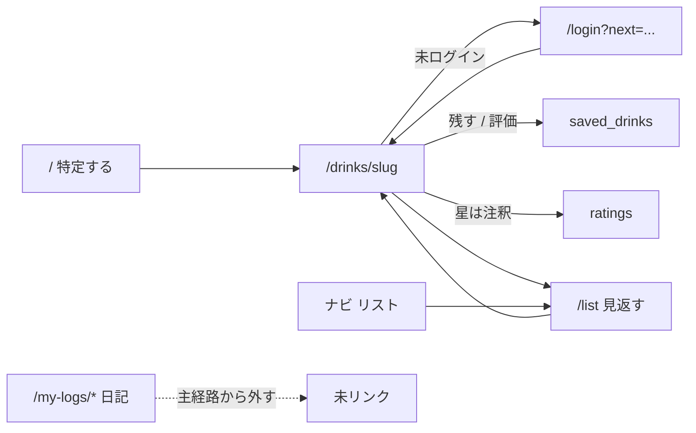

---
todos:
  - id: copy-home
    status: in_progress
    content: トップコピー・metadata/JSON-LD・バナー削除・検索/カテゴリ時のページネーション
  - id: saved-drinks-data
    content: saved_drinks migration + RLS + トリガー + ratings バックフィル + Go CRUD + types
    status: pending
  - id: drink-sequential
    content: 銘柄詳細の残す sequentialと評価の同居。フレーバー節削除
    status: pending
  - id: list-page
    content: /list を銘柄見返しにする。/my-logs exact redirect。日記 UI を主経路から外す
    status: pending
  - id: nav-empty-auth
    content: ナビ「リスト」、空状態、login next、プロフィール、カクテル一覧コピー、最近残した
    status: pending
name: Identify Save List
overview: 未ログインでは銘柄を特定し、ログイン後は1人1銘柄のリストに残す。リストの正は新規 `saved_drinks`。既存の `drink_logs` 日記 UI は主経路から外し、テーブルと API は DROP しない。
isProject: false
---

# 銘柄を特定し、リストに残す

対象は **Web のみ**。Mobile / i18n / AI Chat は触らない。技術スタックは現状踏襲（Next.js App Router、Server Actions、Go API、Supabase）。新規外部サービスは増やさない。

---

## プロダクト決定（固定）

再議論しない。

- **トップの約束**: 銘柄を特定する。未ログインで完結する。
- **ログイン後の約束**: 特定した銘柄を自分のリストに残す。日記でも、レビュー投稿が主目的でもない。
- **評価**: 消さない。残すことの任意の注釈。
- **対象**: Web のみ。グローバル前提。日本向け（器プリセット、節酒、グラム集計）を楔にしない。
- **今回やらない**: search miss のユーザー向け体験、個人ブログ的パブリッシュ。

個人オブジェクト（1人1銘柄）:

- 残す（星なし可） → リストに入る。未評価でよい
- 評価する → 星が付く。同時にリストに入る
- 評価を消す → 星だけ消える。リストには残る
- リストから外す → マークごと消える（星もコメントも消える）
- 「評価したのにリストに無い」は作らない
- 量・日付・場所は銘柄ページの必須にしない
- 銘柄ページから `/my-logs/new` へ送らない

---

## データモデル決定（1案）

**リストの正は新規テーブル `saved_drinks`（薄い印）。`ratings` は注釈、`drink_logs` は日記として残すがリストには使わない。**

却下した案:

- **`drink_logs` をリストの正にする**: 1ユーザー×1銘柄の UNIQUE が無い。`volume_ml` / `drank_at` / `quantity` が必須で、カスタム銘柄（`custom_drink_name`）も許す。セッション履歴であり、1人1銘柄の印にならない。
- **`ratings` をリストの正にする**: `rating SMALLINT NOT NULL CHECK (1–5)` のため星なし保存が表せない。「評価を消す」は現状行 DELETE なので、行＝リストだとリストからも消える。RLS は `SELECT USING (true)` で公開。未評価の印をここに置くと公開レビューと私的リストが混ざる。

選んだ形:

- `saved_drinks`: `user_id` + `drink_id` の UNIQUE。所有者のみ RLS。公開しない。
- `ratings`: 今どおり公開の星＋コメント。`UNIQUE (drink_id, user_id)` のまま。
- `drink_logs`: テーブル・Go API・既存サブルートは **DROP しない**。主 UI から外す。ログ行をリストへ自動移行しない（粒度が違う。カスタム銘柄は `drinks` に無い）。

不変条件（DB トリガーで保証。Go のフィーチャー間 import を増やさない）:

- `ratings` への INSERT/UPDATE → 同じ `(user_id, drink_id)` を `saved_drinks` に UPSERT
- `saved_drinks` の DELETE → 同じ組の `ratings` を DELETE
- `ratings` の DELETE では `saved_drinks` を消さない

既存 `ratings` はマイグレーションで `saved_drinks` にバックフィルする（評価済み＝リスト済み）。`drink_logs` からはバックフィルしない。

Go: 新規 `apps/api/internal/saveddrink`（`drinklog` と同じ薄い CRUD）。`review` の upsert/delete はトリガーに任せるので、評価 API の契約は変えない。

| 操作            | API                                                                                          |
| --------------- | -------------------------------------------------------------------------------------------- |
| 残す            | `POST /api/auth/saved-drinks` `{ drink_id }`（idempotent）                                   |
| 外す            | `DELETE /api/auth/saved-drinks/{drink_id}`（トリガーで星も消える）                           |
| 一覧            | `GET /api/auth/saved-drinks`（drink JOIN、任意で自分の rating LEFT JOIN、`created_at DESC`） |
| 銘柄ページ用    | `GET /api/auth/saved-drinks/mine?drink_id=`                                                  |
| 評価する / 消す | 既存 `POST/DELETE /api/auth/reviews`                                                         |

Web は既存どおり Server Action → Go。Supabase クライアントから `saved_drinks` を直接叩かない（`ratings` / `drink_logs` と同じ）。

---

## 1. 共通シェル（Header / Footer / ナビ）

### 現状

- [apps/web/src/components/layouts/header.tsx](apps/web/src/components/layouts/header.tsx): ロゴ `/`、「お酒」`/`、「カクテル」`/cocktails`、ログイン時のみ「記録」`/my-logs`、未ログイン CTA は「Login」`/login`、ログイン時アバター `/profile`。
- [apps/web/src/components/layouts/footer.tsx](apps/web/src/components/layouts/footer.tsx): コピーライトのみ。
- ルート [apps/web/src/app/layout.tsx](apps/web/src/app/layout.tsx) の metadata は Discover / review / share 調。
- [apps/web/src/proxy.ts](apps/web/src/proxy.ts): `/profile`, `/my-cocktails`, `/my-logs` を保護。未ログインは `/login` へ（`next` なし）。

### このページの約束

ログイン前後でトップの骨格は変えない。未ログイン CTA はヘッダー Login のまま。ナビは「リスト」を見返す入口。本文で日記やレビューを売らない。

### 変更内容（UI / コピー / 導線）

- 「記録」→「リスト」、href は `/list`。
- Footer は触らない。
- ルート metadata / keywords を「探す・特定する」に合わせる（ページ 2 と同時でよい）。
- `proxy.ts` に `/list` を追加。`/my-logs` は日記サブルート用に残す。
- 保護ルートへ来た未ログインは `/login?next=<path>`（相対パスのみ。`//` 禁止）。

### データ・API

なし（metadata とナビと proxy）。

### やらないこと

- ログイン後ダッシュボード化、モバイル用別ナビの新設、i18n、フッターにプロダクト説明を足すこと。

### 受け入れ条件

- ログイン後ナビに「リスト」があり `/list` へ行く。「記録」ラベルが残っていない。
- 未ログインのヘッダー CTA は Login のまま。トップがログインの有無で別レイアウトにならない。

---

## 2. トップ `/`

### 現状

- [apps/web/src/app/page.tsx](apps/web/src/app/page.tsx): H1 `Discover Spirits`、補足「お気に入りのお酒を見つけて、レビューを共有しましょう」。初期 `limit: 20`。JSON-LD も Explore / review / share。
- [apps/web/src/components/drinks/drink-list-client.tsx](apps/web/src/components/drinks/drink-list-client.tsx): カクテル案内バナー → カテゴリ＋検索 → グリッド。件数表示のみでページネーションなし（API の `offset` は未使用）。
- [apps/web/src/components/drinks/drink-search.tsx](apps/web/src/components/drinks/drink-search.tsx): placeholder「お酒を検索...」。ボタン「検索」は [confirmed-search-input.tsx](apps/web/src/components/catalog/confirmed-search-input.tsx) に既存。
- `SearchMissLogger` は確定検索のゼロヒットを既存どおり送る（運用は維持。ユーザー向け miss UX は足さない）。

### このページの約束

未ログインでも銘柄を特定できる。検索が主。ログイン後も同じ骨格。残した銘柄があるときだけ、検索下に「最近残した」1行。

採用コピー:

- 見出し: 銘柄を特定する
- 補足: ラベルや名前の手がかりから、商品単位で探す
- 検索プレースホルダ: 銘柄名・別名で検索
- 検索ボタン: 検索

### 変更内容（UI / コピー / 導線）

- H1 / 補足 / placeholder / JSON-LD / ルート metadata を上記に置換。`Discover Spirits` と「レビューを共有しましょう」は使わない。
- 並び: 見出し → 検索 → カテゴリチップ →（任意）最近残した → 一覧。
- カクテルバナーは外す（ヘッダー「カクテル」で足りる）。
- 検索前（`q` も `category` も無し）: 先頭 20 件の棚。ページネーションなし。
- `q` または `category` があるとき: 結果が主。カクテル一覧と同じ `offset` URL で「前へ / 次へ」（ラベルは「もっと見る / 次へ」でも可。既存カクテル一覧に合わせ「前へ / 次へ」を推奨）。Go `/api/drinks` の limit/offset はそのまま使う。
- ログインかつ `saved_drinks` が1件以上のときだけ、検索下に「最近残した」横1行（銘柄名リンク、件数は少なく。空なら出さない）。

### データ・API

- 公開ドリンク一覧は既存。
- 「最近残した」だけ `GET /api/auth/saved-drinks?limit=`（未ログインでは呼ばない）。

### やらないこと

- ログイン後ホームのダッシュボード化、日記・週次グラム、search miss のユーザー向け空状態、カクテルをリストに残すこと。

### 受け入れ条件

- 未ログインで検索→詳細まで完結する。
- 指定コピー以外の Discover / レビュー共有がトップ本文・metadata・JSON-LD に無い。
- カクテルバナーが無い。
- フィルタ無しは 20 件で打ち切り。検索またはカテゴリ時は次ページに進める。
- 「最近残した」は保存があるログイン時だけ。空なら DOM に出ない。

---

## 3. 銘柄詳細 `/drinks/[slug]`

### 現状

- [apps/web/src/app/drinks/[slug]/page.tsx](apps/web/src/app/drinks/[slug]/page.tsx): 説明の直後が「評価」（公開平均＋個人ウィジェット＋みんなの評価）。未ログインは「ログインすると星評価を付けられます」。フレーバー「近日公開」。量・日付・場所フォームは無い。`/my-logs/new` へのリンクも無い。
- 個人評価は [drink-review-widget.tsx](apps/web/src/app/drinks/[slug]/drink-review-widget.tsx) → 共有 [entity-rating-widget.tsx](apps/web/src/components/ratings/entity-rating-widget.tsx)（カクテルレシピでも使用）。「取り消す」は rating 行 DELETE。

### このページの約束

説明の直後・「みんなの評価」の前に、残すことが主。評価は任意の注釈。量・日付・場所は置かない。

Sequential（この4状態）:

- 未ログイン: `[ ログインしてリストに残す ]`（「ログインすると星評価を付けられます」は使わない）。`/login?next=/drinks/[slug]`
- ログイン・未保存: 主 `[ リストに残す ]`、副 `評価する`（リンクまたは secondary）。評価保存でリストにも入る（トリガー）。
- ログイン・保存済み・未評価: `リストに追加済み` / `[ 評価する ]` / `リストから外す`
- ログイン・保存済み・評価済み: `リストに追加済み` + 星 + コメント / `[ 評価を編集 ]` / `リストから外す`

評価ダイアログ（星必須・コメント任意）は維持。「評価を消す」は編集まわりの三次アクションとして残す（リストには残る）。カクテル用 `EntityRatingWidget` の文言は変えない。

### 変更内容（UI / コピー / 導線）

- 公開平均星と「みんなの評価」は個人アクションの下に残す。H2「評価」は公開側に寄せ、個人ブロックは sequential 用の新しい見出しにしないか、「リスト」側の短い状態表示にする。
- フレーバープロファイル節を削除（非表示でも可。削除を推奨）。
- ドリンク専用コンポーネントを [drink-review-widget.tsx](apps/web/src/app/drinks/[slug]/drink-review-widget.tsx) の編集で足す（新規ディレクトリは作らない）。ダイアログ中身は既存 `EntityRatingWidget` を内側で再利用してよい。
- 外すは確認なしでも可（既存削除と同じ軽さ）。成功後 `router.refresh()`。

### データ・API

- 上記 `saved-drinks` + 既存 reviews。
- ページ RSC は `getOptionalAccessToken` 済みなので、ログイン時は mine save + mine review を並列取得。

### やらないこと

- 量・プリセット・日付・場所、`/my-logs/new` への送出、フレーバー本実装、カクテルを残すこと。

### 受け入れ条件

- 4状態が指定どおり。未ログイン文面に星評価誘導が無い。
- 星なし保存ができる。評価するとリストに入る。評価削除後もリストに残る。リストから外すと星もコメントも無い。
- 公開平均とみんなの評価が個人ブロックの下に残る。
- 「近日公開」が出ない。セッション入力へのリンクが無い。

---

## 4. リスト（旧 `/my-logs`）

### 現状

日記型。主語はセッションとグラム。

- [apps/web/src/app/my-logs/page.tsx](apps/web/src/app/my-logs/page.tsx): H1「飲んだ記録」、主 CTA「記録を追加」→ `/my-logs/new`、顔が「今週の摂取量」（純アルコール g・杯数）、直近30日を暦日セクション。空状態は「まだ記録がありません」→ `/my-logs/new`。
- サブ: `/my-logs/new`（バッチ・カスタム銘柄・場所・量）、`/my-logs/[id]/edit`、`/my-logs/days/[date]/edit`。
- Go: [apps/api/internal/drinklog](apps/api/internal/drinklog)（list / summary / batch / day replace / patch / delete）。
- テーブルは3本の migration（量、場所とカスタム、杯数）。UNIQUE(user, drink) なし。

### このページの約束

残した銘柄を見返す。入力先ではない。並びの主語は銘柄。

**ルート**: `/list` に変える。`/my-logs` の exact は `/list` へリダイレクト。`/my-logs/new` などサブはリダイレクトしない（日記の逃げ道として URL 直打ちのみ）。

**週次純アルコール**: **後回し**。`/list` に出さない（折りたたみもしない）。Go `GET /summary` は残す。健康判定はしない。

### 変更内容（UI / コピー / 導線）

新規 [apps/web/src/app/list/page.tsx](apps/web/src/app/list/page.tsx)（このルートのためファイル追加は正当）。既存 my-logs 一覧ファイルは redirect に縮める。

- H1: リスト（または「残した銘柄」）。補足は見返し。主 CTA「記録を追加」は置かない。
- カード/行は銘柄（名前、任意の自分の星、詳細へのリンク、外す）。`created_at DESC`。
- 空: 「まだリストに銘柄がありません」＋ トップ（検索）へ。`/my-logs/new` へ送らない。
- 週次 g・杯数・日次セクション・この日を編集・量・場所は出さない。

既存日記機能の縮退（推測 DROP しない）:

- **残す**: `drink_logs` テーブル、RLS、Go CRUD / summary、`/my-logs/new`, `/my-logs/[id]/edit`, `/my-logs/days/[date]/edit`、関連 Server Actions / Zod / プリセット。
- **非表示**: ヘッダー、`/list`、銘柄ページ、プロフィール、空状態からのリンク。主 CTA にしない。
- **移行しない**: ログ → `saved_drinks` の自動変換なし。カスタム銘柄はカタログに無いのでリスト対象外のまま。
- カタログ外メモ（`custom_drink_name` + search_miss insert）は search miss までの逃げ道。`/my-logs/new` に残すがリストの顔にしない。

### データ・API

- 一覧は `GET /api/auth/saved-drinks`。外すは DELETE。
- `drink_logs` API は日記サブルート用に残す。

### やらないこと

- 日記を主体験として残すこと、グラムをリストの顔にすること、カスタム銘柄をリストの主 CTA にすること、テーブル DROP、カクテルをリストに入れること。

### 受け入れ条件

- `/list` は銘柄の見返し。記録追加 CTA と週次 g が無い。
- 空状態はトップへ。`/my-logs` は `/list` へ。`/my-logs/new` は直打ちで動くがナビに無い。
- リストの行は1銘柄1行。同じ銘柄の複数セッションで増えない。

---

## 5. カクテル `/cocktails` および `/cocktails/[slug]`

### 現状

- 一覧: 「カクテルを探す」。metadata / 補足がアレンジ投稿・みんなのアレンジ。ページネーション「前へ / 次へ」済み。
- 詳細: 公式レシピ＋コミュニティ投稿 CTA（「このレシピをアレンジして投稿する」等）。リスト保存は無い。

### このページの約束

今は「特定する + 公式レシピを見る」。カクテルをリストに残すのは次フェーズ。

### 変更内容（UI / コピー / 導線）

コピーだけ、コミュニティ・共有の売り文句を弱める。機能は足さない。投稿 UI は既存のまま（削除しない）。

提案:

- 一覧 metadata: 定番カクテルを特定し、公式レシピを見る、程度
- 一覧補足: 名前やベースからカクテルを特定する、程度
- 詳細の投稿 CTA 文言は触らなくてよい（機能削除に見えるため）。矛盾が強いのは一覧の売り文句。

### データ・API

なし。

### やらないこと

- カクテルを `saved_drinks` に入れること、材料逆引き、レシピ評価フローの改修、投稿機能の追加/削除。

### 受け入れ条件

- 未ログインでカクテルを特定し公式レシピを見られる。
- 一覧の「投稿しましょう / みんなのアレンジを見つけましょう」が残っていない。
- カクテル詳細に「リストに残す」が無い。

---

## 6. 認証 `/login` `/signup` とプロフィール `/profile`

### 現状

- Login: 「Enter your credentials to access your account」。成功は常に `/`。[actions.ts](<apps/web/src/app/(auth)/actions.ts>) に `next` なし。
- Profile: 「飲んだ記録を見る」→ `/my-logs`。棚・評価一覧ではない。

### このページの約束

ログイン理由は「リストに残す」（小さく）。プロフィールの記録リンクをリストに合わせる。棚や評価一覧への拡張はしない。

### 変更内容（UI / コピー / 導線）

- Login / Signup の短い補足を「特定した銘柄をリストに残す」に寄せる。英語 UI 全体の i18n はやらない。
- `next` クエリ（相対パスのみ）で元の銘柄ページへ戻す。hidden field または searchParams。無指定は `/`。
- プロフィールリンク: 「リスト」→ `/list`。「飲んだ記録を見る」は使わない。

### データ・API

なし。

### やらないこと

- ソーシャルログイン追加、プロフィールを棚/公開評価一覧に拡張、i18n 基盤。

### 受け入れ条件

- 銘柄の「ログインしてリストに残す」から戻り、同じ銘柄で残せる。
- プロフィールから `/list` へ行ける。日記一覧へのラベルが無い。

---

## 実装順序

制約どおり。データは 2 の前に入れる。

1. **コピーとトップ（未ログインで特定できる）**  
   metadata / トップ見出し / 検索コピー / バナー削除 / 検索・カテゴリ時のページネーション。`saved_drinks` 無しでも完了可。「最近残した」は 2 の後。
2. **銘柄ページの「残す」＋評価との同居**  
   migration（テーブル、RLS、トリガー、ratings バックフィル）→ Go `saveddrink` → Server Actions → sequential UI。評価 upsert がリスト入りになることを確認。
3. **リストを見返し用に縮退**  
   `/list`、`/my-logs` exact redirect、日記リンクを主経路から外す。週次 g は出さない。
4. **ナビ・メタデータ・空状態の文言揃え**  
   Header「リスト」、プロフィール、login `next`、空状態、カクテル一覧コピー。「最近残した」をトップに接続。

検証: `pnpm lint` / `pnpm type-check` / `cd apps/api && go vet ./...`（Go 変更時）。既存 `drinklog` テストは壊さない。

---

## 今回やらないこと（横断）

- Mobile / Expo
- i18n 実装
- ソーシャル（フォロー、フィード、公開プロフィール）
- AI コンシェルジュ
- フレーバー評価の本実装
- 店舗・地図・EC
- カクテル材料逆引き
- 個人ブログ / 長文パブリッシュ
- search miss のユーザー向け体験（`SearchMissLogger` 運用は既存のまま）
- 健康判定・ガイドライン比較
- 日記型の「いつ・何を・どれだけ」を主体験として残すこと
- `drink_logs` / ratings の DROP
- カクテルをリストに残すこと
- ログからリストへの自動移行

---

## 既存プランとの差分

既存プランの本文は書き換えない。この方針は日記（量・週次 g・`/my-logs`）を主にしていた実装と食い違う。

- [`.cursor/plans/drink_volume_logs.plan.md`](.cursor/plans/drink_volume_logs.plan.md): 核は「何を・どれだけ」。評価と `drink_logs` を分離したプライベート摂取ログ。**本プランでは摂取ログを主約束にしない。** テーブルと API は残し、UI を主経路から外す。
- [`.cursor/plans/drink_logs_refactor_49b49220.plan.md`](.cursor/plans/drink_logs_refactor_49b49220.plan.md) / [`.cursor/plans/local_dates_day_edit_000a067a.plan.md`](.cursor/plans/local_dates_day_edit_000a067a.plan.md): 編集・日次・現地 TZ。コードは既にある。**本プランでは `/list` に出さない。** サブルートは直打ち用に残す。
- [`.cursor/plans/star_rating_feature_ab6e2067.plan.md`](.cursor/plans/star_rating_feature_ab6e2067.plan.md) / [`.cursor/plans/refactor_rating_flow_39d512cf.plan.md`](.cursor/plans/refactor_rating_flow_39d512cf.plan.md): 評価は残す。役割を「任意の注釈」に下げ、未ログイン CTA をリスト保存に変える。1人1評価の UNIQUE は維持。
- ドリンク詳細への記録フォームは volume プラン時点で未実装のまま。**本プランでも銘柄ページに量入力は置かない。**
