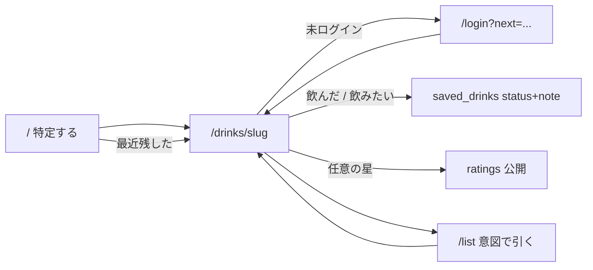

---
todos:
  - id: data-status-note
    status: in_progress
    content: saved_drinks に status+note、バックフィル、トリガー drank、UPDATE RLS、Go POST/PATCH、types
  - id: drink-page-intent
    content: 銘柄ページの飲んだ/飲みたい＋メモ Dialog。評価との同居は既存を壊さない
    status: pending
  - id: list-recall
    content: /list をフィルタ・検索・画像・意図・メモ冒頭の見返しに厚くする
    status: pending
  - id: home-auth-copy
    content: 最近残したに意図印、認証コピーを最小揃え
    status: pending
name: Intent List Status Note
overview: 無印ブックマークをやめ、残す操作そのものを drank / want の意図選択にする。status と非公開メモは saved_drinks に載せ、公開 ratings とは混ぜない。Web の銘柄ページ・/list・最近残した、をこの順で厚くする。
isProject: false
---

# 意図を選んで残し、リストで引く

対象は **Web のみ**。技術スタックは現状踏襲（Next.js App Router、Server Actions、Go `saveddrink`、Supabase）。新規サービスは増やさない。既存ファイルの編集を優先する。

---

## プロダクト決定（固定）

再議論しない。

- トップの約束は「銘柄を特定する」。未ログインで完結。ログイン後にダッシュボード化しない。
- ログイン後の約束は「特定した銘柄を自分のリストに残す」。日記でも、レビュー投稿が主目的でもない。
- 評価（星＋公開コメント）は消さない。残すことの任意の注釈。公開。`みんなの評価` に出る。
- 対象は Web のみ。グローバル前提。日本向け（器・節酒・グラム）を楔にしない。
- 1人1銘柄。リストの正は `saved_drinks`。`ratings` は注釈。`drink_logs` はリストに使わない（DROP しない）。
- 評価するとリストに入る。評価を消しても印は残る。リストから外すと星も公開コメントも非公開メモも消える。
- 無印の「リストに残す」を主 CTA にしない。残す操作そのものが意図の選択。
- 意図は 2 値だけ: `drank`（飲んだ）と `want`（飲みたい）。Have / 所有 / 未分類を常設しない。
- 星はどちらでも任意。公開コメントと非公開メモは別物。メモは任意・短文。公開スイッチはやらない。
- 量・日付・場所・杯数はフィールドにしない。カクテルをリストに残すのは次フェーズ。

意図の結果:

- 飲んだ（星なし可）: リスト入り、`status=drank`
- 飲みたい（星なし可）: リスト入り、`status=want`
- 評価する（未保存）: リスト入り、status が無ければ `drank`
- 評価する（保存済み）: 星が付く。status は変えない
- 評価を消す: 星と公開コメントだけ消える。status とメモは残る
- 飲んだ ⇄ 飲みたい: status だけ変わる。星・メモは残る
- リストから外す: マークごと消える（星・公開コメント・メモも消える）

---

## データモデル決定（1案）

**`saved_drinks` に `status` と `note` を足す。別テーブルは作らない。`ratings` にも `drink_logs` にも置かない。**

選んだ形:

- [`supabase/migrations/20260813200000_create_saved_drinks.sql`](supabase/migrations/20260813200000_create_saved_drinks.sql) を ALTER する新規 migration（既存ファイルは書き換えない）。
- `status TEXT NOT NULL` + `CHECK (status IN ('drank', 'want'))`。DB デフォルトは付けない（無印 insert を許さない）。トリガーと Go が必ず明示する。
- `note TEXT NOT NULL DEFAULT ''` + `CHECK (char_length(note) <= 280)`。空文字＝メモなし。`ratings.comment`（≤1000）を流用しない。
- `updated_at` は足さない。並びの主語は既存どおり `created_at DESC`。意図・メモの更新で「最近残した」順は動かさない。
- RLS は所有者のみを維持。現状は SELECT / INSERT / DELETE のみなので、**UPDATE ポリシーを追加**する（Go は DB ロールで RLS をバイパスするが、ポリシー欠落は残さない。メモを公開しない）。
- Web は Server Action → Go。Supabase クライアントから `saved_drinks` を直接叩かない。

バックフィル（1案）:

- 既存行のうち、同じ `(user_id, drink_id)` の `ratings` がある → `drank`
- `ratings` が無い → `want`
- 常設の「未分類」UI は作らない。ローカル demo の評価済み行はトリガー／初回バックフィルで既に `saved_drinks` に入っているので、同じ規則で `drank` になる。

トリガー（維持＋欠落時 `drank`）:

- `ratings` INSERT/UPDATE → `INSERT (user_id, drink_id, status) VALUES (..., 'drank') ON CONFLICT DO NOTHING`。既存 status / note は上書きしない。
- `saved_drinks` DELETE → 同じ組の `ratings` DELETE（メモは行ごと消える）。
- `ratings` DELETE では `saved_drinks` を消さない（メモも消さない）。

却下した案:

- **`ratings` に status / note を置く**: RLS が `SELECT USING (true)`。メモが「みんなの評価」に混ざる。
- **`drink_logs` をリストの正にする**: 1人1銘柄にならない。量・日付が必須寄り。DROP もしない。
- **`saved_drink_notes` 等の別テーブル**: 1行1印のまま足りる。JOIN と削除漏れが増えるだけ。
- **status を NULL 許容（無印のまま）**: 主 CTA がまた「リストに残す」に戻る。
- **POST upsert だけで PATCH を足さない**: 初回は status 必須、更新は status または note の部分更新。1本にすると「status を送らずメモだけ」が表せない。
- **メモ上限を 1000**: 公開コメントと同じ長さになり、記事化に寄る。280 に固定する。

API（[`apps/api/internal/saveddrink`](apps/api/internal/saveddrink) を拡張。`review` の契約は変えない）:

- 残す: `POST /api/auth/saved-drinks` `{ drink_id, status }`（**status 必須**。`drank` | `want` 以外は 400）
  - 既存行への再 POST は `ON CONFLICT` で **status だけ更新**、`note` と `created_at` は触らない（リトライでメモが消えない）。
- 意図・メモ: `PATCH /api/auth/saved-drinks/{drink_id}` `{ status?, note? }`（少なくとも一方必須。`note: ""` でメモ削除）
- 外す: 既存 `DELETE /api/auth/saved-drinks/{drink_id}`
- 一覧: 既存 `GET /api/auth/saved-drinks` の各行に `status`, `note` を足す。`rating` / `comment`（公開）の LEFT JOIN は維持するが、**UI の一言には `note` だけ使う**。
- mine: 既存 `GET /api/auth/saved-drinks/mine?drink_id=` に `status`, `note` を足す。
- 一覧の `status` / `q` クエリは **足さない**。個人リストは件数が少ない（現行 `maxListLimit=100`）。`/list` は `limit=100` で一括取得し、`searchParams`（`status`, `q`）でページ側フィルタする。タグ・フォルダ API は作らない。100 件超は今回やらない。

Web の Server Action は [`apps/web/src/application/saved-drink-actions.ts`](apps/web/src/application/saved-drink-actions.ts) を拡張:

- `saveDrink(drinkId, slug, status)` → POST
- `updateSavedDrink(drinkId, slug, { status?, note? })` → PATCH
- `unsaveDrink` は既存のまま

型は [`packages/types/src/saved-drink.ts`](packages/types/src/saved-drink.ts) に `status: 'drank' | 'want'` と `note: string` を足す。mapper を追随。

---

## 1. 銘柄詳細 `/drinks/[slug]` の個人アクション

### 現状

- [`apps/web/src/app/drinks/[slug]/page.tsx`](apps/web/src/app/drinks/[slug]/page.tsx): 説明の直後が個人ブロック。未ログイン CTA は「ログインしてリストに残す」。公開平均と「みんなの評価」はその下。
- [`drink-review-widget.tsx`](apps/web/src/app/drinks/[slug]/drink-review-widget.tsx): 主 CTA が無印の「リストに残す」。保存後は「リストに追加済み」＋評価／外す。評価ダイアログは星必須・公開コメント任意（≤1000）。
- ページは `fetchMySavedDrink` と `fetchMyReview` を並列取得。mine は今 `id / drink_id / created_at` だけ。

### このページの約束

「これだ」と分かった直後に、飲んだか飲みたいかを 1 操作で残す。評価とメモは任意。日記フォームは置かない。

### 変更内容（UI / コピー / 導線）

未ログイン:

- `[ ログインして残す ]` → `/login?next=/drinks/{slug}`
- 「ログインすると星評価を付けられます」は使わない（現状も無い。戻さない）。

ログイン・未保存:

- 主: `[ 飲んだ ]` `[ 飲みたい ]`（同じ強さの 2 ボタン。`saveDrink(..., 'drank' | 'want')`）
- 副: `評価する`（secondary）。保存したらリスト入り＋トリガーで `drank`

ログイン・保存済み:

- ラベル: `飲んだ` または `飲みたい`（「リストに追加済み」は使わない）
- `[ 飲みたいにする ]` / `[ 飲んだにする ]` → PATCH `status` のみ
- メモがあれば本文表示。なければ `メモを追加`。編集は **小さい Dialog**（既存 `Dialog`）。評価ダイアログとは別。placeholder 例: 「覚え書き（任意）」
- 星があれば表示。なければ `評価する`。`評価を編集` / `評価を消す` は維持
- `リストから外す` は現状どおり即時（確認ダイアログは足さない）

評価ダイアログの中身は維持。量・プリセット・日付は置かない。`/my-logs/new` へ送らない。

実装は `DrinkReviewWidget` を編集して足す。props に `initialStatus` / `initialNote` を追加。新規ディレクトリは作らない。メモ Dialog は同ファイル内の小さな関数コンポーネントでよい（list 側は別の短いクライアントを持つ）。

`deleteReview` 成功時も `/list` と `/` を `revalidatePath` する（星表示がリストに出るため。`submitReview` は既に再検証している）。

### データ・API

上記 `saved-drinks` 拡張＋既存 reviews。評価 API の契約は変えない。

### やらないこと

- 無印「リストに残す」の復活、日記フィールド、公開メモスイッチ、カクテル保存、評価ダイアログへのメモ混入。

### 受け入れ条件

- 未ログイン CTA が「ログインして残す」。星評価誘導が無い。
- 未保存の主操作が飲んだ／飲みたいの 2 つ。どちらも星なしで残せる。
- 未保存で評価するとリスト入りかつ `drank`。保存済みで評価しても status は変わらない。
- 評価削除後も status とメモが残る。外すと星・公開コメント・メモが無い。
- メモは「みんなの評価」に出ない。公開コメントはこれまでどおり出る。
- 「リストに追加済み」だけの状態表示が無い。

---

## 2. リスト `/list`（見返す場所）

### 現状

- [`apps/web/src/app/list/page.tsx`](apps/web/src/app/list/page.tsx): 見出し「リスト」、補足「残した銘柄を見返せます。」、名前＋任意の星＋即時「リストから外す」。画像なし、検索なし、意図なし、メモなし。
- 空: 「まだリストに銘柄がありません」→ `/`。入力先ではない（維持）。
- `/my-logs` exact は既に `/list` へ。日記サブルートは直打ち用。

### このページの約束

残した銘柄を、意図つきで引き出す。入力先ではない。主 CTA を「記録を追加」やカタログ外メモにしない。空の全体リストは検索（トップ）へ戻す。

### 変更内容（UI / コピー / 導線）

採用コピー:

- 見出し: リスト
- 補足: 飲んだ銘柄と、飲みたい銘柄を見返す
- 空（0件）: まだリストに銘柄がありません → 銘柄を探す（`/`）
- フィルタ: すべて / 飲んだ / 飲みたい（`?status=`。未指定＝すべて）
- 検索ゼロ（全体は空でない）: リストに一致する銘柄がありません。カタログで探すなら `/` へ（`q` があれば `/?q=`）。空の全体リストとは文言を分ける。

体験:

- 並びは `created_at DESC`。主語は銘柄。
- 各行（最小）: 画像（あれば。無ければ既存の Wine フォールバック）、名前、意図、任意の星、任意のメモ冒頭（1行 truncate）。行の名前（または行の主リンク）で `/drinks/[slug]`。
- リスト内検索: 既存 [`ConfirmedSearchInput`](apps/web/src/components/catalog/confirmed-search-input.tsx) を `pathname="/list"` で再利用。名前とメモを case-insensitive で絞る。`SearchMissLogger` は付けない。
- 意図の切り替えと外すはこのページからもできる。外すは現状どおり即時。
- 週次グラム・杯数・日付グルーピングは出さない。

実装: [`list/page.tsx`](apps/web/src/app/list/page.tsx) を RSC のまま厚くする。フィルタ済み配列の描画と行アクション用に、同ディレクトリへクライアント 1 ファイル（例: `saved-drink-row.tsx`）を足してよい。カタログカードコンポーネントは流用しない（棚用で重い）。

### データ・API

- `GET /api/auth/saved-drinks?limit=100`。フィルタはページ側。
- 切り替えは PATCH、外すは DELETE。

### やらないこと

- 記録を追加 CTA、Discover、週間グラム、公開コメントをメモ代わりに出すこと、無限タグ／フォルダ、日記サブルートへのリンク。

### 受け入れ条件

- 各行に意図が見える。メモがあれば冒頭が出る。公開コメントは行に出ない。
- すべて / 飲んだ / 飲みたいで絞れる。名前・メモ検索ができる。
- 空の全体と検索ゼロで文言が違う。空の全体は `/` へ。
- ここで意図を切り替えても星とメモが残る。外すと行が消え、銘柄ページでも印が無い。
- 「記録を追加」と週次 g が無い。

---

## 3. トップ `/` の「最近残した」

### 現状

- [`apps/web/src/app/page.tsx`](apps/web/src/app/page.tsx) が `limit: 8` で取得し、slug / name だけを渡す。
- [`drink-list-client.tsx`](apps/web/src/components/drinks/drink-list-client.tsx) が検索下に横 1 行。空なら出さない。骨格（見出し・検索・カテゴリ・棚）は既に「特定する」側。

### このページの約束

トップをリストのダッシュボードにしない。残した銘柄があるときだけ 1 行。

### 変更内容（UI / コピー / 導線）

- 骨格は変えない。
- 各リンクに短い印を付ける: `銘柄名（飲んだ）` / `銘柄名（飲みたい）`。
- 空ならこれまでどおり DOM に出さない。

### データ・API

既存 `GET /api/auth/saved-drinks?limit=8`。レスポンスの `status` を使うだけ。

### やらないこと

- トップにフィルタ・メモ編集・ダッシュボード化。

### 受け入れ条件

- 保存があるログイン時だけ「最近残した」が出る。各項目に飲んだ／飲みたいが分かる。
- 未ログインや 0 件では出ない。見出し・検索・棚の順は変わらない。

---

## 4. ナビ・認証コピー・プロフィール

### 現状

- ナビ「リスト」→ `/list` 済み。[`header.tsx`](apps/web/src/components/layouts/header.tsx)
- Login / Signup 補足: 「特定した銘柄をリストに残すために…」
- プロフィールの「リスト」→ `/list` 済み。棚ではない。

### このページの約束

ナビとプロフィールの入口は維持。ログイン理由を意図の選択に小さく揃える。

### 変更内容（UI / コピー / 導線）

- ナビ「リスト」は維持。
- Login / Signup の補足を「飲んだ／飲みたいを残すためにログイン（登録）」に揃える。i18n はしない。
- プロフィールの「リスト」リンクは維持。

### データ・API

なし。

### やらないこと

- プロフィールを棚に拡張、ソーシャル、ナビ新設、i18n。

### 受け入れ条件

- ナビとプロフィールから `/list` へ行ける。
- 認証補足に無印「リストに残すため」だけが残っていない。

---

## 5. カクテル

### 現状

一覧・詳細にリスト保存は無い。

### このページの約束

今は触らない。カクテルをリストに残すのは次フェーズ。

### 変更内容（UI / コピー / 導線）

なし。コピー変更も必須でない。

### データ・API

なし。

### やらないこと

- カクテルを `saved_drinks` に入れること、材料逆引き、詳細への保存 CTA。

### 受け入れ条件

- カクテル詳細に飲んだ／飲みたいが無い。既存レシピ UI が壊れていない。

---

## 実装順序

日記 UI を主経路に戻さない。公開コメントと非公開メモを二重管理しない。

1. **データ** — migration（status + note、バックフィル、トリガーを欠落時 `drank`、UPDATE RLS）→ Go `saveddrink`（POST status 必須、PATCH、一覧/mine の返却）→ types / mapper / Server Action。既存 `service_test.go` を status 検証まで伸ばす。
2. **銘柄ページ** — 飲んだ／飲みたい＋メモ Dialog。評価との同居は既存ダイアログを壊さない。
3. **`/list`** — コピー、フィルタ、検索、行（画像・意図・星・メモ冒頭・切替・外す）。
4. **最近残した＋認証コピー** — 最小揃え。

検証: `pnpm lint` / `pnpm type-check` / `cd apps/api && go vet ./...`。Go 変更時は `go test ./internal/saveddrink`。

---

## 今回やらないこと（横断）

- Mobile / Expo / i18n 実装
- ソーシャル（フォロー、フィード、公開プロフィール、レビューへの投稿者名）
- AI コンシェルジュ、フレーバー評価、店舗・地図・EC
- カクテル材料逆引き、カクテルをリストに残すこと
- 個人ブログ / 長文パブリッシュ / メモの公開スイッチ
- search miss のユーザー向け体験
- 健康判定・グラム集計・器プリセット
- 日記型の「いつ・何を・どれだけ」を主体験として残すこと
- `drink_logs` / `ratings` の DROP
- タグ、フォルダ、複数リスト、ウィッシュリストをリストと別オブジェクトにすること
- OCR / 画像検索 / 類似銘柄
- 無印ブックマークを残したまま status をオプションにすること

---

## 既存プランとの差分

既存プランの本文は書き換えない。

- [`.cursor/plans/identify_save_list_98da0e7a.plan.md`](.cursor/plans/identify_save_list_98da0e7a.plan.md): 「特定してリストに残す」は実装済み。本プランはその続きで、無印印を `drank` / `want` と非公開メモに置き、`/list` を見返す場所にする。前プランの sequential（主 CTA「リストに残す」／「リストに追加済み」）は破棄する。
- 前プランのデータ正（`saved_drinks` が印、`ratings` は注釈、`drink_logs` は残す）は継承する。今回足すのは status / note とその UI だけ。
- 評価・トリガー・「評価するとリスト入り／外すと星も消える」は継承。今回はトリガー insert 時に `status='drank'` を明示する。
- 日記プラン群（volume / day edit）は引き続き主経路にしない。
