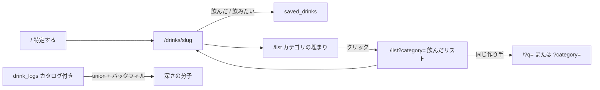

---
todos:
  - id: union-depth-api
    status: completed
    content: catalog log → saved_drinks バックフィル + トリガー、GET /api/auth/saved-drinks/depth（union SQL は saveddrink リポジトリに閉じる）、types
  - id: category-specialty
    content: /list は drank>0 のカテゴリ埋まりだけ。クリックで /list?category= の飲んだリスト
    status: completed
  - id: maker-return
    content: カテゴリ詳細でのみ作り手 2 銘柄以上。未 drank の published 少数 + /?q= へ戻す
    status: completed
name: List Depth Map
overview: '`/list` はカテゴリごとにどれをどれくらい飲んだかを見返し、クリックでそのカテゴリの飲んだリストへ進む。飲んだの正は published のユニーク drink_id（saved_drinks.drank ∪ カタログ付き drink_logs）。称号・公開プロフィール・日記復活はやらない。'
isProject: false
---

# リストに深さマップを置く

対象は **Web のみ**。技術スタックは現状踏襲（Next.js 16 App Router、Server Actions、Go API、Supabase）。新規外部サービスは増やさない。既存ファイルの編集を優先する。



---

## プロダクト決定（固定）

再議論しない。

- トップの約束は「銘柄を特定する」。未ログインで完結。ログイン後にダッシュボード化しない。**深さマップは `/list` に置く。`/` をダッシュボードにしない。**
- ログイン後の約束は「特定した銘柄を自分のリストに残す」。日記でも、レビュー投稿が主目的でもない。
- 意図は 2 値だけ: `drank` / `want`。無印「リストに残す」を復活させない。
- リストの正は `saved_drinks`。`ratings` は公開の注釈。`drink_logs` はリストの正にしない（テーブルと API は DROP しない）。
- 1人1銘柄（カタログ ID がある行）。評価するとリストに入る、等の既存不変条件は壊さない。
- 対象は Web のみ。グローバル前提。日本向け（器・節酒・グラム）を楔にしない。
- カクテルをリストに残すのは次フェーズ。今回の集計にもカクテルを混ぜない。
- 仮の印（`visibility='provisional'`）は図鑑マスに数えない。リスト行としては既存どおり残してよい。
- カメラ / OCR / おすすめフィード / 公開ランキングはやらない。
- **深さ**が主語。全体の「お酒博士」や種類数マイスターは出さない。
- **バッジは自分だけ。** `/profile` を社交化しない。
- 日記 UI は主経路に戻さない。`/my-logs` redirect とナビから日記を消した状態を維持する。
- 閾値ラダー（50/100/500/1000、カテゴリ 200）は出さない。分母は published カタログ実数。
- リスト上限 `maxListLimit=100` の拡張は、深さと同時にやらない。

---

## データモデル決定（1案）

**集計の正は「published なユニーク `drink_id`」の union。リストの正は従来どおり `saved_drinks`。称号テーブルは作らない。**

飲んだ（分子）:

- `saved_drinks.status = 'drank'` かつその drink が `published`、**または**
- `drink_logs.drink_id IS NOT NULL` かつその drink が `published`
- 同じ銘柄は何回でも 1
- `want` は数えない
- `custom_drink_name` のみ（`drink_id` なし）は数えない
- `visibility='provisional'` は分母にも分子にも入れない
- カクテルテーブルは見ない

分母: `drinks.visibility = 'published'` を `category` で `COUNT(*)`。シード目安は sake 200 / whisky 180 / beer 150 / wine 150 / 他は 100 以下。固定「200」は置かない。

深さの単位（2段）:

1. **カテゴリ**: 飲んだ数 / そのカテゴリの published 数。**`drank > 0` のカテゴリをすべて出す。0件のカテゴリは出さない**（12個の未着手棚にしない）。並びは件数が多い順。同数なら埋まり率（drank/total）、なお同数なら `category` 名。先頭（最も厚い）を得意とし、作り手クラスタのスコープに使う。
2. **作り手**: 得意カテゴリに、同一 `manufacturer`（TEXT 完全一致）が 2 銘柄以上あるものだけ。無ければ **全体** で同じ条件。`manufacturer` が NULL / 空はクラスタしない。シリーズエンティティは作らない。

所有権: 両テーブルとも `user_id =` JWT のユーザー。Go は RLS をバイパスするので SQL で必ず絞る。

### ログのリスト行バックフィル（する）

**ワンショット migration + `drink_logs` の INSERT/UPDATE トリガー。** カタログ付き・published だけ `saved_drinks` に `status='drank'`, `note=''`。`ON CONFLICT (user_id, drink_id) DO NOTHING`（既存の `want` / `note` は上書きしない）。自由入力ログはリスト化しない。ログ削除では `saved_drinks` を消さない（ratings 削除と同じ）。

理由: 進捗に含めることは必須。バックフィルしないと「数字だけ埋まって行が無い」か「行が時系列のまま過去ログが見えない」。SQL トリガーなら Go のフィーチャー間 import が要らない（既存の ratings → saved_drinks と同じ型）。`drink_logs` はリストの正にしない。印の置き場は `saved_drinks` のまま。

シードの `drink_logs` は 0 件。ワンショットはローカルでは no-op。確認は `/my-logs/new` 直打ちでカタログ銘柄を 1 件記録する。

### 却下した案

- **称号テーブル / バッジ棚 / 解除演出**: 今回の仮説は自分用の埋まり。称号は当たってから別 PLAN。
- **`drink_logs` をリストの正にする**: 1人1銘柄にならない。量・日付が付き、日記を主経路に戻す。禁止。
- **日記 UI 復活**（`/my-logs` 一覧、銘柄から `/my-logs/new`）: 入力先を `/list` にしない。サブルート直打ちは現状維持。
- **Web だけ雑に二重カウント**: リスト 100 件 + ログ数ページを JS で足すと、100 件超・分母・manufacturer 欠落で分子が欠ける。同じ `drink_id` を二重に数えやすい。
- **全カテゴリのバッジ棚（0件含む 12 個）**: 未着手を並べると称号ラダーに寄る。**drank > 0 の実数行は出す。0件は出さない。**
- **リスト 100 件のメモリ集計だけ**: 分母（published 実数）とログ union と「未 drank の同作り手」が揃わない。`maxListLimit` 拡張も同時にやらない。
- **`GET /api/auth/saved-drinks` に集計を混ぜる**: 一覧は limit/offset。深さは全件 union。応答がページと混ざる。
- **ワンショットだけ（トリガーなし）**: 直打ちの新規ログが行に載らず、集計とリストがまた割れる。
- **蔵 / シリーズの新規テーブル**: マスタにシリーズが無い。`manufacturer` TEXT を使う。

---

## 「飲んだ」union（SQL）

`saveddrink` リポジトリに閉じる。`drinklog` パッケージは import しない。

```sql
SELECT DISTINCT u.drink_id, d.category, d.manufacturer
FROM (
  SELECT s.drink_id
  FROM saved_drinks s
  INNER JOIN drinks d ON d.id = s.drink_id
  WHERE s.user_id = $1
    AND s.status = 'drank'
    AND d.visibility = 'published'
  UNION
  SELECT l.drink_id
  FROM drink_logs l
  INNER JOIN drinks d ON d.id = l.drink_id
  WHERE l.user_id = $1
    AND l.drink_id IS NOT NULL
    AND d.visibility = 'published'
) u
INNER JOIN drinks d ON d.id = u.drink_id;
```

分母:

```sql
SELECT category, COUNT(*)::int
FROM drinks
WHERE visibility = 'published'
GROUP BY category;
```

未 drank の同作り手（次の 1 手、レコメンドエンジンではない）:

```sql
SELECT slug, name
FROM drinks
WHERE visibility = 'published'
  AND manufacturer = $2
  AND ($3::text IS NULL OR category = $3)
  AND id NOT IN (/* 上記 union の drink_id */)
ORDER BY name
LIMIT 3;
```

バックフィル migration（新規ファイル。既存 migration は書き換えない）:

```sql
INSERT INTO saved_drinks (user_id, drink_id, status)
SELECT DISTINCT l.user_id, l.drink_id, 'drank'
FROM drink_logs l
INNER JOIN drinks d ON d.id = l.drink_id
WHERE l.drink_id IS NOT NULL
  AND d.visibility = 'published'
ON CONFLICT (user_id, drink_id) DO NOTHING;

-- AFTER INSERT OR UPDATE OF drink_id ON drink_logs
-- drink_id IS NULL または provisional なら no-op
-- INSERT saved_drinks (..., 'drank') ON CONFLICT DO NOTHING
```

---

## API

**専用** `GET /api/auth/saved-drinks/depth`（認証必須）。`?category=` は作り手クラスタのスコープだけ変える。`categories`（drank>0 の全部）は常に返す。`all` と未知カテゴリは無視して概要と同じ（全体フォールバックあり）。**有効な商品カテゴリが付いているときは、そのカテゴリだけで作り手を出し、全体へフォールバックしない。**

**一覧** `GET /api/auth/saved-drinks` に任意の `category` / `status` を足す（未指定は従来どおり全ステータス）。プレースホルダのみ。`maxListLimit=100` は触らない。カテゴリ付きかつ `status` が `want` 以外のときは `d.visibility = 'published'` も絞る（図鑑の「飲んだ」と揃える）。無効な `status` は 400。無効な `category` / `all` はフィルタなし。ホームの「最近残した」はパラメータ無しのまま動く。

[`apps/api/internal/saveddrink`](apps/api/internal/saveddrink) を拡張。`r.Get("/depth", ...)` を `/mine` の隣に足す。`drinklog` は import しない。SQL は repository に閉じ、service が得意・作り手（上限 3、2 銘柄以上）・次の 1 手を組む。

応答（案）:

```ts
interface ListDepth {
  specialty: {
    category: Exclude<DrinkCategory, 'all'>;
    drank: number;
    total: number;
  } | null;
  categories: {
    category: Exclude<DrinkCategory, 'all'>;
    drank: number;
    total: number;
  }[];
  makers: {
    manufacturer: string;
    drank: number; // >= 2
    nextDrinks: { slug: string; name: string }[];
  }[];
}
```

- `categories` は **drank > 0 だけ**。0件カテゴリは入れない。並びは件数 → 埋まり率 → 名前。
- `specialty` は `categories[0]`（最も厚い）。無い（drank 0）とき `makers` は空。
- `makers` は得意カテゴリで 2+ があればそちら。無ければ全体。最大 3。
- `nextDrinks` は **先頭の作り手だけ** 最大 3（薄くカタログへ戻す）。他の作り手は件数と検索リンクだけ。
- 検索 URL は Web が既存の `/?q={manufacturer}&category={specialty}` を組む。`GET /api/drinks` の `q` は manufacturer も見る。新規検索 API は作らない。

一覧 GET に `manufacturer` を足す（既存 JOIN に列を 1 本）。行から同作り手検索へ戻すため。集計は depth 側。`maxListLimit=100` は触らない。

型は [`packages/types/src/saved-drink.ts`](packages/types/src/saved-drink.ts) に足す。mapper / [`saved-drinks-api.server.ts`](apps/web/src/application/saved-drinks-api.server.ts) を追随。

---

## Web: `/list` の情報設計

`/list` は **カテゴリごとの埋まり** が主語。時系列の全件ダンプは出さない。カテゴリ行のリンクは **`/list?category=`**（ホーム `/?category=` ではない）。作り手の「同じ作り手」だけ従来どおり `/?q=` / `?category=`。

```
/list
  見出し: リスト
  補足: どれをどれくらい飲んだか
  [カテゴリの埋まり]  Beer 3 / 150  …  ← クリックでカテゴリ詳細
  飲みたいを見る → /list?status=want

/list?category=sake
  戻る → /list
  見出し: Sake
  補足: {drank} / {total}
  [カテゴリの埋まり]（切替用。作り手はこのカテゴリ）
  検索（任意）
  このカテゴリで飲んだ published の行

/list?status=want
  戻る → /list
  飲みたい行だけ（薄い避難口。カテゴリ埋まりの主仮説ではない）
```

深さブロックは RSC。[`list-depth.tsx`](apps/web/src/app/list/list-depth.tsx)。無効な `category` / `all` は概要。`status=want` が付いているときは want ビューを優先。

空状態:

- **概要で深さ 0**: 「まだ記録した銘柄がありません」→ `/`。飲みたい避難口は残してよい。
- **カテゴリ詳細で行 0**: 「このカテゴリで飲んだ銘柄はまだありません」。カタログ `/?category=` へ。
- **want で行 0**: 「飲みたい銘柄はまだありません」。
- 検索ゼロ（行はある）: 「リストに一致する銘柄がありません」。

`/profile` は **触らない**。「リスト」リンクは既にある。深さは出さない。

行: published は既存どおり詳細へ。`manufacturer` があれば薄いテキストで `/?q={encode(manufacturer)}`（表示中カテゴリがあれば `&category=` も）。仮の印は非リンクのまま。カテゴリ詳細の行は published の `drank` だけ。

`/` の骨格・最近残した・ゼロ件出口は触らない。

---

## コピー案

カテゴリ名は既存 [`CATEGORY_LABELS`](apps/web/src/config/drinks.ts)（Sake / Whisky …）。トップのチップと揃える。日本語別名（日本酒）は新設しない（i18n しない）。

- 見出し（概要）: リスト
- 補足（概要）: どれをどれくらい飲んだか
- カテゴリ（drank > 0）: `{Label} {drank} / {total}`（例: `Sake 12 / 200`）。0件カテゴリは出さない。リンク先は `/list?category=`。
- 見出し（カテゴリ）: `{Label}`。補足: `{drank} / {total}`。戻る: カテゴリ一覧へ
- 作り手（カテゴリ詳細のみ）: `{manufacturer} {n}種`
- 次の 1 手: 銘柄名 → `/drinks/{slug}`。まとめて見る → `/?q={manufacturer}&category={category}`
- 深さ空: まだ記録した銘柄がありません → 銘柄を探す（`/`）
- カテゴリの行が空: このカテゴリで飲んだ銘柄はまだありません
- 飲みたい避難口: 飲みたいを見る → `/list?status=want`

使わない: お酒博士、マイスター、図鑑コンプ、今夜あと 1 杯、ストリーク、弱点、ランク、飲めば強くなる、固定 200 種類。

---

## やらないこと

- 全体 / カテゴリの称号ラダー、バッジ画像、解除演出
- 公開プロフィール、他人の深さマップ、リーダーボード
- `/my-logs` 一覧の復活、銘柄ページから `/my-logs/new` へ送る
- `drink_logs` をリストの正にする、杯数・日付・場所を `/list` の必須にする
- カクテルのリスト化、Mobile、i18n
- シリーズ / 蔵マスタの新規テーブル
- `/` をログイン後ダッシュボードにする
- アルコール摂取量・純アルコール g・カレンダー Habit
- 仮の印を図鑑の分母や分子に入れる
- 運営マージ UI、AI 下書き
- `maxListLimit` の引き上げ、計測基盤の新設
- カメラ / OCR / おすすめフィード / 公開ランキング

---

## 受け入れ条件

- ログインして `/list` を開くと、残した直後でなくても、**記録したカテゴリそれぞれの**「N / そのカテゴリの published 数」が見える（drank が 1 件以上あるカテゴリだけ。0件は出ない）。時系列の全件ダンプは出ない。
- カテゴリ行をクリックすると `/list?category=` に進み、**そのカテゴリで飲んだ銘柄**がリストで見える。カテゴリリンクはホーム検索ではない。
- 同じ作り手が 2 銘柄以上あるとき、カテゴリ詳細で「{作り手} N種」が見える。リンクからその作り手の銘柄詳細、または `/?q=` / `?category=` のカタログに戻れる。
- `want` だけの銘柄は N に入らない。深さ 0 のときは「まだ記録した銘柄がありません」。飲みたいは `/list?status=want`。
- カタログ付きの過去ログ（`drink_id` あり・published）は深さの N に入る。既存の `want` / `note` は上書きされない。自由入力ログはリスト行にも深さにも入らない。
- 仮の印は深さに入らない。リスト行としては既存どおり残る。
- `/` の見出し・検索・棚の順は変わらない。ログイン後もダッシュボードにならない。
- `/my-logs` は `/list` へ。ナビと `/list` に「記録を追加」が無い。
- カクテルが深さに混ざらない。称号・ストリーク・固定 200 / 50 / 100 / 500 が出ない。
- `/profile` に深さマップも他人向け UI も増えていない。

---

## 実装順

日記を主経路に戻さない。100 件超のリスト拡張と同時にやらない。

1. **union 集計** — migration（バックフィル + トリガー）→ `GET /depth`（SQL を saveddrink に閉じる）→ types / server fetch。`go test ./internal/saveddrink` で得意の選出と want 除外。
2. **カテゴリ偏り** — `/list` に drank > 0 のカテゴリをすべて出す。0件は出さない。クリックで `/list?category=`。空状態は上記。
3. **作り手まとまりとカタログへ戻る** — カテゴリ詳細で。2+ 作り手、次の 1 手、行の manufacturer リンク。

検証: `pnpm lint` / `pnpm type-check` / `cd apps/api && go vet ./...` / `go test ./internal/saveddrink`。

---

## 既存不変条件

- ratings INSERT → `saved_drinks` UPSERT `drank`、既存 status/note は触らない。unsave → ratings DELETE。ratings DELETE では印を消さない。
- provisional は公開検索・詳細・図鑑マスに出ない。通常 POST の `DrinkExists` は published のみ。
- `/my-logs` exact は `/list`。サブルート直打ちは残す。主 CTA にしない。
- `/` をログイン後ダッシュボードにしない。
- 1人1銘柄。無印 CTA を復活させない。

---

## 既存プランとの差分

既存プランの本文は書き換えない。

- [identify_save_list](.cursor/plans/identify_save_list_98da0e7a.plan.md): 「ログからリストへ自動移行しない」を、**カタログ付き・published のみ**に限って覆す（ワンショット + トリガー、want/note は維持）。リストの正が `saved_drinks` であることは継承。
- [intent_list_status_note](.cursor/plans/intent_list_status_note_6b916cd3.plan.md): `drank` / `want` と `/list` 見返しは継承。今回足すのは深さマップだけ。一覧の `status`/`q` を API に上げない判断は維持。
- [zero_hit_exit](.cursor/plans/zero_hit_exit_b76d0d64.plan.md): 仮の印は図鑑に数えない。リスト行の仮印表示は継承。

---

## 要確認

本文の決定は緩めていない。実装時に目視で食い違う点だけ。

1. **`local_demo` の ratings が published 全件 CROSS JOIN** のため、`rater01` 等はほぼ全カタログが `drank`。深さは満杯に見える。デモシードの改変は今回やらない。受け入れの目視は非デモユーザー、または want だけの行で行う。
2. **得意行のカテゴリ名は英語ラベル**（Sake）。プロンプト例の「日本酒」とは表記が違う。トップチップと揃えるため。i18n はしない。
3. **シードに `drink_logs` は 0 件**。バックフィルの目視は `/my-logs/new` 直打ちでカタログ銘柄を 1 件記録して確認する（ナビには出さない）。

---

## 実際の実装との差分

本文の決定は書き換えていない。実装で足した細部だけ。

- `ListDepth` に `maker_scope`（`specialty` | `all`）を足した。作り手が得意カテゴリに無く全体へ落ちたとき、`/?q=` に得意 `category` を付けない。
- 一覧 GET の `drink` に `manufacturer` を足した（プランどおり）。行から同作り手検索へ戻す。
- `/list` の深さブロックは [`apps/web/src/app/list/list-depth.tsx`](apps/web/src/app/list/list-depth.tsx)（プランで許可した 1 ファイル）。
- カテゴリ表示と作り手検索 URL は [`apps/web/src/config/drinks.ts`](apps/web/src/config/drinks.ts) の `drinkCategoryLabel` / `makerSearchHref`。
- 保存先: [`.cursor/plans/list_depth_map_1b590ec1.plan.md`](.cursor/plans/list_depth_map_1b590ec1.plan.md)

**カテゴリ表示の覆し（後から）:** 当初の「得意 1 行」をやめ、**drank > 0 のカテゴリをすべて出す。0件は出さない。** 12個の未着手バッジ棚・称号は出さない。作り手クラスタのスコープは、概要では最も厚いカテゴリ（`specialty`）、カテゴリ詳細では表示中カテゴリ。全体フォールバックは概要だけ。

**リスト IA の覆し（後から）:** `/list` に深さマップと時系列全件を並べるのをやめ、**概要はカテゴリの埋まりだけ**。クリックで `/list?category=` にそのカテゴリの飲んだリスト。カテゴリリンクは `/?category=` にしない。飲みたいは `/list?status=want`。一覧 GET に任意の `category` / `status` を足す（未指定の契約は維持）。`maxListLimit=100` は触らない。
