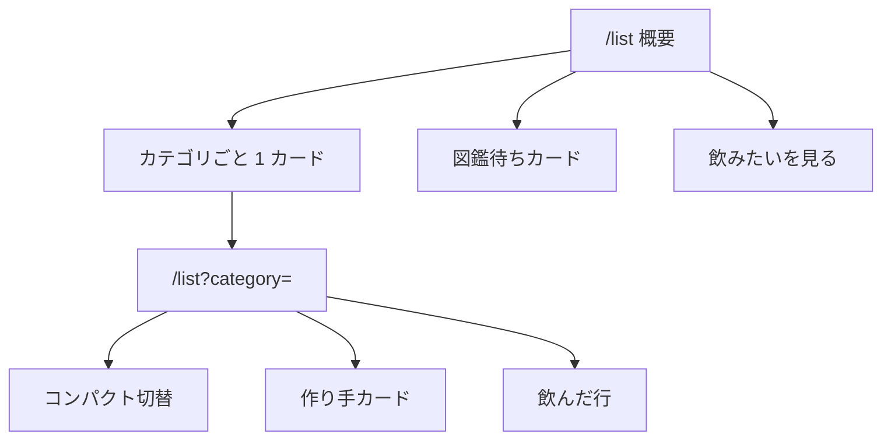

# `/list` をカテゴリ別セクションカードにする

対象は **Web のみ**。[`list_depth_map`](.cursor/plans/list_depth_map_1b590ec1.plan.md) の深さマップと [`atlas_stake_merge`](.cursor/plans/atlas_stake_merge_23fc369e.plan.md) の「図鑑待ちは分数の外」は壊さない。Go API・型・SQL は触らない。

寂しさの原因はデータ不足ではなく、[list-depth.tsx](apps/web/src/app/list/list-depth.tsx) が **1枚の薄い枠に Beer / Whisky / Tequila をテキスト行でまとめている**こと。スクリーンショットの空白は、カードを分割し分数を視覚化すれば埋まる。



---

## プロダクト決定（継承。再議論しない）

- 概要の主語はカテゴリの埋まり。時系列全件ダンプは出さない。クリック先は `/list?category=`。
- `drank > 0` のカテゴリだけ出す。0件の 12 個棚・称号・得意バッジは出さない。
- 分数は published の `drank / total`。`want` と `visibility='provisional'` は入れない。
- 作り手クラスタは **カテゴリ詳細だけ**。概要に上げない。
- コピーは「記録した銘柄」「図鑑」「埋まり」。使わない: お酒博士、マイスター、図鑑コンプ、ストリーク、弱点、ランク、% 完了、あと N 種。
- 閾値ラダー（50/100/500、固定 200）と進捗バーの **終点ラベル** は出さない。分母はカタログ実数のまま。
- `/` をダッシュボードにしない。`/profile` は触らない。カクテル・Mobile・i18n はやらない。
- リスト上限 `maxListLimit=100` は触らない。カタログカード（[entity-catalog-card.tsx](apps/web/src/components/catalog/entity-catalog-card.tsx)）は流用しない。

---

## デザイン決定（1案）

**概要は縦積みのフル幅セクションカード。カテゴリ詳細では大きなカードを繰り返さず、切替はコンパクト、作り手だけカード化する。**

### `/list` 概要

各 `depth.categories` 行を **1カード = 1セクション** にする。2カラムの bento にはしない（ダッシュボード／バッジ棚に見える。3件だと 2+1 で欠ける）。`max-w-2xl` は維持。

カード構成（既存 [Card](apps/web/src/components/ui/card.tsx) をフル構成で使う。カタログと同じ `Link` で包む）:

- `CardTitle`: `Beer` など [drinkCategoryLabel](apps/web/src/config/drinks.ts)
- `CardAction`: `ChevronRight`（行全体がリンクであることの手がかり）
- 分数: `2 / 150` を `text-3xl tabular-nums`。分母だけ `text-muted-foreground` で一段小さく
- その下に **比例フィル**（`bg-muted` トラック + `bg-foreground` の塗り）。`%` テキスト・残り件数・レベルは出さない
- カード全体が `/list?category=` へのリンク。ホバーはカタログ同様 `group-hover:shadow-md`

比例フィルはゲーミフィケーションの進捗バーではない。既存の分数を目で比較するための装飾。`role` は付けず `aria-hidden`（リンクの「Beer 2 / 150」と二重に読まない）。`drank > 0` のとき塗りが 1px に潰れないよう **最低約 2px** だけ見せる。10% 下限のような嘘の幅は付けない。

並びは API のまま（件数 → 埋まり率 → 名前）。先頭を「得意」とラベルしない。

**図鑑待ち**は分数カードの **後** に、破線の静かな 1 カード。`図鑑待ち N` + 「図鑑待ちのマスは分数に入れていません」。リンク先 `/list?pending=1`。フィルは付けない。

**飲みたいを見る**はテキストリンクのまま（主仮説ではない避難口。カードにすると深さと同じ重さになる）。

空・エラーは今の破線枠を維持。文言は変えない。

### `/list?category=`

H1 と補足（`{drank} / {total}`）は今どおり。その下に **大きなカテゴリカードを並べない**（行リストが折りたたまれる）。切替は drank > 0 カテゴリのコンパクトなリンク列（アクティブは `font-semibold` か `Badge` default、他は outline）。

作り手は 1 作り手 = 1 カード（複数リンクがあるのでカード全体はリンクにしない）:

- 見出し: `{manufacturer} {n}種` → 既存の `/?q=` 検索
- 次の 1 手: 銘柄名 → `/drinks/{slug}`
- 「同じ作り手の銘柄」

`want` / `pending` ビューは深さマップを出さない現状を維持。行 UI（[saved-drink-row.tsx](apps/web/src/app/list/saved-drink-row.tsx)）は触らない。

---

## 見た目の骨格（概要）

```
リスト
どれをどれくらい飲んだか

┌─────────────────────────────┐
│ Beer                      › │
│ 2 / 150                     │
│ █░░░░░░░░░░░░░░░░░░░░░░░░░ │
└─────────────────────────────┘
┌─────────────────────────────┐
│ Whisky                    › │
│ 2 / 182                     │
│ █░░░░░░░░░░░░░░░░░░░░░░░░░ │
└─────────────────────────────┘
┌─────────────────────────────┐
│ Tequila                   › │
│ 1 / 75                      │
│ █░░░░░░░░░░░░░░░░░░░░░░░░░ │
└─────────────────────────────┘

┌ ─ ─ ─ ─ ─ ─ ─ ─ ─ ─ ─ ─ ─ ┐
│ 図鑑待ち 1                  │
│ 分数に入れていません         │
└ ─ ─ ─ ─ ─ ─ ─ ─ ─ ─ ─ ─ ─ ┘

飲みたいを見る
```

---

## 実装

既存ファイルの編集を優先。新規ページや API は作らない。

- [apps/web/src/app/list/list-depth.tsx](apps/web/src/app/list/list-depth.tsx): 概要はセクションカード + フィル。`showMakers` / `activeCategory` 時はコンパクト切替 + 作り手カード。`flex flex-col gap-*`（`space-y-*` を増やさない）。RSC のまま。`'use client'` は付けない。
- [apps/web/src/app/list/page.tsx](apps/web/src/app/list/page.tsx): `PendingCountLink` を破線 Card に。概要の余白をカード間 `gap-3`、ブロック間 `gap-6` 程度に揃える。
- アイコンは既存どおり `lucide-react`（`ChevronRight`）。カテゴリ別のジョッキ／ボトルアイコンは足さない（12 個のバッジ棚に寄る）。
- shadcn `Progress` は追加しない。色はセマンティックトークンのみ。カテゴリごとに色を分けない。
- `pnpm lint` / `pnpm type-check`。Go は変更しないので `go vet` は不要。

---

## 却下した案

- **2カラムグリッド / bento**: 画面は埋まるが、未着手棚やダッシュボードに見える。セクションという依頼ともずれる。
- **概要にも作り手・銘柄サムネを載せる**: `ListDepth` に画像が無く、一覧 GET を概要で足すと `maxListLimit` と depth の責務が混ざる。[intent_list_status_note](.cursor/plans/intent_list_status_note_6b916cd3.plan.md) もカタログカード流用を禁止している。
- **カテゴリ詳細でも大きなカードを全件表示**: 切替用のブロックが画面を占有し、飲んだ行が主語でなくなる。
- **%・残り件数・「得意」バッジ・カテゴリ色**: 称号ラダー／飲めば埋まるゲームに戻る。
- **図鑑待ちを分数カードに混ぜる / 飲みたいを同等カードにする**: atlas の「分数の外」と「薄い避難口」を壊す。
- **Empty / Progress の新規 shadcn 追加**: 既存 Card + 破線空状態で足りる。

---

## やらないこと

- API / SQL / `ListDepth` 型の変更、サムネ用の追加 fetch
- 称号、ストリーク、公開プロフィール、日記 UI 復活
- 仮の印を分子・分母に入れる
- `/` の骨格変更、Mobile、i18n、カクテルのリスト化

---

## 受け入れ条件

- `/list` 概要で、Beer / Whisky / Tequila などが **別カード** で見え、各カードに `{Label}` と `{drank} / {total}` と比例フィルがある。1枚の枠に行が並ぶ見た目ではない。
- カードをクリックすると `/list?category=` に進む（`/?category=` ではない）。
- 0件カテゴリは出ない。`%`・残り件数・得意・称号が出ない。
- 図鑑待ちは分数カードの外の破線カード。`pending=1` へ行く。分数は変わらない。
- カテゴリ詳細では大きなカードの縦積みがなく、コンパクト切替と（条件を満たすとき）作り手カード、その下に飲んだ行がある。
- 飲みたいは概要末尾のテキストリンクのまま。

---

## 既存プランとの差分

本文の歴史は書き換えない。この PLAN は見た目だけを足す。

- [list_depth_map](.cursor/plans/list_depth_map_1b590ec1.plan.md): IA・コピー・集計は継承。「カテゴリの埋まり」の **ビジュアル** を 1 枠のリストからセクションカードへ変える。比例フィルは終点ラベル付き進捗バーではない。
- [atlas_stake_merge](.cursor/plans/atlas_stake_merge_23fc369e.plan.md): 図鑑待ちは分数の外のまま。リンクをカード化するだけ。
- [identify_save_list](.cursor/plans/identify_save_list_98da0e7a.plan.md) / [intent_list_status_note](.cursor/plans/intent_list_status_note_6b916cd3.plan.md): `/list` を見返しにする方針は継承。時系列ダンプもカタログカード流用もしない。
