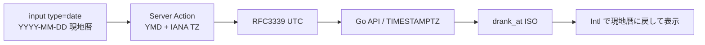
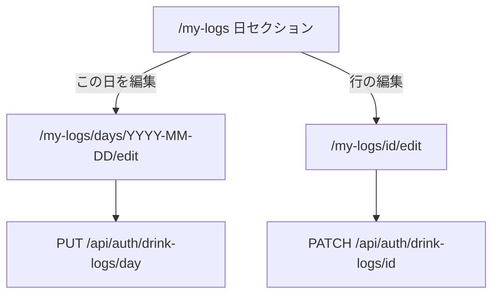

---
todos:
  - id: tz-helpers
    status: in_progress
    content: Tokyo 固定ヘルパーを IANA TZ 引数付きに置換。cookie + hidden time_zone。一覧/週次/フォームの暦日を現地化
  - id: go-date-validation
    content: Go に drank_at の未来日（+36h）等の検証を追加しテスト
    status: pending
  - id: field-errors
    content: shadcn field を追加し useActionState の fieldErrors を項目横に表示。canSubmit でボタンを殺さない
    status: pending
  - id: day-replace-api
    content: PUT /api/auth/drink-logs/day （範囲内の追加/更新/削除をトランザクション）+ types
    status: pending
  - id: day-edit-ui
    content: '/my-logs/days/[date]/edit と一覧の「この日を編集」。新規バッチフォームを共有'
    status: pending
  - id: verify
    content: go vet/test、pnpm lint / type-check
    status: pending
name: Local dates day edit
overview: 飲酒記録の暦日を Asia/Tokyo 固定からブラウザ現地タイムゾーンへ切り替え、API には UTC の TIMESTAMPTZ だけを載せる。Zod エラーは shadcn Field で項目横に出し、一覧の日付単位で一括編集できるようにする。
isProject: false
---

# 飲酒記録: 現地日付と日付一括編集

対象は Request ID `900b98b2` 相当の現行実装（[`.cursor/plans/drink_logs_refactor_49b49220.plan.md`](.cursor/plans/drink_logs_refactor_49b49220.plan.md) がリポジトリ上の正）。クラウド側から当該 run は取得できなかったが、コードは実装済み。

現状の問題:

- 暦日・週境界・「今日」がすべて `Asia/Tokyo` 固定（[`drink-log-schema.ts`](apps/web/src/utils/drink-log-schema.ts) / [`drink-log-day.ts`](apps/web/src/utils/drink-log-day.ts) / [`my-logs/page.tsx`](apps/web/src/app/my-logs/page.tsx)）
- Go は `drank_at` を RFC3339 として受け取るだけで、未来日などの日付バリデーションがない
- Zod の `fieldErrors` は Action が返しているが UI は先頭の `state.error` だけ。`canSubmit` でボタンを殺すためエラー理由も見えない
- 作成は日付単位のバッチ、編集は [`/my-logs/[id]/edit`](apps/web/src/app/my-logs/[id]/edit/page.tsx) の1件のみ

## 日付の契約（日本固定をやめる）

- **保存の正**は今どおり `drink_logs.drank_at TIMESTAMPTZ`（UTC instant）。カレンダー日付型にはしない。
- **意味**: ユーザーが選んだ現地暦日の **そのタイムゾーンにおける 0:00** を UTC にしたもの。時刻 UI は今と同じく持たない。
- **表示・グループ・週次・max=今日**はすべて `Intl.DateTimeFormat(..., { timeZone })`。`Asia/Tokyo` リテラルと `UTC-9` 固定減算は削除する（DST のある TZ で壊れるため）。
- **TZ のソース**はブラウザの `Intl.DateTimeFormat().resolvedOptions().timeZone`（プロフィール項目は作らない）。
  - フォーム: hidden `time_zone` を submit（Server Action が自己完結）。
  - RSC の一覧・週次・日付編集の fetch 範囲: cookie `sakehub-tz`。[`my-logs/layout.tsx`](apps/web/src/app/my-logs) を新設し、小さなクライアントで cookie を書いて未設定時だけ `router.refresh()`。不正な IANA は UTC にフォールバック（Tokyo には戻さない）。
- ヘルパーは TZ 引数付きに改名する（例: `zonedDayKey`, `zonedDateToIso`, `isoToZonedDateInput`, `todayYmdInTimeZone`, `startOfZonedDayUtc`, `groupLogsByZonedDay`）。Zod の「未来日」は **その TZ の今日** と比較する。
- 既存行は東京 0:00 の instant のまま。東京ユーザーは見え方不変。他 TZ のユーザーは旧データが1日ずれる可能性あり。マイグレーションはしない。

## バックエンドの日付バリデーション

Go は暦日を解釈しない（TZ を持たない）。instant として検証する。

[`service.go`](apps/api/internal/drinklog/service.go) の Create / Update / 新規の日付一括更新で共通関数:

- RFC3339 としてパース済みであること（ハンドラ既存）
- `drank_at` が `now+36h` より後なら 400（UTC-12 の「今日 0:00」まで余裕を見て、遠い未来を拒否）
- 任意で `now-10y` より前も拒否
- `from`/`to` は既存どおり RFC3339。`to > from`。日付一括用の範囲は長さ上限（例: 50h。DST の 25h 日 + 余裕）

[`service_test.go`](apps/api/internal/drinklog/service_test.go) に未来日拒否を追加。

## Zod エラーを項目横に出す（RHF / shadcn Form は使わない）

既存方針（[`apps/web/AGENTS.md`](apps/web/AGENTS.md) の `useActionState` + ネイティブ `<form action>`）を維持する。shadcn `Form` は React Hook Form 前提で `useActionState` と相性が悪いので入れない。

使うのは **Field プリミティブのみ**:

- `cd apps/web && pnpm dlx shadcn@latest add field`（`Field` / `FieldLabel` / `FieldError` / `FieldGroup` / `FieldDescription`）
- 無効時: `Field` に `data-invalid`、コントロールに `aria-invalid`、メッセージは `FieldError`
- レイアウトは `FieldGroup` + `gap-*`（`space-y-*` を新規に増やさない）

エラーの載せ方:

- Action は `z.flattenError` ではなく `error.issues` を `path.join('.')` した `fieldErrors: Record<string, string>` にする（`items.0.input_value` が必要）
- [`new-log-form.tsx`](apps/web/src/app/my-logs/new/new-log-form.tsx) / 編集フォームで `drank_at` / `place_url` / 各行の銘柄・量に割り当て
- `canSubmit` でボタンを殺すのをやめる（0件のときだけ disable）。submit 後に項目エラーが見えるようにする
- フォーム先頭の `state.error` は、項目に紐づかない失敗（認証・API）用に残す

[`DrinkLogLineEditor`](apps/web/src/components/drink-logs/drink-log-line-editor.tsx) に行単位の error を渡せるようにする。

## 日付でまとめて編集

作成と同じ「1つの日付 + 場所 + 複数行」を、その現地暦日の全ログに対して行う。1件編集は残す（行の「編集」）。日付セクション見出しに「この日を編集」を足す。

### Go: `PUT /api/auth/drink-logs/day`

chi では `/{id}` より前に登録。ボディ例:

- `range_from` / `range_to`: 編集対象の元の現地日の UTC 半開区間（フロントが TZ から計算）
- `drank_at`: 保存後の日付（現地 0:00 の ISO）。日付変更で全日移動
- `place_name` / `place_url`: 作成と同じく全日で共有
- `items`: `{ id?: uuid, ...CreateItemInput }`（1–20）。`id` ありは更新、なしは追加。範囲内にあって payload に無い id は削除

トランザクション（`BeginTx` → rollback/commit）。範囲外の id を更新しようとしたら 400。`normalizeItem` / serving 規則は再利用。

[`packages/types/src/drink-log.ts`](packages/types/src/drink-log.ts) に `DrinkLogDayReplaceInput` を追加。

### Web

- ルート: [`apps/web/src/app/my-logs/days/[date]/edit/page.tsx`](apps/web/src/app/my-logs/days/[date]/edit/page.tsx)
- cookie TZ で `date`（`YYYY-MM-DD`）→ `from`/`to`、既存 `GET /` でその日のログを取得。0件なら `notFound()`
- 新規と日次編集でバッチフォームを共有（初期行・`range_from`/`range_to`・submit ラベルだけ違う）
- 場所が日によってバラバラな既存データ: 全部同じなら prefills、混在なら空にして「保存するとこの日の場所は1つに揃います」と `FieldDescription`
- Server Action `replaceDrinkLogsForDay`（同じ Zod バッチスキーマ + 各 item の任意 `id`）
- 一覧セクション見出しにリンク。行の1件編集・削除は残す
- `proxy.ts` の `/my-logs` prefix で保護済み。sitemap は触らない

## スコープ外

- Mobile
- プロフィールへの TZ 保存
- 既存 `drank_at` のバックフィル
- shadcn Form / React Hook Form
- ログイン等の他フォームへの Field 展開
- ページネーション・ドリンク詳細からの記録

## 検証

- `cd apps/api && gofmt && go vet ./... && go test ./internal/drinklog`
- `pnpm lint` と `pnpm type-check`（ルート）
- 手動: TZ を Tokyo 以外に見立てて「今日」・日セクション・未来日 Zod エラーが日付欄に出ること、日付一括で行の追加/削除/日付変更が原子的に保存されること

## 実際の実装との差分

- 新規で日付が今日のときは現地 0:00 ではなく送信時刻の UTC instant を保存する。過去日だけ日付ピッカー経由で現地 0:00 にする。
- `PUT /day` はクライアントの `range_from` / `range_to` を信じず、`time_zone` + 元の `date`（YYYY-MM-DD）からサーバーが半開区間を計算する。
- 同一暦日の記録が 21 件以上あるときは一括編集 UI を出さず、API は 409 で拒否する（未ロード行の DELETE を防ぐ）。
- `place_url` は Zod / Go とも http(s) のみ。`logToLine` は join 欠落時も `drinkId` を保持する。
