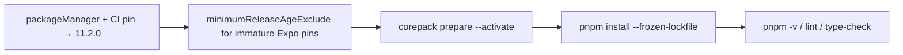

# pnpm 11.0.4 → 11.2.0 アップデート

## 公式情報サマリ

一次ソース:

- [pnpm 11.2](https://pnpm.io/blog/releases/11.2)
- [pnpm 11.1](https://pnpm.io/blog/releases/11.1)（11.0.4 からの中間マイナー）

### 11.2.0 の主な変更（いずれも非破壊 / オプトイン）

| 種別 | 内容 | 当リポへの影響 |
| --- | --- | --- |
| Minor | Experimental: `@pnpm/pacquet` を `configDependencies` に入れると install の materialization を Rust 側へ委譲 | **未使用**。オプトインしない限り挙動不変 |
| Minor | config dependencies が 1 段の `optionalDependencies`（os/cpu/libc）を解決 | **未使用** |
| Minor | ドキュメント済みだった `pnpm login --scope` を実装 | ローカル/CI の日常フローに影響なし |
| Minor | `pnpm outdated` / `pnpm update --interactive` が runtime エントリを表示 | 表示のみ |
| Patch | `cafile` の解決パス修正、`injectWorkspacePackages` + pruned lockfile のクラッシュ修正、`minimumReleaseAge` 境界修正など | 当リポの通常 `pnpm install --frozen-lockfile` には害なし。改善のみ |

### 11.1.x で入った追加機能（参考）

`pnpm audit signatures`、named registries（`gh:`）、`--no-runtime`、`pnpm bugs` / `pnpm owner` など。いずれも破壊的ではない。

### バージョン選定

- **ターゲット**: ユーザー指定どおり **11.2.0**
- 同系列の後続パッチ `11.2.1` / `11.2.2` は主に pacquet / configDependencies 周りの修正。当リポは pacquet 未使用のため **11.2.0 で十分**
- npm `latest` は調査時点で `11.20.0`。より新しい 11.x への追従は別 PR とする

## 影響調査結果

### 必須変更（3箇所）

| ファイル | 変更 |
| --- | --- |
| [`package.json`](package.json) | `"packageManager": "pnpm@11.0.4"` → `"pnpm@11.2.0"` |
| [`.github/workflows/build-lint-check.yml`](.github/workflows/build-lint-check.yml) | `pnpm/action-setup` の `version: 11.0.4` → `11.2.0` |
| [`pnpm-workspace.yaml`](pnpm-workspace.yaml) | `minimumReleaseAgeExclude` に公開 24h 未満の Expo 系 11 パッケージを追加 |

### マイグレーション時に判明したブロッカー

pnpm **11.1.3** から、`pnpm install`（`--frozen-lockfile` 含む）が既存 lockfile エントリを `minimumReleaseAge`（既定 1440 分）で再検証する（[v11.1.3 notes](https://github.com/pnpm/pnpm/releases/tag/v11.1.3) / [#11583](https://github.com/pnpm/pnpm/pull/11583)）。

現行 lockfile の Expo SDK 56 系（`expo@56.0.19` 等、公開 ~2026-08-06T11:50Z）が cutoff 未満のため `ERR_PNPM_MINIMUM_RELEASE_AGE_VIOLATION` で止まる。公式推奨どおり `minimumReleaseAgeExclude` で許可する（依存のダウングレードや `minimumReleaseAge: 0` は採らない）。

### 変更不要と判断した箇所

| 箇所 | 理由 |
| --- | --- |
| [`AGENTS.md`](AGENTS.md) / [`README.md`](README.md) | `pnpm@11` / `pnpm 11+` とメジャーのみ記載。ピン変更不要 |
| [`pnpm-lock.yaml`](pnpm-lock.yaml) | ツールチェーンのみのバンプ。依存解決の再計算は不要（`--frozen-lockfile` で確認） |
| apps / packages の依存 | アプリ依存は触らない |



## 実装手順

1. **ピン更新**
   - `package.json` の `packageManager`
   - `.github/workflows/build-lint-check.yml` の `version`
2. **supply-chain 除外**
   - `pnpm-workspace.yaml` に immature Expo ピンを `minimumReleaseAgeExclude`
3. **ローカル有効化**
   ```bash
   bash -lc 'corepack prepare pnpm@11.2.0 --activate && pnpm -v'
   ```
4. **再インストール（lockfile 厳密）**
   ```bash
   bash -lc 'pnpm install --frozen-lockfile'
   ```
5. **検証**
   ```bash
   bash -lc 'pnpm -v'          # 11.2.0
   bash -lc 'pnpm lint'
   bash -lc 'pnpm type-check'
   ```
6. **コミット / PR** — Conventional Commits: `chore(deps): bump pnpm from 11.0.4 to 11.2.0`

## リスクとロールバック

- **リスク**: 11.1.3+ の lockfile 再検証により、公開直後の依存を含む lockfile があると CI install が落ちる（今回は Expo で発生）
- **緩和**: `minimumReleaseAgeExclude` で明示許可。将来 Expo を上げるときは loose mode が自動追記するか、同様に exclude を更新
- 問題時は `packageManager` / CI `version` を `11.0.4` に戻し、exclude を削除して `corepack prepare pnpm@11.0.4 --activate`

## 意図的にやらないこと

- `@pnpm/pacquet` の導入（実験的 opt-in）
- 依存パッケージの一括更新（`pnpm update`）
- `minimumReleaseAge: 0` による全面オプトアウト
- 11.2.0 より新しい 11.x（11.20.0 等）へのジャンプ
