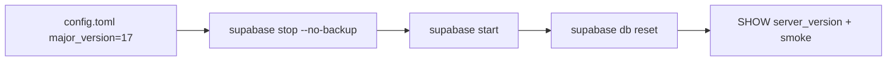

# PostgreSQL 15 → 17 ローカルアップグレード

## スコープ

- **対象**: ローカル Supabase（[`supabase/config.toml`](supabase/config.toml) + `supabase start`）
- **対象外**: ホスト済み Supabase プロジェクト（リンク済み `project-ref` なし）。リモートがある場合は別作業（Dashboard の Postgres upgrade + ローカル `major_version` をリモートに合わせる）
- **狙いのバージョン**: Supabase CLI が引く最新 PG17 イメージ（手元 CLI `2.95.4` には `supabase/postgres:17.6.1.106` が入っている）。アプリからマイナーをピンする仕組みはない

## 影響調査結果

### 必須変更（2箇所）

| ファイル | 変更 |
|---|---|
| [`supabase/config.toml`](supabase/config.toml) | `major_version = 15` → `major_version = 17` |
| [`AGENTS.md`](AGENTS.md) | `PostgreSQL 15` → `PostgreSQL 17` |

### 変更不要と判断した箇所

- **マイグレーション SQL**: PG15 固有構文なし。`gen_random_uuid()`、stored generated `tsvector`、`EXECUTE FUNCTION`、RLS、`SECURITY DEFINER ... SET search_path = ''`（[`handle_new_user`](supabase/migrations/20260521220111_create_users.sql)）は 17 でも問題なし
- **拡張**: マイグレーションに `CREATE EXTENSION` なし。seed の `pgcrypto` は 17 でも有効（害なし）
- **Go API / Web / Mobile**: 接続文字列と `lib/pq` / `@supabase/*` のみ。PG メジャーをハードコードしていない
- **CI / Docker / `.env`**: PG バージョンピンなし
- **決定的 UUIDv5 seed**（[`packages/cocktail-seed`](packages/cocktail-seed)）: DB バージョン非依存

### PG15→17 の破壊的変更との突き合わせ

アプリ影響が起きやすい項目（`search_path` 強化、統計ビュー改名・廃止拡張など）は、現行スキーマ・クエリでは未使用。`update_updated_at()` に `SET search_path` が無いが、expression index / matview からは参照されていないためアップグレードブロッカーではない。



## 実装手順

1. **設定更新**
   - [`supabase/config.toml`](supabase/config.toml): `major_version = 17`
   - [`AGENTS.md`](AGENTS.md): スタック表の PostgreSQL 表記を 17 に更新
   - [`supabase/README.md`](supabase/README.md) に「ローカル Postgres メジャーは `config.toml` の `major_version`（現在 17）。メジャー変更後はデータディレクトリ非互換のため `supabase stop --no-backup` → `start` → `db reset`」を短く追記

2. **ローカルスタック再作成**（データは消える前提）
   ```bash
   supabase stop --no-backup
   supabase start          # PG17 イメージ取得
   supabase db reset       # ↓ 3 の migrations + seed を一括実行
   ```
   メジャー間で data volume は流用できない。ローカル開発データは捨てて再 seed する。

3. **migrations 適用と seed 投入**（新規スクリプトは作らない。既存 CLI / npm script を使う）

   `supabase db reset` が最後にやること:
   1. 全 [`supabase/migrations/`](supabase/migrations/) をタイムスタンプ順に適用
   2. [`supabase/config.toml`](supabase/config.toml) の `[db.seed]` に従い seed を実行:
      - `./seeds/official_cocktails.sql`
      - `./seed.sql`

   ```toml
   [db.seed]
   enabled = true
   sql_paths = ["./seeds/official_cocktails.sql", "./seed.sql"]
   ```

   確認コマンド例:
   ```bash
   supabase migration list
   psql "$DATABASE_URL" -c "SELECT count(*) FROM cocktails;"
   psql "$DATABASE_URL" -c "SELECT count(*) FROM cocktail_recipes WHERE is_official;"
   ```

   `db reset` 後に seed だけやり直しが必要な場合のフォールバック（既存）:
   ```bash
   pnpm supabase:seed
   # = supabase db query --local --file supabase/seeds/official_cocktails.sql
   #   && supabase db query --local --file supabase/seed.sql
   ```

4. **検証**
   - `psql ... -c 'SHOW server_version;'` → `17.x`
   - 主要テーブル存在: `cocktails`, `cocktail_recipes`, `ratings`, `search_misses`, `users`
   - seed 件数ざっくり確認（公式カクテル等）
   - Go API スモーク: drinks / cocktails 一覧、search miss INSERT
   - Web: `/cocktails` 検索（0件時の miss ログ含む）が動くこと
   - `cd apps/api && go test ./...`（DB 依存テストがあれば実行時にローカル DB 利用）

5. **失敗時の切り戻し**
   - `major_version` を 15 に戻し、再度 `stop --no-backup` → `start` → `db reset`

## 注意点

- 将来リモートを link したとき、リモートがまだ 15 だと `db diff` / `db dump` がバージョン不一致で失敗する。ホスト側も 17 に揃えてから link する
- UUIDv7（PG18）はこの作業では扱わない
- 「最新」は upstream 17.latest ではなく、**Supabase が配布する 17.x イメージの最新**になる
