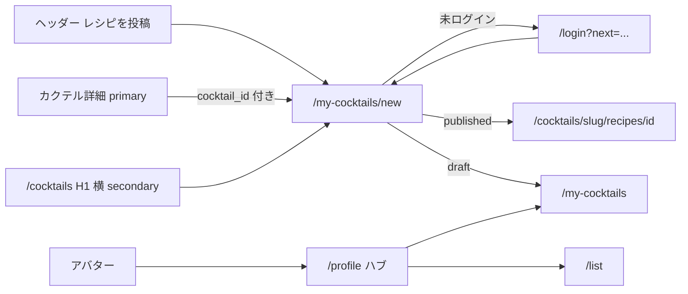

# カクテルレシピ作成の一次導線 + プロフィールハブ

対象は **Web のみ**（`apps/mobile` は触らない）。技術スタックは現状踏襲（Next.js 16 App Router、Server Actions、Go API、Supabase、shadcn/ui v4 + Tailwind v4 CSS-first）。新規外部サービスは増やさない。既存ファイルの編集を優先する。

関連プラン（本文は書き換えない）:

- [カクテルレシピ登録ページ](cocktail_recipe_page_f90258ea.plan.md) — フォームと POST は既にある。成功後 `redirect('/')` と一覧未整備が残件
- [カクテルレシピ MVP 基盤](cocktail_recipe_mvp_foundation_839f535b.plan.md) — 公式レシピ・手順。今回は触らない
- [銘柄を特定しリストに残す](identify_save_list_98da0e7a.plan.md) — デスクトップ左ナビ「リスト」。トップのカクテルバナーは外済み。今回トップにヒーロー CTA を戻さない
- [プロフィール編集・退会](web_profile_edit_and_delete.md) — 表示名・退会の仕様は変えない。置き場所だけハブのドリルインへ移す



---

## 調査結果

実装前にコードで確認したこと。スコープを広げない。

### Create レスポンスに `cocktail_slug` が無い

[`Insert`](apps/api/internal/cocktail/repository.go) は `RETURNING id, is_official, created_at, updated_at` のみ。`Recipe.CocktailSlug` は `json:"cocktail_slug,omitempty"` だが Create では空のままなので JSON に出ない。`id` と `status` は返る。

公開 GET の `FindPublishedRecipeByID` は `cocktails.slug` を JOIN 済み。Web が `cocktail_id` から slug を推測しない。Create の Insert 後（同一 tx 内）に `SELECT slug FROM cocktails WHERE id = $1` して `CocktailSlug` を埋める。JOIN 失敗は Create 失敗（FK があるので通常起きない）。slug が空なら Web はホームへ捨てず **`/my-cocktails` へ fail-closed**。

### 公開 `GET /api/cocktail-recipes/{id}` は published のみ

[`GetRecipeByID`](apps/api/internal/cocktail/service.go) → `FindPublishedRecipeByID`（`status = 'published'`）。draft は 404。draft 保存後は公開詳細へ飛ばさない。行き先は `/my-cocktails`。draft 用 GET は **作らない**（編集 UI が次 PLAN）。

### RLS と Go の役割

[`cocktail_recipes_select`](supabase/migrations/20260731235801_cocktail_recipes_is_official.sql) は `published OR auth.uid() = user_id`。セッション RLS なら自分の draft は PostgREST でも読める。退会の draft DELETE は今どおりセッション RLS（[`profile/actions.ts`](apps/web/src/app/profile/actions.ts)）。

自分の一覧は **Go API（auth）** に寄せる。理由: JOIN（slug / 親カクテル名）、`saved-drinks` と同じ Server fetch、service role を使わない、Go は RLS をバイパスするので `user_id` は JWT のみ。フロントから `from('cocktail_recipes')` で一覧を読まない。

`POST /api/cocktail-recipes` のパスは動かさない。新規は `GET /api/auth/cocktail-recipes/mine`。

### インデックス

既存 `idx_cocktail_recipes_user_id (user_id)` がある。mine は `WHERE user_id = $1 AND NOT is_official ORDER BY updated_at DESC`。ユーザーあたり件数は少なく、単列インデックスで足りる。`(user_id, updated_at)` の migration は **今回作らない**。件数が増えたら次で足す。

### `safeNextPath` と query

[`safeNextPath`](apps/web/src/utils/safe-next-path.ts) は相対パスと query（`?cocktail_id=`）を許す。`://` / `//` / `\` は拒否。関数自体は壊れていない。

壊れるのは **未エンコードの `?next=`**。`/login?next=/my-cocktails/new?cocktail_id=uuid` だと `cocktail_id` が login の別パラメータになる。銘柄詳細は既に `encodeURIComponent` 済み。今回も同じ。`safeNextPath` は変更しない。共通 [`loginHref`](apps/web/src/utils/login-href.ts)（新規）で `encodeURIComponent` を一箇所に閉じる。

proxy は `searchParams.set('next', ...)` でエンコードする。[`/list`](apps/web/src/app/list/page.tsx) はページでも `redirect('/login?next=/list')`。[`/my-cocktails/new`](apps/web/src/app/my-cocktails/new/page.tsx) は `redirect('/login')` のみ。proxy 任せにしない。

### ヘッダーのモバイル

[`header.tsx`](apps/web/src/components/layouts/header.tsx) の左ナビは `hidden sm:flex`（お酒 / カクテル / リスト / 運営）。モバイルはロゴと右の Login またはアバターだけ。「レシピを投稿」を左ナビに入れるとモバイルから消える。**右クラスタ（アバター / Login の隣）にコンパクトに出す。** 左ナビの desktop「リスト」は壊さない。リストのモバイル入口はハブ。

### 詳細 CTA の現状

公式レシピ直下「このレシピをアレンジして投稿する」と、みんなのレシピ見出し横「レシピを投稿する」は muted 下線 Link。`cocktail_id` プリセットあり。空状態ボックス内には CTA が無い（見出し横だけ）。未ログインでも `/my-cocktails/new?cocktail_id=` へ行き、proxy が login に流す。ページ側の `next` 欠落とフォームコピー（登録 / オリジナル）が残る。

### その他

- `/my-cocktails` ページファイルは `new/` だけ。一覧は 404。proxy の `/my-cocktails` 保護で足りる
- sitemap は `/` と `/cocktails` と公開詳細のみ。認証ページは足さない
- `apps/web` に `type-check` script は無い（既存どおり `pnpm type-check` は mobile / types / utils）

---

## プロダクト決定（固定）

再議論しない。

1. **作成の一次導線はヘッダー。** 文言は「レシピを投稿」（「登録」禁止。マスタ申請と混ざる）。未ログインでも出す。確認 Modal なし。ログイン済みは `/my-cocktails/new`、未ログインは `/login?next=/my-cocktails/new`（`loginHref` + `safeNextPath`）。
2. **モバイルでもヘッダーに出す。** `hidden sm:flex` の中だけに置かない。右クラスタの compact ボタン。リストはモバイルではハブ。desktop 左ナビ「リスト」は残す。
3. **カクテル詳細の既存 2 リンクは残して primary Button に格上げ。** 公式直下とみんなのレシピ見出し横。空状態にも同じ投稿 Button を足す（現状空ボックス内に無い）。`cocktail_id` 維持。消さない。
4. **カクテル一覧は secondary。** H1 横のみ。グリッドを汚さない。ページの主は「探す」。補足に「公式を見て、自分のアレンジも残せる」程度。Modal なし。
5. **`/my-cocktails` 一覧を新設。** 自分の draft + published。公式（`is_official`）は混ぜない。空状態に primary「レシピを投稿」と親種別必須のコピー（「アレンジレシピを投稿」。「オリジナル」禁止）。1 件以上でもヘッダーに投稿ボタン。
6. **投稿成功後:** published → `/cocktails/{slug}/recipes/{id}`。draft → `/my-cocktails`。`redirect('/')` をやめる。slug 欠落は `/my-cocktails`。
7. **ログインコピーは next で分岐。** 既定は現行「飲んだ／飲みたいを残すためにログイン」。`next` が `/my-cocktails` で始まるときはレシピ投稿用。signup も同じ分岐。確認ダイアログは出さない。
8. **`/my-cocktails/new` の未ログイン redirect に `next` を付ける**（query の `cocktail_id` も含める。`/list` と同じ。proxy 任せにしない）。
9. **`/profile` はモバイルファーストの行リスト・ハブ。** モバイルも desktop も同じ。サイドバーを作らない。
10. ハブのグループは固定（下記）。ファーストビューから DisplayNameForm / DeleteAccountSection / Email・Login Type・Member Since の定義リストを外す。
11. ハブに大きい「レシピ登録」ヒーロー CTA を置かない。作成の空状態は `/my-cocktails`。
12. 親 `cocktail_id` 必須は変えない。UI コピーは「アレンジ」「投稿」。完全オリジナル（親なし）は別 PLAN。

ハブ IA:

```
[アバター] 表示名
           email

マイコンテンツ
  リスト              → /list
  カクテルレシピ        → /my-cocktails

アカウント
  表示名を変更         → /profile/display-name
  ログアウト            （ハブ上の SignOut。ドリルインしない）
  退会                → /profile/delete（既存の表示条件を維持）
```

アカウントの読み取り（Email / Login Type / Member Since）は **`/profile/display-name` にまとめる**。`/profile/account` は作らない（項目 3〜6 個の段階で画面を増やさない）。

---

## 却下（本線にしない）

- 未ログイン CTA の確認 Modal / 「ログイン画面に移動します」ダイアログ
- デスクトップ限定ミニサイドバー、レスポンシブでシェルが分岐する IA
- ボトムタブ（お酒 / カクテル / リスト / マイページ）
- 公開プロフィールと設定の分離、他人から見える `/u/[id]`
- レシピ編集・削除 UI（一覧と作成ループが先）
- 親なしオリジナルカクテル、マスタへのユーザー登録
- ヘッダーに「レシピを投稿」を足さず、プロフィール奥だけで発見させる案
- 詳細の文脈つき CTA（`cocktail_id` プリセット）の削除
- 投稿成功後のホームリダイレクト維持
- トップへカクテル投稿ヒーロー / バナーを戻す（identify_save_list と矛盾。90 秒はヘッダーで満たす）
- Mobile アプリ、i18n の一括、計測基盤の新設
- Service Role のクライアント露出、Supabase 直で他人の draft を読む実装
- draft 用公開 GET、編集画面の先取り
- `(user_id, updated_at)` インデックス migration（今は不要）
- `POST /api/cocktail-recipes` を `/api/auth/...` へ引っ越すこと
- shadcn `Empty` / Sidebar / Item の新規追加（未導入。既存の dashed 空状態と Link 行で足りる）

---

## Step 1 — 自分のレシピ API

### 目的

認証ユーザーの draft + published を、親カクテルの slug / 名前付きで一覧できるようにする。

### 現状ギャップ

Auth のレシピ API は `POST /api/cocktail-recipes` のみ。自分の一覧が無い。Create は slug を返さない。

### 実装方針

- `GET /api/auth/cocktail-recipes/mine?limit=&offset=`
- [`router.go`](apps/api/internal/router/router.go) の既存 `/api/auth` グループに `cocktailH` の mine ルートを載せる（`saved-drinks` / `cocktail-recipe-ratings` と同じ）
- 対象: JWT の `user_id` かつ `NOT is_official`。status は draft + published。公式アカウントの公式行は出ない（仕様）
- 返す summary: `id`, `name`, `status`, `image_url`, `updated_at`, `cocktail_id`, `cocktail_slug`, `cocktail_name`（親マスタ名）。評価集計は一覧に不要なので足さない
- レスポンス形はカクテル一覧に合わせ `{ data, total, limit, offset }`
- デフォルト limit 50、max 100。既存 `parseLimitOffset` / `clampListBounds` を再利用
- SQL は repository、検証（UUID 不要、limit/offset のみ）は service、ハンドラは薄い。プレースホルダ `$1`
- `ORDER BY updated_at DESC`
- 新しいテーブルは作らない
- 同じ Step 内で Create の Insert 後に slug を JOIN して返す（Step 3 の redirect が Web 推測に依存しない）

### 対象ファイル

- [`apps/api/internal/cocktail/model.go`](apps/api/internal/cocktail/model.go) — `MyRecipeSummary`（または同等）
- [`apps/api/internal/cocktail/repository.go`](apps/api/internal/cocktail/repository.go) — `ListMine` + Insert 後 slug
- [`apps/api/internal/cocktail/service.go`](apps/api/internal/cocktail/service.go)
- [`apps/api/internal/cocktail/handler.go`](apps/api/internal/cocktail/handler.go) — `ListMine` + Auth mine routes
- [`apps/api/internal/router/router.go`](apps/api/internal/router/router.go)
- [`packages/types/src/cocktail.ts`](packages/types/src/cocktail.ts) または [`cocktail-recipe.ts`](packages/types/src/cocktail-recipe.ts) — mine summary + list result
- [`apps/web/src/application/cocktail-mappers.ts`](apps/web/src/application/cocktail-mappers.ts)
- [`apps/web/src/application/cocktails-api.server.ts`](apps/web/src/application/cocktails-api.server.ts) — `fetchMyCocktailRecipes`（`authServerFetch`。既存 saved-drinks と同じ）

### 受け入れ

- Bearer なし → 401。他人の行は JWT の user 以外出ない
- 公式レシピが混ざらない。draft と published の両方が出る
- Create 201 の JSON に `id` / `status` / `cocktail_slug` がある
- `go fmt` / `go vet ./...`

---

## Step 2 — `/my-cocktails` 一覧

### 目的

draft の置き場と、投稿の戻り先を作る。ハブより先に存在させる。

### 現状ギャップ

`/my-cocktails` は `new/` 以外 404。成功後はホーム。draft が見えない。

### 実装方針

- 新規 [`apps/web/src/app/my-cocktails/page.tsx`](apps/web/src/app/my-cocktails/page.tsx)（このルートのための追加は正当）
- 保護は既存 proxy の `/my-cocktails`。ページでも `/list` と同じく未ログインは `redirect('/login?next=/my-cocktails')`
- RSC。`getOptionalAccessToken` → `fetchMyCocktailRecipes`
- 空: 短い説明（アレンジレシピを投稿。親カクテルが必要）+ primary「レシピを投稿」→ `/my-cocktails/new`。「オリジナル」禁止
- 1 件以上: 行（[`saved-drink-row.tsx`](apps/web/src/app/list/saved-drink-row.tsx) に近いカード行。新規ディレクトリは作らない）。一覧ヘッダーにも投稿ボタン
- published: `/cocktails/{cocktail_slug}/recipes/{id}` へ
- draft: 公開詳細へ飛ばさない。`Badge`「下書き」と親カクテル名。行は非リンク（編集が無い）
- ページネーション: total がページサイズ超のときだけ「前へ / 次へ」（カクテル一覧と同じ offset URL）。v1 の既定 50
- sitemap に足さない。robots の disallow 追加もしない（スコープ外）
- metadata title は「カクテルレシピ」程度

### 対象ファイル

- [`apps/web/src/app/my-cocktails/page.tsx`](apps/web/src/app/my-cocktails/page.tsx)（新規）
- 行コンポーネントが page を肥大化させるなら同ディレクトリに 1 ファイル（`my-recipe-row.tsx`）
- Step 1 の server fetch / types

### 受け入れ

- ログイン済みで自分の draft / published が見える。公式が混ざらない
- 空状態から `/my-cocktails/new` に行ける
- published 行だけレシピ詳細に着く。draft 行をクリックしても公開 404 に行かない
- 未ログインで `/my-cocktails` → `/login?next=/my-cocktails`
- sitemap.xml に `/my-cocktails` が無い

---

## Step 3 — 投稿ループを閉じる

### 目的

作ったものがホーム銘柄一覧に捨てられない。

### 現状ギャップ

[`actions.ts`](apps/web/src/app/my-cocktails/new/actions.ts) は成功時 `redirect('/')`。レスポンス body を読まない。`revalidatePath` 無し。

### 実装方針

- 201 JSON から `id` / `status` / `cocktail_slug` を読む
- `status === 'published'` かつ slug あり → `/cocktails/{slug}/recipes/{id}`
- それ以外（draft、slug 欠落）→ `/my-cocktails`
- `revalidatePath('/my-cocktails')`。published なら `/cocktails/{slug}` とレシピ詳細も
- `redirect` は Next の例外なので、その前に revalidate する
- 失敗時の `{ ok: false, error }` は維持（throw しない）

### 対象ファイル

- [`apps/web/src/app/my-cocktails/new/actions.ts`](apps/web/src/app/my-cocktails/new/actions.ts)
- Step 1 の Go Insert（slug）。未完了ならこの Step で入れる

### 受け入れ

- 公開保存 → 作ったレシピ詳細。下書き保存 → `/my-cocktails` にその行がある
- `/` の銘柄一覧に飛ばない
- 詳細の「みんなのレシピ」に、公開した行がすぐ見える（revalidate）

---

## Step 4 — クロムと詳細 CTA（発見）

### 目的

未ログインでも 90 秒以内に投稿の存在が分かる。クリックしたら Modal なしでフォーム（または login → フォーム）に着く。

### 現状ギャップ

ヘッダーに作るが無い。モバイルはアバター以外に自分の場所が無い。詳細 CTA は fold 下の下線。一覧に投稿導線が無い。フォームと login が「登録 / オリジナル / リストに残す」のまま。`/my-cocktails/new` のページ redirect に `next` が無い。

### 実装方針

**共通 href（新規 util、4 箇所以上で使う）:**

- [`apps/web/src/utils/login-href.ts`](apps/web/src/utils/login-href.ts) — `loginHref(next)` = `/login?next=${encodeURIComponent(safeNextPath(next))}`
- [`apps/web/src/utils/recipe-compose-href.ts`](apps/web/src/utils/recipe-compose-href.ts) — `recipeComposePath(cocktailId?)` と `recipeComposeHref({ loggedIn, cocktailId })`

Header は RSC なので `user` の有無で href を分岐できる。詳細・一覧も RSC。確認 Modal はどの画面にも出さない。

**ヘッダー:**

- 右ナビ（Login / アバターの左）に compact「レシピを投稿」。`size="sm"`。未ログイン時は Login（現行 primary）と並べ、投稿側は `variant="outline"` または secondary（primary を 2 個並べない）。ログイン時はアバターの左
- 右ナビの `gap-6` はモバイルで詰まるので `gap-2 sm:gap-4` 程度に落とす
- 左ナビ `hidden sm:flex` には足さない

**詳細** [`cocktails/[slug]/page.tsx`](apps/web/src/app/cocktails/[slug]/page.tsx):

- 既存 2 本を shadcn `Button` のリンクにする（Base UI は `render={<Link href=... />}`。`asChild` は使わない）
- 空状態ボックス内にも同じ「レシピを投稿する」。`cocktail_id` 維持
- 未ログインは `recipeComposeHref({ loggedIn: false, cocktailId })`
- ページで `getAuthProfile` または `getOptionalAccessToken` が未使用なら、CTA 用に user の有無だけ取る

**カクテル一覧:**

- H1「カクテルを探す」と同じ行の右に secondary「レシピを投稿」
- 補足を「公式を見て、自分のアレンジも残せる」程度に足す。グリッド内に主ボタンを置かない

**ログイン / signup:**

- `next.startsWith('/my-cocktails')` のときコピーをレシピ投稿用に（例: 「アレンジレシピを投稿するためにログイン」）。signup は「…するために登録」（アカウント登録の「登録」はレシピ登録ではない。Sign Up ボタン文言は触らない）
- 既定コピーは現行のまま

**フォームページ:**

- 未ログイン: `redirect(loginHref(recipeComposePath(cocktailId)))`。`cocktail_id` を落とさない
- metadata / H1 / 補足 / 公開ボタンの「登録」「オリジナル」を「投稿」「アレンジ」に置換。下書き保存はそのまま
- `cocktail_id` 必須セレクトは維持

**Button リンク:** 既存 Dialog と同じ `render`。新規 shadcn コンポーネントは足さない。

### 対象ファイル

- [`apps/web/src/components/layouts/header.tsx`](apps/web/src/components/layouts/header.tsx)
- [`apps/web/src/app/cocktails/[slug]/page.tsx`](apps/web/src/app/cocktails/[slug]/page.tsx)
- [`apps/web/src/app/cocktails/page.tsx`](apps/web/src/app/cocktails/page.tsx)
- [`apps/web/src/app/(auth)/login/page.tsx`](apps/web/src/app/(auth)/login/page.tsx)
- [`apps/web/src/app/(auth)/signup/page.tsx`](apps/web/src/app/(auth)/signup/page.tsx)
- [`apps/web/src/app/my-cocktails/new/page.tsx`](apps/web/src/app/my-cocktails/new/page.tsx)
- [`apps/web/src/app/my-cocktails/new/cocktail-recipe-form.tsx`](apps/web/src/app/my-cocktails/new/cocktail-recipe-form.tsx)
- [`apps/web/src/utils/login-href.ts`](apps/web/src/utils/login-href.ts)（新規）
- [`apps/web/src/utils/recipe-compose-href.ts`](apps/web/src/utils/recipe-compose-href.ts)（新規）
- [`apps/web/src/utils/safe-next-path.ts`](apps/web/src/utils/safe-next-path.ts) — **変更しない**（呼ぶ側を直す）

### 受け入れ

- 未ログインのトップ / カクテル面のヘッダーに「レシピを投稿」がある。モバイル幅でも見える。左ナビを閉じても消えない
- クリックで確認なしに `/login?next=...`。ログイン後に `/my-cocktails/new`（詳細経由なら `cocktail_id` 付き）
- ログイン済みはヘッダーまたは詳細 primary からフォームへ
- 詳細の 2 本が Button。空状態にも投稿ボタン。`cocktail_id` が付く
- 一覧 H1 横だけ secondary。グリッドに主 CTA が無い
- ログイン画面にレシピ用コピー。リスト経由では現行コピー
- `/my-cocktails/new` 直打ち未ログインで `next` が付く
- 「登録する」「オリジナルカクテル」がフォーム見出し・公開ボタンから消えている

---

## Step 5 — プロフィールハブ

### 目的

モバイルでアバター → ハブ → リスト / 自分のレシピ が 2 タップ。設定の縦積みをやめる。

### 現状ギャップ

[`profile/page.tsx`](apps/web/src/app/profile/page.tsx) は定義リスト + 表示名フォーム + 下線「リスト」+ Sign Out + 退会。レシピへのリンクが無い。ファーストビューに編集と退会がある。

### 実装方針

依存: Step 2 の `/my-cocktails` が存在すること。ハブだけ先に出して 404 にしない。

- `/profile` をインデックスにする。desktop も同じ UI。`max-w-2xl` は維持してよい。サイドバー禁止
- 先頭はアバター・表示名・email のみ（編集フォームなし）
- マイコンテンツとアカウントは見出し + 行リスト。行は `Link` + `ChevronRight`（lucide）。レイアウトシステムを足さない
- ログアウトはアカウント節の行（chevron なし）。既存 [`SignOutButton`](apps/web/src/app/profile/sign-out-button.tsx) をハブ向けに見た目を寄せて再利用。仕様は変えない（成功後 `/login`）
- [`DisplayNameForm`](apps/web/src/app/profile/display-name-form.tsx) とアカウント dl を [`/profile/display-name`](apps/web/src/app/profile/display-name/page.tsx) へ。Server Action [`updateDisplayName`](apps/web/src/app/profile/actions.ts) は移さず、`revalidatePath` に `/profile/display-name` を足す
- [`DeleteAccountSection`](apps/web/src/app/profile/delete-account-section.tsx) を [`/profile/delete`](apps/web/src/app/profile/delete/page.tsx) へ。`isAccountDeletionBlocked` の表示条件はハブの退会行と delete ページの両方で維持（該当者は行も出さない）
- 退会の確認 Dialog・draft DELETE・`deleteUser` は変えない
- ドリルインは戻るリンク（`/profile`）をページ先頭に置く
- `/profile` の未ログインは `redirect(loginHref('/profile'))`（`/list` に合わせる）
- ハブにレシピ投稿ヒーローを置かない

### 対象ファイル

- [`apps/web/src/app/profile/page.tsx`](apps/web/src/app/profile/page.tsx)
- [`apps/web/src/app/profile/display-name/page.tsx`](apps/web/src/app/profile/display-name/page.tsx)（新規）
- [`apps/web/src/app/profile/delete/page.tsx`](apps/web/src/app/profile/delete/page.tsx)（新規）
- [`apps/web/src/app/profile/display-name-form.tsx`](apps/web/src/app/profile/display-name-form.tsx) — ロジックそのまま。置くページだけ変わる
- [`apps/web/src/app/profile/delete-account-section.tsx`](apps/web/src/app/profile/delete-account-section.tsx)
- [`apps/web/src/app/profile/sign-out-button.tsx`](apps/web/src/app/profile/sign-out-button.tsx)
- [`apps/web/src/app/profile/actions.ts`](apps/web/src/app/profile/actions.ts) — revalidate パス追加のみ
- [`apps/web/src/lib/auth/account-deletion.ts`](apps/web/src/lib/auth/account-deletion.ts) — 仕様変更なし
- proxy の `/profile` プレフィックスでドリルインも保護される。matcher 追加不要

### 受け入れ

- `/profile` ファーストビューに表示名フォーム・退会フォーム・Email / Login Type / Member Since の dl が無い
- リストとカクテルレシピが「マイコンテンツ」。アカウント節と混ざらない
- アバター → プロフィール → リスト、および → `/my-cocktails` が 2 タップ（モバイル）
- 表示名変更後ヘッダーアバター文字が変わる（既存）
- 退会の確認・公式/admin 非表示・公開レシピ SET NULL が回帰しない
- ハブに「レシピ登録」ヒーローが無い

---

## Step 6 — 品質

- `pnpm lint`
- `pnpm type-check`（web に script が無いのは既存どおり）
- Go 変更時 `cd apps/api && gofmt ./... && go vet ./...`
- 回帰: 表示名編集、退会、`/list`、レシピ作成フォーム（材料・手順・下書き/公開）、ヘッダー「リスト」（desktop）、admin ナビ
- 認証ページを sitemap に足していないこと

---

## PR 分割（採用）

1 本にまとめない。ハブだけ先に出して `/my-cocktails` が 404 にならないようにする。

| PR | 含む Step | 関心事 |
| --- | --- | --- |
| **PR1** | 1 + 2 + 3 | API + `/my-cocktails` 一覧 + 投稿後 redirect。ループが先 |
| **PR2** | 4 | ヘッダー / 詳細 Button / 一覧 secondary / ログイン copy / next / フォーム文言 |
| **PR3** | 5 | プロフィールハブ + ドリルイン移設。PR1 のあとに出す |

Step 6 は各 PR の完了条件。

同一 PR にしてはいけない: ハブと一覧未整備。クロムだけ先で戻り先がホームのまま、も避ける（PR1 が先）。

---

## 既知の欠落（次 PLAN）

- **レシピ編集・削除 UI。** draft は一覧上で分かるが、詳細にも編集画面にも行けない。公開後の直しもできない
- draft 専用 GET（編集が必要になったら切る）
- 親なしオリジナル
- 投稿の計測イベント
- モバイルアプリの同等導線
- 公式アカウントが `/my-cocktails` を開いても公式行は出ない（除外仕様）

---

## 成功の見方（計測基盤は作らない。受け入れに落と済み）

- 未ログインでもトップやカクテル面のヘッダーから「レシピを投稿」が見える
- クリック → 確認なし → login `next` → フォーム
- ログイン済みはヘッダーまたは詳細 primary からフォーム
- 公開保存 → レシピ詳細。draft → `/my-cocktails`。ホームに捨てない
- モバイル: アバター → ハブ → リスト / 自分のレシピが 2 タップ
- プロフィール FV にインラインの表示名フォーム・退会フォームが無い
