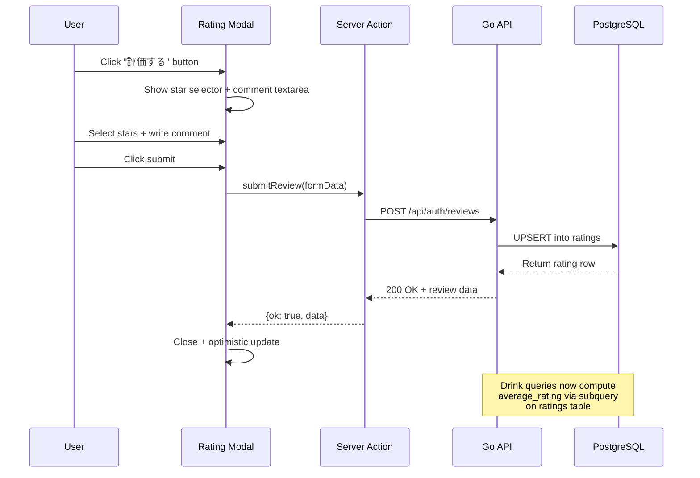

# Refactor User Rating Registration Flow

## Current State

There is already a WIP implementation (all untracked files) with:

- A `drink_reviews` table migration ([supabase/migrations/20260523164918_create_drink_reviews.sql](supabase/migrations/20260523164918_create_drink_reviews.sql))
- Go API `review` feature package ([apps/api/internal/review/](apps/api/internal/review/))
- Frontend inline review widget ([apps/web/src/app/drinks/[slug]/drink-review-widget.tsx](apps/web/src/app/drinks/[slug]/drink-review-widget.tsx))
- Server actions and API clients

The refactoring touches **all layers**: database, Go API, shared types, and frontend.

---

## Phase 1: Database Migration

**Goal**: Rename table to `ratings`, drop denormalized columns from `drinks`.

Replace the existing untracked migration `20260523164918_create_drink_reviews.sql` with a new migration that:

1. Creates `ratings` table (instead of `drink_reviews`):
   - `id UUID PRIMARY KEY DEFAULT gen_random_uuid()`
   - `user_id UUID NOT NULL REFERENCES auth.users(id) ON DELETE CASCADE`
   - `drink_id UUID NOT NULL REFERENCES drinks(id) ON DELETE CASCADE`
   - `rating SMALLINT NOT NULL CHECK (1-5)`
   - `comment TEXT NOT NULL DEFAULT ''` (optional, max 1000 chars)
   - `created_at / updated_at` timestamps
   - `UNIQUE (drink_id, user_id)` -- enforces one rating per user per drink
2. Drops `average_rating` and `total_reviews` columns from `drinks` table
3. Removes the `update_drink_rating_stats()` trigger function (no longer needed since we compute dynamically)
4. Keeps RLS policies (same logic, just on `ratings` table)
5. Keeps `updated_at` auto-update trigger

---

## Phase 2: Go API Changes

### 2a. Drink model/repository -- remove denormalized columns, add computed fields

**Files**: [apps/api/internal/drink/model.go](apps/api/internal/drink/model.go), [apps/api/internal/drink/repository.go](apps/api/internal/drink/repository.go)

- Keep `AverageRating` and `TotalReviews` in the `Drink` Go struct (API response shape stays the same)
- Change all SELECT queries (`allColumns`, `FindByID`, `FindBySlug`, `List`) to compute these via subqueries against the `ratings` table:

```sql
SELECT d.id, d.slug, ...,
  COALESCE((SELECT AVG(r.rating)::NUMERIC(3,2) FROM ratings r WHERE r.drink_id = d.id), 0) AS average_rating,
  COALESCE((SELECT COUNT(*) FROM ratings r WHERE r.drink_id = d.id), 0) AS total_reviews,
  d.created_at, d.updated_at
FROM drinks d
WHERE ...
```

- Remove `average_rating` and `total_reviews` from the `INSERT` query's RETURNING clause in `Insert()`

### 2b. Review package -- rename table references

**Files**: All files in [apps/api/internal/review/](apps/api/internal/review/)

- Update all SQL queries to reference `ratings` table instead of `drink_reviews`
- No structural changes needed -- the existing handler/service/repository architecture is correct

### 2c. Router -- no changes needed

The router ([apps/api/internal/router/router.go](apps/api/internal/router/router.go)) is already wired correctly.

---

## Phase 3: Shared Types

**File**: [packages/types/src/drink.ts](packages/types/src/drink.ts)

- Keep `averageRating` and `totalReviews` in the `Drink` type (the Go API still returns them, just computed differently)
- No changes needed to `DrinkReview` type

---

## Phase 4: Frontend -- Modal Dialog with Rating + Comment

### 4a. Add Dialog component (shadcn/ui)

Run `pnpm dlx shadcn@latest add dialog` in `apps/web` to get the Dialog primitive.

### 4b. Refactor `DrinkReviewWidget` to modal-based flow

**File**: [apps/web/src/app/drinks/[slug]/drink-review-widget.tsx](apps/web/src/app/drinks/[slug]/drink-review-widget.tsx)

Current behavior: Clicking a star immediately submits the rating (no comment support in UI).

New behavior:

- Show a button ("評価する" / "評価を編集する") that opens a **Dialog/Modal**
- Inside the modal:
  - `StarRatingInput` for 1-5 star selection
  - `Textarea` for optional comment (max 1000 chars)
  - Submit button
- If the user already has a rating, pre-fill both star value and comment from `initialReview`
- On submit: call the existing `submitReview` server action (already sends rating + comment)
- On success: close the modal, show optimistic update
- Keep the "取り消す" (delete) functionality

### 4c. Update drink detail page

**File**: [apps/web/src/app/drinks/[slug]/page.tsx](apps/web/src/app/drinks/[slug]/page.tsx)

- The page already passes `drink.averageRating` and `drink.totalReviews` to `StarRatingDisplay` -- no changes needed since the API response shape is preserved
- The review widget integration stays the same, just the widget itself changes to modal

### 4d. Drink card -- no changes needed

**File**: [apps/web/src/components/drinks/drink-card.tsx](apps/web/src/components/drinks/drink-card.tsx)

- Still uses `drink.averageRating` which will be computed by the API. No changes.

---

## Data Flow (After Refactoring)



---

## Summary of File Changes

| File                                                          | Change                                                          |
| ------------------------------------------------------------- | --------------------------------------------------------------- |
| `supabase/migrations/20260523164918_create_drink_reviews.sql` | Rewrite: `ratings` table, drop denormalized columns from drinks |
| `apps/api/internal/drink/model.go`                            | Keep struct fields, remove from INSERT                          |
| `apps/api/internal/drink/repository.go`                       | Compute avg/total via subqueries                                |
| `apps/api/internal/review/repository.go`                      | `drink_reviews` -> `ratings` in SQL                             |
| `apps/web/src/app/drinks/[slug]/drink-review-widget.tsx`      | Refactor to modal with comment textarea                         |
| `apps/web/src/components/ui/dialog.tsx`                       | New (generated by shadcn CLI)                                   |
| `supabase/seed.sql`                                           | Update if referencing `drink_reviews`                           |
