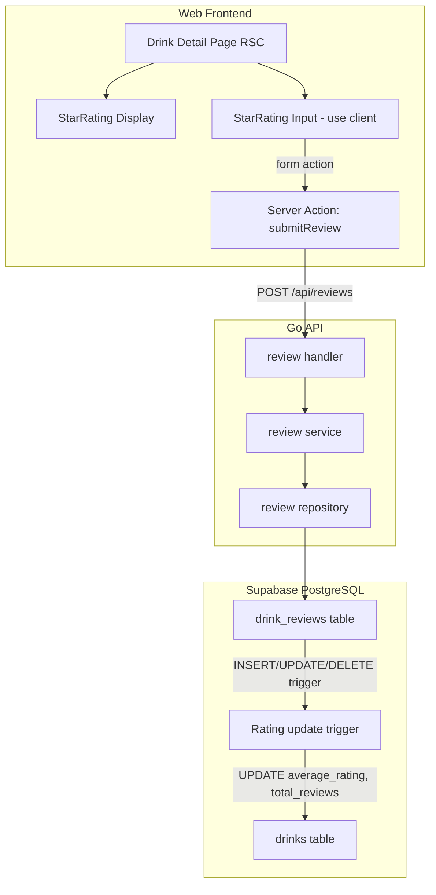

# Star Rating Feature for Alcohol Detail Page

## Current State

- The `drinks` table already has `average_rating` and `total_reviews` columns (denormalized for performance)
- The migration file already contains a **commented-out design** for `drink_reviews` table at [supabase/migrations/20260515210611_create_drinks.sql](supabase/migrations/20260515210611_create_drinks.sql) (lines 112-128)
- The `DrinkReview` type already exists in [packages/types/src/drink.ts](packages/types/src/drink.ts) (lines 38-46)
- The detail page at [apps/web/src/app/drinks/[slug]/page.tsx](apps/web/src/app/drinks/[slug]/page.tsx) has a placeholder "Reviews section" (lines 116-123)
- Auth middleware exists at [apps/api/internal/middleware/auth.go](apps/api/internal/middleware/auth.go) with `RequireAuth` and `UserID` helper

## Architecture

## Implementation Plan

### 1. Database Migration (new migration file)

Create `supabase/migrations/<timestamp>_create_drink_reviews.sql`:

- `drink_reviews` table with `id`, `drink_id`, `user_id`, `rating` (1-5), `comment`, `created_at`, `updated_at`
- `UNIQUE(drink_id, user_id)` constraint (one review per user per drink)
- RLS policies: authenticated users can read all, insert/update/delete own
- Trigger function to auto-update `drinks.average_rating` and `drinks.total_reviews` on INSERT/UPDATE/DELETE
- Index on `drink_id` for fast lookup

### 2. Go API - Review Feature (`apps/api/internal/review/`)

Create a new feature package following the existing pattern ([apps/api/internal/drink/](apps/api/internal/drink/)):

- **`model.go`** - `Review` struct, `CreateInput`, `UpdateInput`
- **`repository.go`** - `FindByDrinkAndUser`, `ListByDrink`, `Upsert` (INSERT ON CONFLICT UPDATE), `Delete`
- **`service.go`** - Business logic, validation (rating 1-5)
- **`handler.go`** - Routes:
  - `GET /api/reviews?drink_id={id}` - Get reviews for a drink (public)
  - `GET /api/reviews/mine?drink_id={id}` - Get current user's review (authenticated)
  - `POST /api/reviews` - Create/update review (authenticated, upsert)
  - `DELETE /api/reviews/{id}` - Delete own review (authenticated)

Wire into [apps/api/internal/router/router.go](apps/api/internal/router/router.go) under the authenticated group.

### 3. Web Frontend - Star Rating Component

Create `apps/web/src/components/ui/star-rating.tsx` (client component):

- Reusable star rating component with two modes:
  - **Display mode**: Shows filled/half/empty stars based on `value` prop (for average display)
  - **Input mode**: Interactive stars with hover preview and click-to-rate (for user input)
- Use Lucide `Star` icon with fill states
- Accessible: keyboard navigation (arrow keys), proper ARIA labels
- UX: Tap/click a star to rate immediately (no submit button needed for a "quick evaluation" feel), with optimistic UI update via `useOptimistic`

### 4. Web Frontend - Server Action

Create `apps/web/src/app/drinks/[slug]/actions.ts`:

- `submitReview` Server Action: validates input, calls Go API with auth token
- Returns `{ ok: true, data }` or `{ ok: false, error }` pattern (per project convention)

### 5. Web Frontend - Detail Page Integration

Update [apps/web/src/app/drinks/[slug]/page.tsx](apps/web/src/app/drinks/[slug]/page.tsx):

- Replace the reviews placeholder with:
  - Average star display (using `StarRating` in display mode) with count
  - Interactive star rating input for authenticated users (using `StarRating` in input mode)
  - Show user's existing rating if they've already reviewed
- Update the sidebar "evaluation" section to use the visual star component instead of text
- For unauthenticated users, show stars with a "login to rate" prompt

### 6. Shared Types

The `DrinkReview` type already exists in [packages/types/src/drink.ts](packages/types/src/drink.ts). Add a `DrinkReviewWithUser` type if needed for display with user info.

## UX Considerations for Easy Evaluation

- **One-tap rating**: Click/tap a star to immediately submit (no confirmation step)
- **Optimistic update**: Star fills instantly before server confirms
- **Re-rate**: Click a different star to change rating (upsert semantics)
- **Visual feedback**: Hover/touch preview shows what rating would be
- **Undo**: Click the same star again to remove rating (optional enhancement)
- **No mandatory comment**: Rating is the only required input; comment is optional and can be added later
