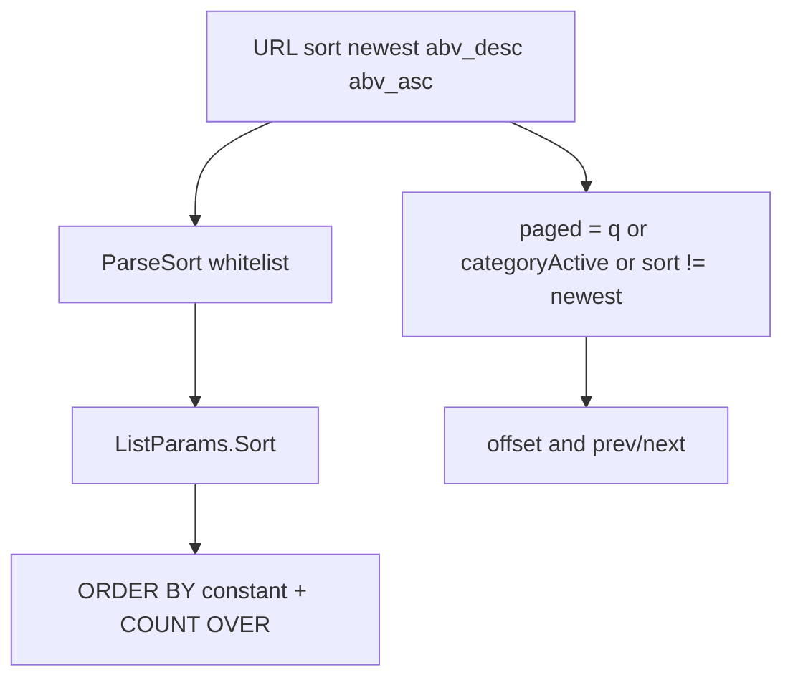

# セクション 2 — 度数のソート

対象は **Web のみ**。国フィルター / 度数レンジ / 評価順 / 関連度 / カクテル並びは触らない。

関連プラン:

- [レイアウト変更](web_layout_count_and_recent.md)（件数と同じ段。同一 PR 推奨）
- [表示名編集・退会](web_profile_edit_and_delete.md)

## 目的

アルコール度数で銘柄一覧を並べ替えられるようにする。フィルターではない。カテゴリ選択後が主ケースだが、UI を隠して複雑化しない。

## 現状

Go [`GET /api/drinks`](../../apps/api/internal/drink/handler.go) は `category` / `q` / `limit` / `offset` のみ。[`ListParams`](../../apps/api/internal/drink/model.go) に sort は無い。[`repository.go`](../../apps/api/internal/drink/repository.go) は `ORDER BY created_at DESC` 固定。`COUNT(*) OVER()` 済み。

Web の `searchParams` / [`FetchDrinksParams`](../../apps/web/src/application/drinks-api.ts) / [`useDrinks`](../../apps/web/src/application/use-drinks.ts) SWR キーは `category, q, limit, offset`。カードは既に `drink.abv` を表示。

未フィルタ（棚）は先頭 20 件のみ。このままだと ABV ソートしても棚の 20 件しか入れ替わらず壊れて見える。

[`SearchMissLogger`](../../apps/web/src/components/catalog/search-miss-logger.tsx) は `filtersActive` が true だと miss を書かない。現行は `filtersActive={categoryFilterActive}`。

shadcn Select は [`apps/web/src/components/ui/select.tsx`](../../apps/web/src/components/ui/select.tsx) に既にある。未使用。

カクテル API は `recipe_count DESC, name ASC` 固定。触らない。

## 決定（固定）

- クエリは `sort` のみ。許可値: `newest`（デフォルト、`created_at DESC`。省略時もこれ） / `abv_desc` / `abv_asc`。
- 不正値は `newest` にフォールバック。400/500 にしない。
- `abv IS NULL` は常に末尾（`NULLS LAST`）。PostgreSQL の `DESC` 既定は NULLS FIRST なので **両方明示**する。
- UI はセレクト1つ。カテゴリチップ列にチップ種を増やさない。レイアウト変更後の件数と同じ段（件数左、セレクト右）。
- デフォルトは newest。カテゴリ未選択でも ABV ソートは動いてよい。検収の主ケースはカテゴリ選択後。
- `sort` がデフォルト以外なら、未検索・未カテゴリでも **ページネーション対象**。
- **`category=all` はカテゴリ未選択と同じ**（チップの「すべて」は URL から `category` を消すが、手打ち・共有 URL で `?category=all` は残る）。現行は `filtered = q || (category && category !== 'all')`。`paged = q || category || sort !== 'newest'` と短縮すると `?category=all` が truthy になり、棚なのに offset が有効化される。
- `paged` の仕様（`drink-list-query.ts` に固定。複製しない）:

  ```ts
  export function isCategoryFilterActive(category: string): boolean {
    return category !== '' && category !== 'all';
  }
  export function isDrinkListPaged(input: {
    q: string;
    category: string;
    sort: DrinkListSort;
  }): boolean {
    return Boolean(
      input.q || isCategoryFilterActive(input.category) || input.sort !== 'newest',
    );
  }
  ```

  このヘルパーで `q` を trim しない。RSC は既存どおり渡す前に trim、client は `searchParams` のまま。空白 `q` の扱いはこの PR で変えない。
- **`paged` / `parseDrinkListSort` / `isCategoryFilterActive` は1箇所。** [`apps/web/src/utils/drink-list-query.ts`](../../apps/web/src/utils/drink-list-query.ts)（新規）。`page.tsx`（RSC）と `drink-list-client.tsx`（client）に複製しない。片一方だけ更新すると SSR fallback と SWR 表示がズレる。API へ渡す `category` も `isCategoryFilterActive` が false なら省略（現行 `drinks-api.ts` と同じ）。
- Go の `ParseSort` と Web の `parseDrinkListSort` は **同じ許可値・同じデフォルト（空・不正 → `newest`）**。
- ソート変更時は `offset` をリセット。
- 評価順・関連度は足さない。`q` ありのデフォルトも newest。
- 国パラメータ、`abv_min` / `abv_max`、スライダーは出さない。
- ソートだけでは `filtersActive` を true にしない。`filtersActive={categoryFilterActive}` を維持。
- `COUNT(*) OVER()` を復活させない。別 COUNT クエリを足さない。
- 既存 `GET /api/drinks` を伸ばす。新エンドポイント禁止。
- ORDER BY はホワイトリスト定数のみ。ユーザー入力を SQL に連結しない。
- ABV 用 INDEX は v1 で足さない。カタログが小さい前提。成長後に seq scan が増えたら `(visibility, abv)` の部分 INDEX を別 PR で検討する（この PR で推測追加しない）。

度数レンジ（スライダー、5–15% 等）は実装しない。より広いテストユーザーから再要望が出たら別プランで検討する。

## 実装方針



Go:

- `ListParams` に `Sort string`。
- handler で `ParseSort(q.Get("sort"))`。空・不正 → `newest`。
- repository は switch で定数を返すだけ:

  - `newest`: `ORDER BY created_at DESC`
  - `abv_desc`: `ORDER BY abv DESC NULLS LAST, created_at DESC`
  - `abv_asc`: `ORDER BY abv ASC NULLS LAST, created_at DESC`

- `fmt.Sprintf` に載せるのはこの定数だけ。`params.Sort` 生文字は載せない。
- カタログが小さいので ABV 用 INDEX は v1 で足さない。

Web:

- [`packages/types`](../../packages/types) に `DrinkListSort = 'newest' | 'abv_desc' | 'abv_asc'` を足して前後で型を共有してよい。
- [`apps/web/src/utils/drink-list-query.ts`](../../apps/web/src/utils/drink-list-query.ts): `parseDrinkListSort` / `isCategoryFilterActive` / `isDrinkListPaged` / この2ファイル用の `parseOffset`。`page.tsx` と `drink-list-client.tsx` はこれを import するだけ。他ページの `parseOffset` はこの PR でまとめない。
- `FetchDrinksParams.sort` を client/server 両方に。`newest` のときは URL と API クエリから省略してよい（デフォルト）。
- `useDrinks` のキーに `sort` を足す。
- [`page.tsx`](../../apps/web/src/app/page.tsx) の `searchParams` に `sort`。`isDrinkListPaged` のときだけ URL の offset を使う。
- [`drink-list-client.tsx`](../../apps/web/src/components/drinks/drink-list-client.tsx): 件数と同じ段に Select。ラベル: 「新着」「度数が高い順」「度数が低い順」。`aria-label="並び順"`。
- セレクト変更: `sort` を set / newest なら delete。`offset` を delete。`router.push`。
- [`category-filter.tsx`](../../apps/web/src/components/drinks/category-filter.tsx) と [`confirmed-search-input.tsx`](../../apps/web/src/components/catalog/confirmed-search-input.tsx) は既に `URLSearchParams` コピー＋ `offset` 削除なので、`sort` は自動で残る。追加改修は不要（残ることを受け入れで確認する）。
- 件数文言: `paged` ならレンジ、棚（`paged === false`）なら短文。既存ロジックの拡張であり破壊ではない。

## 対象ファイル

- [`apps/api/internal/drink/model.go`](../../apps/api/internal/drink/model.go)
- [`apps/api/internal/drink/handler.go`](../../apps/api/internal/drink/handler.go)
- [`apps/api/internal/drink/repository.go`](../../apps/api/internal/drink/repository.go)
- [`apps/web/src/app/page.tsx`](../../apps/web/src/app/page.tsx)
- [`apps/web/src/components/drinks/drink-list-client.tsx`](../../apps/web/src/components/drinks/drink-list-client.tsx)
- [`apps/web/src/application/drinks-api.ts`](../../apps/web/src/application/drinks-api.ts)
- [`apps/web/src/application/drinks-api.server.ts`](../../apps/web/src/application/drinks-api.server.ts)
- [`apps/web/src/application/use-drinks.ts`](../../apps/web/src/application/use-drinks.ts)
- [`apps/web/src/utils/drink-list-query.ts`](../../apps/web/src/utils/drink-list-query.ts)（新規）
- [`packages/types`](../../packages/types)（任意の union）

触らない: カクテル handler/repository/list、詳細ページ並び、`SearchMissLogger` の契約変更。

## 受け入れ条件

- `?category=beer&sort=abv_desc` でビールが度数降順。NULL ABV は末尾。
- `?sort=abv_asc` のみ（q/category なし）で全 published が度数昇順になり、20件超なら前へ/次へが出る。件数はレンジ文言。
- `sort` 省略と `sort=newest` は現状と同じ `created_at DESC`。棚の短文言とページネーション無しを維持。
- `?category=all&offset=20`（sort 省略）は棚と同じく offset 無視。件数は短文言、ページネーション無し。`?category=all&sort=abv_desc` はページネーション対象（sort が newest 以外）。
- `sort=nope` は 200 で newest。UI は新着。Go `ParseSort` と Web `parseDrinkListSort` のフォールバックが一致する。
- ソート変更で offset が 0 に戻る。
- ゼロ件＋ `q` あり＋カテゴリ無しの miss 計測が、`sort=abv_desc` でも記録される（`filtersActive` が sort で true にならない）。
- カードの ABV 表示は現状のまま。
- `pnpm lint` / `pnpm type-check`。Go は `cd apps/api && go vet ./...`。

## やらないこと

- `abv_min` / `abv_max` / スライダー / 国
- 評価順・関連度・カクテル sort
- カテゴリチップ増設、トップの閲覧ポータル化
- 別 COUNT クエリ、新エンドポイント
- 推測での INDEX 追加（成長後の `(visibility, abv)` 部分 INDEX は別 PR）

## PR

[レイアウト変更](web_layout_count_and_recent.md) と **同一 PR（PR-A）**。表示名・退会には混ぜない。

## レビュー反映（PR #119）

- `paged` 判定を `drink-list-query.ts` に集約。Go / Web の sort 許可値を受け入れ条件に明記。
- INDEX は v1 で足さないが、後続の検討条件を残す。
- `paged` の短縮式から `category !== 'all'` が落ちないよう `isCategoryFilterActive` を固定。`?category=all&offset=20` を受け入れに追加。
