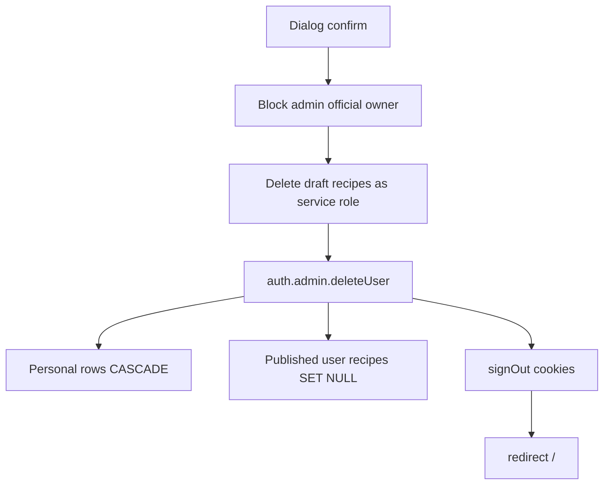

# セクション 3 — プロフィール編集・退会機能

対象は **Web のみ**。表示名編集と退会は **必ず別 PR**。退会を先に出さない。

関連プラン:

- [レイアウト変更](web_layout_count_and_recent.md)
- [度数のソート](web_drinks_abv_sort.md)

---

## 3A 表示名編集

### 目的

サインイン後に表示名を変えられる。変えたらヘッダーのアバター文字も変わる。

### 現状

- [`apps/web/src/app/profile/page.tsx`](../../apps/web/src/app/profile/page.tsx) は表示のみ。フォームなし。
- [`apps/web/src/app/(auth)/actions.ts`](../../apps/web/src/app/(auth)/actions.ts) は signIn / signUp / signOut のみ。
- [`public.users.display_name`](../../supabase/migrations/20260521220111_create_users.sql) + RLS `users_update_own` + `GRANT UPDATE (display_name, avatar_url)` は既存。足りないのはフォーム。
- `display_name` に長さ CHECK は無い。既存行は空文字が多い（signup トリガーが display_name を埋めない）。
- [`getAuthProfile`](../../apps/web/src/lib/auth/app-role.ts) は `app_role` だけ。ヘッダーは **email の local-part** でアバター文字を作っており `display_name` を見ていない。
- Go `internal/user` は GET のみ。プロフィール更新を Go に足さない（単純 CRUD は RLS 直）。

### 決定（固定）

- v1 は **表示名だけ**。アバターアップロード、bio、メール変更、パスワード変更は出さない。
- スキーマを増やして編集可能カラムを足さない。
- trim 後に空・空白のみは不可。長さ **1–50**（アプリ）。DB は `char_length(display_name) <= 50` のみ。`>= 1` は既存の空行で migration が落ちるので足さない。空行のバックフィルもしない。
- Server Action + 自分のセッションの Supabase server client で UPDATE。
- ヘッダーは `display_name`（trim して非空）→ なければ email local-part。編集してもヘッダーが変わらない実装は不合格。
- Sign Out は残す。編集とログアウトを同じボタンにしない。
- 既存プロフィールページの英語ラベルをこの PR で i18n し直さない。

### 実装方針

- 新規 [`apps/web/src/app/profile/actions.ts`](../../apps/web/src/app/profile/actions.ts)（auth actions に混ぜない）。
- `updateDisplayName`: `getUser()` → trim → 1–50 でなければ `{ ok: false, error }` → `from('users').update({ display_name }).eq('id', user.id)` → `revalidatePath('/', 'layout')` と `/profile`。throw しない。
- ページに uncontrolled input + `useActionState` + 既存 Field / Button。
- [`getAuthProfile`](../../apps/web/src/lib/auth/app-role.ts) の select を `app_role, display_name` に伸ばす。`AuthProfile` に `displayName: string | null`。ヘッダーとプロフィールでこれを使う（プロフィールの `select('*')` をやめられるなら寄せる）。
- migration: `ALTER TABLE public.users ADD CONSTRAINT chk_users_display_name_length CHECK (char_length(display_name) <= 50);`

### 対象ファイル

- [`apps/web/src/app/profile/page.tsx`](../../apps/web/src/app/profile/page.tsx)
- [`apps/web/src/app/profile/actions.ts`](../../apps/web/src/app/profile/actions.ts)（新規）
- 小さなクライアントフォーム（既存 page を肥大化させないため）
- [`apps/web/src/lib/auth/app-role.ts`](../../apps/web/src/lib/auth/app-role.ts)
- [`apps/web/src/components/layouts/header.tsx`](../../apps/web/src/components/layouts/header.tsx)
- `supabase/migrations/` 新規（display_name 上限）

### 受け入れ条件

- `/profile` で表示名を 1–50 文字に変更できる。空・空白・51文字はエラーで DB が変わらない。
- 変更後、ヘッダーアバターの文字が新しい表示名になる（email local-part のままは不合格）。
- Sign Out は別ボタンのまま。
- `pnpm lint` / `pnpm type-check`。

### やらないこと（3A）

- 退会 UI、service role クライアント
- アバター/bio/メール/パスワード
- Go PATCH、設定画面アプリ新設

---

## 3B 退会（表示名 PR の次）

### 目的

自分のアカウントを消せる。公開カタログ（公式レシピ・published 銘柄）は欠けない。公開済みユーザーレシピは本文を残し著者を「退会したユーザー」にする。

### 現状

- 退会 UI も Admin API 呼び出しも無い。
- Web の service role クライアントは未作成。`SUPABASE_SERVICE_ROLE_KEY` はルート `.env`（`apps/web/.env.local` が symlink）。
- `auth.users` DELETE の現状 FK:
  - CASCADE: `public.users`, `saved_drinks`, `ratings`, `drink_logs`, `cocktail_recipe_ratings`, `drinks.submitted_by`（暫定銘柄）, **`cocktail_recipes`（公式含む）**
  - SET NULL: `search_misses.user_id` のみ
- 公式レシピは seed の `official@sakehub.app` / `SakeHub公式`。`cocktail_recipes.user_id ON DELETE CASCADE` のままだと公式アカウント削除でカタログが消える。
- レシピ一覧は既に `LEFT JOIN public.users`。`authorName` が空だと Web は著者名を出さない。
- Go `UserID` は `string`（NULL 不可）。

### 決定（固定）

- プロフィールの危険ゾーン。確認なしに消さない。確認文でリスト・評価・ログが消えること、公開レシピ本文は「退会したユーザー」名義で残ることを明示する。
- 本物の退会は `auth.users` 削除。`public.users` だけ消して Auth を残さない。
- クライアントに service role を出さない。Server Action からのみ Admin API。
- **匿名化は SET NULL**（tombstone ユーザーへ付け替えない）。
  - 公開済み・非公式レシピ: `user_id` を NULL にして本文を残す。
  - 下書き（`status = 'draft'`）は個人データとして削除してから Auth 削除（NULL の下書きを残さない）。
  - 公式（`is_official = true`）は一般退会の対象外。`user_id` を NULL にしない制約を付ける。
- 表示は「退会したユーザー」。JSON-LD の個人著者フォールバックもこれに揃える。
- 暫定銘柄 `submitted_by ON DELETE CASCADE`、リスト/評価/ログ/レシピ評価は個人データとして消えてよい。`search_misses` は既存 SET NULL。
- 退会後はセッション破棄して `/`。同じメールで再ログインできないこと。
- 運営セルフ退会を塞ぐ: `app_role = 'admin'`、または `is_official = true` のレシピ保有、または email が `official@sakehub.app`。該当者には危険ゾーンを出さない（公式シードを UI から消せるのは不合格）。
- 退会は Go に寄せない。理由: Auth Admin API と service role が Web Server Action の仕事であり、Go `internal/user` は GET のみ。特権面を増やさない。

### 実装方針

Migration（新規ファイル。既存 migration は書き換えない）:

- `cocktail_recipes.user_id` を NULL 可に。
- FK を `ON DELETE SET NULL` に張り替え。
- `CHECK (NOT is_official OR user_id IS NOT NULL)` で公式の孤児化を禁止。

Go（退会 PR に含める。リスト並びは変えない）:

- レシピの `UserID` を `*string`（または NullString）にし、NULL を scan できるようにする。
- `author_name` を `COALESCE(NULLIF(TRIM(u.display_name), ''), CASE WHEN r.user_id IS NULL THEN '退会したユーザー' END)` にする（既存の LEFT JOIN 3箇所）。
- カクテル一覧の `ORDER BY` は変えない。

Web:

- [`apps/web/src/lib/supabase/admin.ts`](../../apps/web/src/lib/supabase/admin.ts) 新規。`import 'server-only'`。`createClient(url, SERVICE_ROLE_KEY)`。`'use client'` から import しない。
- `deleteAccount` Server Action: セッション user → ガード → service role で draft DELETE → `auth.admin.deleteUser` → `signOut` → `redirect('/')`。失敗は結果オブジェクト。
- 確認は既存 Dialog。チェックボックス必須（リスト・評価・ログ削除の理解）。Sign Out と退会を同じボタンにしない。
- 著者表示が空で消えないこと（SQL COALESCE 後は `authorName` が入る）。[`recipe-json-ld.ts`](../../apps/web/src/utils/recipe-json-ld.ts) の個人フォールバックを「退会したユーザー」に。
- [`.env.example`](../../.env.example) の service role コメントに「Web の退会 Server Action」を追記。値はコミットしない。

### 対象ファイル

- `supabase/migrations/` 新規
- [`apps/web/src/lib/supabase/admin.ts`](../../apps/web/src/lib/supabase/admin.ts)（新規）
- [`apps/web/src/app/profile/actions.ts`](../../apps/web/src/app/profile/actions.ts)（delete 追加）
- プロフィール危険ゾーン UI
- [`apps/api/internal/cocktail/model.go`](../../apps/api/internal/cocktail/model.go) / [`repository.go`](../../apps/api/internal/cocktail/repository.go)（NULL user_id と著者名のみ）
- [`packages/types/src/cocktail-recipe.ts`](../../packages/types/src/cocktail-recipe.ts) / cocktail mapper（`userId` optional）
- [`apps/web/src/utils/recipe-json-ld.ts`](../../apps/web/src/utils/recipe-json-ld.ts)
- [`.env.example`](../../.env.example)

### 受け入れ条件

- 一般ユーザーが確認後に退会できる。以降そのメールでログインできない。`/` に戻る。
- `saved_drinks` / `ratings` / `drink_logs` / 下書きレシピ / 暫定銘柄は消える。
- 公開済みユーザーレシピは残り、著者名が「退会したユーザー」。公式レシピは残る。
- admin / 公式アカウントでは退会 UI が出ない。出してもサーバーが拒否する。
- service role キーがクライアントバンドルに含まれない。
- `pnpm lint` / `pnpm type-check`。Go 変更があるので `cd apps/api && go vet ./...`。

### やらないこと（3B）

- tombstone ユーザー
- 公開レシピ本文の削除、公式レシピの CASCADE
- メール変更・パスワード変更を退会に混ぜる
- Go への DELETE /users
- 運営コンソールからのユーザー削除 UI（別議論）

---

## PR 分割と実装順

推奨は **3 PR**（レイアウトと度数ソートを同一 PR にまとめる）。崩すなら理由を PR 本文に書く。

1. **PR-A レイアウト + 度数ソート** — 件数移動、「最近残した」下へ、カクテル件数位置、`GET /api/drinks?sort=`、件数と同じ段のセレクト。フロントが同じ段を触るため分割すると二度書きになる。
2. **PR-B 表示名編集** — フォーム、CHECK 上限 50、ヘッダー反映。退会より先。
3. **PR-C 退会** — SET NULL migration、admin client、確認ダイアログ、レシピ著者フォールバック。B より先に出さない。B 無しで危険ゾーンだけ足さない。

同一 PR にしてはいけない: 表示名と退会。退会をレイアウト/ソートに混ぜない。

完了条件（各 PR）: `pnpm lint`、`pnpm type-check`。Go を触る PR-A / PR-C は `cd apps/api && go vet ./...`。
