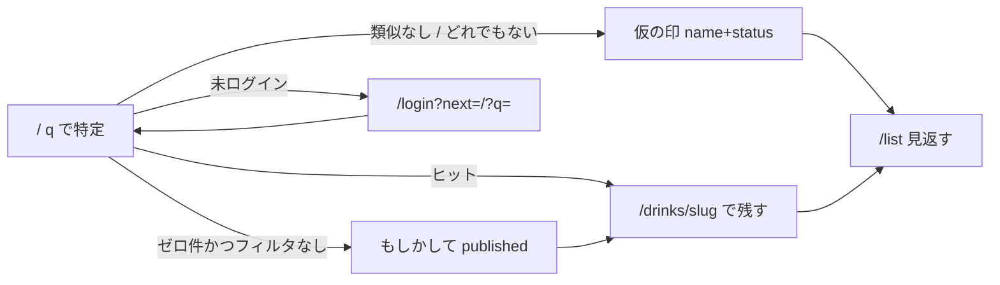

---
todos:
  - id: suggestions-api
    status: in_progress
    content: 'GET /api/drinks に published フィルタ + ゼロ件かつ category 空のときだけ trgm suggestions（N=5, 0.3）'
  - id: home-zero-ui
    content: 'トップ q のみゼロ件: もしかして DrinkCard + SearchMissLogger の filtersActive 揃え'
    status: pending
  - id: provisional-data-api
    content: drinks visibility 等の migration / RLS / ratings 拒否 / saveddrink provisional POST と Unsave lifetime
    status: pending
  - id: local-zero-hit-seed
    content: 'supabase/seeds/local_zero_hit.sql（類似用 published + rater01 の仮印）。config / pnpm supabase:seed / README のみ。本番シードには入れない'
    status: pending
  - id: list-and-recent
    content: /list の仮印バッジ・非リンク・星非表示。最近残したは /list へ
    status: pending
  - id: auth-next-cta
    content: 未ログイン CTA と /login?next=/?q= 復帰。成功後 /list
    status: pending
name: Zero Hit Exit
overview: お酒検索のゼロ件に、既存 published カタログの類似候補と、ログイン後すぐ自分のリストへ載る仮の印を足す。ローカル専用シードでゼロ件・類似・仮の印を再現する。公開マスタの自動生成・承認待ち・カクテルはやらない。
isProject: false
---

# ゼロ件でもループが続く出口

対象は **Web のみ**。技術スタックは現状踏襲（Next.js App Router、Server Actions、Go API、Supabase）。新規外部サービスは増やさない。既存ファイルの編集を優先する。

---

## プロダクト決定（固定）

再議論しない。

- トップの約束は「銘柄を特定する」。未ログインで完結。ログイン後にダッシュボード化しない。
- ログイン後の約束は「特定した銘柄を自分のリストに残す」。日記でも、レビュー投稿が主目的でもない。
- 意図は 2 値だけ: `drank` / `want`。無印「リストに残す」を主 CTA にしない。
- リストの正は `saved_drinks`。`ratings` は公開の注釈。`drink_logs` はリストに使わない（DROP しない）。
- 対象は Web のみ。グローバル前提。
- 1人1銘柄（カタログ ID がある行）。評価するとリストに入る、等の既存不変条件は壊さない。
- **対象はお酒検索（`/` の `q`）だけ。** カクテルのゼロ件・カクテルをリストに残すのは次フェーズ。
- カメラ / 画像 / Vision / OCR はやらない。
- 公開カタログの自動生成・自動公開はやらない。仮の印は検索・ランキング・sitemap・JSON-LD・未ログイン一覧に出さない。
- 申請承認待ちにしない。ログイン後は今すぐ `/list` に載る。
- 類似候補は既存の **published** カタログだけ。仮の印同士を候補に出さない。
- 類似は未ログインでも可。仮の印はログイン必須。未ログイン CTA は「ログインしてこの名前で残す」（`next` に検索クエリを戻す）。
- **`q` があり、カテゴリ未指定（または all）、かつヒット 0 件のときだけ** 類似と仮の印を出す。`SearchMissLogger` の `filtersActive` 契約と揃える。
- 仮の印の名前は今の検索クエリ。長い申請フォームは置かない。意図は必須。
- 仮の印に公開評価（星・みんなの評価）を付けない。
- `drink_logs.custom_drink_name` をリストの正にしない。
- 運営管理画面・AI 下書き・マージ UI は今回やらない。スキーマにマージ余地だけ残す。
- 既存 `search_misses` 記録は維持する。

---

## データモデル決定（1案）

**仮の印は `drinks` の `visibility='provisional'` 行 + 既存 `saved_drinks`（`drink_id` FK）。公開面は `visibility='published'` だけ。**

`saved_drinks` の 1人1銘柄と JOIN を壊さない。公開マスタへ自動昇格しない。後から運営が published を足したとき、`saved_drinks.drink_id` を付け替え、仮行に `merged_into_id` を書ける形だけ残す（**マージ処理は実装しない**）。

新規 migration（既存ファイルは書き換えない）で [`drinks`](supabase/migrations/20260515210611_create_drinks.sql) に足す:

- `visibility TEXT NOT NULL DEFAULT 'published'` + `CHECK (visibility IN ('published', 'provisional'))`
- `submitted_by UUID REFERENCES auth.users(id) ON DELETE CASCADE`
- `merged_into_id UUID REFERENCES drinks(id) ON DELETE SET NULL`（今回未使用）
- `name_normalized TEXT`（仮行だけ埋める）
- `CHECK`: published なら `submitted_by IS NULL`、provisional なら `submitted_by IS NOT NULL` かつ `category = 'other'`
- **UNIQUE**: 部分 UNIQUE `(submitted_by, name_normalized) WHERE visibility = 'provisional'`
- 既存行は DEFAULT で published。`status` という列名は使わない（`saved_drinks.status` と衝突する）

カテゴリ: **ユーザーに選ばせない。`other` 固定。** `category` の nullable 化はしない（フォームを長くせず、CHECK も既存のまま）。

名前:

- 表示名は今の `q` を trim。SKU（23 / 45）は聞かない。粗い名前でよい。
- 長さは search miss に揃える: raw ≤ 200、正規化後 2〜40 文字。外れたら 400。
- 正規化は [`NormalizeQuery`](apps/api/internal/searchmiss/normalize.go) と同じ（NFKC・小文字・カタカナ→ひらがな・空白/中黒/長音除去）。フィーチャー間 import を避けるため **`pkg/normalize` に1つ移し**、`searchmiss` と `saveddrink` が参照する。既存 `testdata/normalize-cases.json` を追随。
- slug は `p-{uuid hex}`。公開 URL には使わない（UNIQUE NOT NULL を満たすためだけ）。

RLS（Go は postgres で RLS をバイパスするので、**公開 SQL 側の除外が本体**。RLS は防御）:

- 現行 `drinks_select_public`（`USING (true)`）を捨てる
- `visibility = 'published'` は anon / authenticated が SELECT 可
- `visibility = 'provisional' AND submitted_by = auth.uid()` は所有者だけ SELECT
- INSERT/UPDATE ポリシーは足さない（Web は Server Action → Go。Supabase クライアントから `drinks` / `saved_drinks` を直接叩かない）

公開クエリはデータ投入と同時に published だけにする（中間マージで仮行を混ぜない）:

- [`List` / `FindByID` / `FindBySlug`](apps/api/internal/drink/repository.go) に `visibility = 'published'`
- sitemap の [`fetchDrinksServer({ limit: 1000 })`](apps/web/src/app/sitemap.ts) は List 経由なので追随
- 類似候補も published のみ
- [`DrinkExists`](apps/api/internal/saveddrink/repository.go)（通常の POST `{ drink_id }`）は published のみ。他人の仮行 UUID をリストに付けられない
- `ratings` INSERT を仮行に拒否するトリガー（公開評価を混ぜない）。Go `review` は契約を変えないが、仮行には詳細ページが無いので UI からも届かない
- `GET /api/drinks/by-slug/:slug` は仮行を **所有者でも 404**。公開詳細ページは作らない。見返しは `/list` だけ

仮行の lifetime（1案）: **印を外したあと、その仮行を参照する `saved_drinks` が無ければ `drinks` 行を消す。published は消さない。** `saveddrink` の Unsave をトランザクションにし、DELETE `saved_drinks`（既存トリガーで ratings も消える）→ 仮行かつ他参照なしなら DELETE `drinks`。オーファンは残さない。

同一ユーザーが同じ正規化名で量産しない: 仮行 INSERT は部分 UNIQUE で `ON CONFLICT (submitted_by, name_normalized) WHERE visibility = 'provisional'`。衝突時は既存仮行を再利用し、表示名だけ最新の `q` に更新。`saved_drinks` は既存どおり status だけ UPSERT。

メモ: **今回は入力しない。** ゼロ件 CTA にメモ欄は置かない。`/list` はメモ表示だけ（編集は銘柄詳細の Dialog にあり、仮の印には詳細が無い）。`note` は空のまま。後から list 行へ Dialog を移植すれば足りる（今回やらない）。

API:

- 類似: 既存 `GET /api/drinks` のゼロ件レスポンスに `suggestions[]` を足す。別 `GET /suggestions` は作らない（確定検索の同一リクエストで足りる）。
  - 条件: `q` あり、`category` 空、`total = 0` のときだけ類似 SQL を走る。ヒットがある通常検索・カテゴリ絞りでは `suggestions: []`。
  - N = **5**。閾値は [`export-demand.ts`](packages/drink-seed/src/export-demand.ts) の `SIMILARITY_THRESHOLD = 0.3` に揃える。SQL 形も同じ（`name` と `aliases` の `GREATEST(similarity())`）。`pg_trgm` / `idx_drinks_name_trgm` を使う。新規拡張は足さない。
  - `export-demand.ts` 自体は触らない（運用パイプライン維持）。
- 仮の印: `POST /api/auth/saved-drinks/provisional` `{ name, status }`（認証必須。status は `drank`|`want`。name はサーバで trim / 正規化 / 長さ）。既存 `POST /` の `{ drink_id, status }` は変えない。
- 一覧: 既存 `GET /api/auth/saved-drinks` の `drink` に `visibility` を足す。Web は `visibility === 'provisional'` で仮と判定。slug は返すが **リンクしない**。
- 外す: 既存 `DELETE /api/auth/saved-drinks/{drink_id}` + 上記 lifetime。
- 意図切替: 既存 PATCH。仮行でも可。

Go: 仮行 INSERT は **`saveddrink` リポジトリのトランザクション**（`drinks` + `saved_drinks`）。`drink` パッケージは import しない。`router` だけが handler を集約。`r.Post("/provisional", ...)` を既存 AuthRoutes に足す。

ローカル再現用のシードは **`drinks.sql` に足さない**（生成物かつ本番共通）。専用ファイルは「6. ローカルシード」を参照。

Web: [`saved-drink-actions.ts`](apps/web/src/application/saved-drink-actions.ts) に `saveProvisionalDrink(name, status)`。成功後は `/list` へ（今すぐ見返せる）。`revalidatePath` は `/` と `/list`。

却下した案:

- **`drink_logs.custom_drink_name` でリスト化**: 1人1銘柄にならない。日記 UI を主経路に戻す。禁止。
- **申請テーブルだけ作ってリストに載せない**: 承認待ちになる。禁止。
- **仮行を公開検索に出す**: 自動公開相当。禁止。
- **カメラでマスタ自動 insert**: 禁止。
- **`saved_drinks` に `custom_name` を足して `drink_id` を nullable にする**: 仮行 lifetime と「カタログ ID がある行」の不変条件が割れる。JOIN と通常 save が分岐する。
- **別テーブル `provisional_drinks`**: リストの正を二系統にする。今回の見返しは `saved_drinks` 1本で足りる。
- **`drinks.category` を nullable / ユーザー選択**: フォームが長くなる。`other` 固定で足りる。
- **別 `GET /api/drinks/suggestions`**: 確定検索と二重 fetch になる。List のゼロ件に載せる。
- **仮行の公開詳細（所有者だけ 200）**: 推測 slug / sitemap 漏れの面が増える。見返しは `/list` だけ。

---

## 1. トップ `/` のゼロ件

### 現状

- [`apps/web/src/app/page.tsx`](apps/web/src/app/page.tsx): `q` / `category` / `offset`。`fetchDrinksServer`。ログイン時「最近残した」は `{ slug, name, status }` を [`DrinkListClient`](apps/web/src/components/drinks/drink-list-client.tsx) へ。
- [`DrinkGrid`](apps/web/src/components/drinks/drink-grid.tsx): 0 件で「お酒が見つかりませんでした／検索条件を変更してみてください」。
- [`SearchMissLogger`](apps/web/src/components/catalog/search-miss-logger.tsx): `q` あり・`total === 0`・`filtersActive === false` のとき `POST /api/search-misses`。呼び出しは `filtersActive={category !== ''}`。カテゴリチップの「すべて」は `category` を URL から消すので、通常操作では契約どおり。
- 類似も仮の印も無い。Go List は FTS + `strpos`。ゼロ件でも trgm は走らない。

### このページの約束

名前で特定する。外れたら既存 published 候補へ誘導する。ログイン後は同じ名前で仮の印を残せる。トップを申請フォームやカメラにしない。

### 変更内容（UI / コピー / 導線）

分岐:

- ヒット > 0: 今どおり。`suggestions` を棚に混ぜない。
- ヒット = 0 かつカテゴリ絞りあり: **今の空状態のまま**（仮の印も類似も出さない）。コピーは現行でよい。
- ヒット = 0 かつ `q` のみ（category 空または `all`）:
  - 「『{q}』は見つかりませんでした」
  - 類似があれば「もしかして」+ 既存 [`DrinkCard`](apps/web/src/components/drinks/drink-card.tsx)（画像・名前。`/drinks/{slug}`）
  - その下:
    - 未ログイン: `[ ログインしてこの名前で残す ]` → `/login?next=/?q={encode(q)}`
    - ログイン: 「どれでもない」または類似なしのとき `[ 飲んだ ]` `[ 飲みたい ]`。注記: 「カタログにはまだありません。リストにだけ残します」
  - 「検索条件を変更してみてください」だけにしない。「承認待ち」「リクエスト送信」は使わない。Discover / 記録を追加 / 週間グラムは出さない。

実装: [`DrinkListClient`](apps/web/src/components/drinks/drink-list-client.tsx) で分岐。ゼロ件出口は同ディレクトリへ小さなクライアント 1 ファイル（例: `search-zero-exit.tsx`）を足してよい。`DrinkGrid` のカテゴリ空状態は残す。

`filtersActive` を `category !== '' && category !== 'all'` に揃え、`?category=all` でも miss ログと出口が出るようにする。

「最近残した」（1案）: 仮の印は **`/list` へ飛ばす**。`/drinks/{slug}` にしない（404 になる）。published は今どおり詳細へ。`page.tsx` の recent 型に `visibility`（または `href`）を足す。キーは `slug` ではなく `drinkId`。

骨格（見出し・検索・カテゴリ・最近残した・棚）は変えない。

### データ・API

- `GET /api/drinks` に `suggestions`（上記条件のときだけ中身あり）。[`DrinkListResult`](apps/web/src/application/drinks-api.ts) / server mapper を追随。
- 仮の印は `saveProvisionalDrink`。ページは `isAuthenticated` を client に渡す（トークンは渡さない）。
- `SearchMissLogger` は維持（ゼロ件ログを止めない）。

### やらないこと

- カテゴリ絞りゼロ件での類似／仮登録、カメラ、長い申請フォーム、トップのダッシュボード化、カクテルゼロ件。

### 受け入れ条件

- `q` のみ 0 件: 見出しが「『{q}』は見つかりませんでした」。類似があればカードから published 詳細へ行ける。
- 同じ条件で未ログインはログイン CTA、ログインは飲んだ／飲みたい。残すと `/list` にその名前の仮行が出る。
- カテゴリ付き 0 件: 類似も仮 CTA も無い。現行空状態。
- ヒット > 0: suggestions が UI に出ない。
- ゼロ件でも `search_misses` が裏で1回記録される。
- 「最近残した」の仮の印は `/list`。詳細 404 に行かない。
- 仮の印が未ログインの棚・JSON-LD・sitemap に出ない。
- ローカルシード投入後、ファイル先頭コメントの指定 `q` で「類似ありゼロ件」と「類似なしゼロ件」が再現できる。

---

## 2. リスト `/list`

### 現状

- [`apps/web/src/app/list/page.tsx`](apps/web/src/app/list/page.tsx): 見返し。フィルタ（すべて／飲んだ／飲みたい）、名前・メモ検索、行は [`saved-drink-row.tsx`](apps/web/src/app/list/saved-drink-row.tsx) で `/drinks/{slug}`、星、意図切替、外す。
- 空: 「まだリストに銘柄がありません」→ `/`。主 CTA「記録を追加」は無い。

### このページの約束

見返す場所。仮の印も同じリストに載る。入力先にしない。

### 変更内容（UI / コピー / 導線）

- 仮の印だと分かるバッジ「カタログ未登録」（または短い注記）。
- 行の画像・名前は **リンクしない**（展開もしない）。404 にしない。
- 意図の切り替え・外すは既存どおり。外すと行が消え、参照が無ければ仮の `drinks` 行も消える。
- 公開星は出さない（付けられない。仮行なら `rating` を描画しない）。
- リスト内検索は仮の印の `drink.name` でもヒット（現状の `matchesQuery` で足りる）。
- 空状態・フィルタは維持。主 CTA を「記録を追加」にしない。
- メモ編集は今回足さない。

### データ・API

- 既存 `GET /api/auth/saved-drinks?limit=100` + `visibility`。PATCH / DELETE は既存。
- フィルタはこれまでどおりページ側。

### やらないこと

- 仮行の詳細ページ、公開星、記録を追加、週間グラム、日記サブルートへのリンク、メモ Dialog の移植。

### 受け入れ条件

- 仮の印が同じリストに載り、「カタログ未登録」が見える。
- 行クリックで `/drinks/...` に行かない。
- すべて／飲んだ／飲みたいと名前検索が仮の印でも効く。
- ここで意図を切り替えても行が残る。外すと消え、同じ名前で再度残せる（UNIQUE はユーザー単位なので再利用可）。
- 公開星が仮行に出ない。「記録を追加」が無い。
- ローカルで `rater01@example.com` / `password123` でログインすると、シード済みの仮の印がリストと「最近残した」に出る（詳細へ行かない）。

---

## 3. 認証 `/login` `/signup`

### 現状

- 補足: 「飲んだ／飲みたいを残すためにログイン」。[`safeNextPath`](apps/web/src/utils/safe-next-path.ts) で相対パスのみ。hidden `next`。無指定は `/`。

### このページの約束

仮の印 CTA から来たら、検索クエリ付きトップに戻し、残せる状態にする。

### 変更内容（UI / コピー / 導線）

- `next=/?q=...` は現行 `safeNextPath` で通る。バリデータを変えない。
- コピーは既存のままで足りる。変えない。
- signup も同じ `next` を引き継ぐ（現状どおり）。

### データ・API

なし。

### やらないこと

- Google OAuth、i18n、認証コピーの作り直し。

### 受け入れ条件

- ゼロ件の「ログインしてこの名前で残す」→ ログイン → `/?q=` のゼロ件画面。ログイン済みの飲んだ／飲みたいが出る。
- 銘柄詳細からの `next=/drinks/{slug}` は壊さない。

---

## 4. 銘柄詳細 `/drinks/[slug]`

### 現状

- published 相当の全行が slug で取れる。未ログイン「ログインして残す」。ログインは飲んだ／飲みたい＋メモ＋評価。

### このページの約束

published のみ。仮行の公開ページは作らない。既存の飲んだ／飲みたいは壊さない。

### 変更内容（UI / コピー / 導線）

- Go `FindBySlug` / `FindByID` が provisional を 404。ページは既存 `notFound()`。
- 個人アクション・公開評価の UI は触らない。

### データ・API

- 公開 drink GET の published フィルタのみ。`saved-drinks` / reviews の契約は変えない。
- 通常 save の `DrinkExists` は published のみ。

### やらないこと

- 仮行用の詳細、所有者専用ページ、評価導線の変更。

### 受け入れ条件

- 既存 published の飲んだ／飲みたい／評価が壊れていない。
- 仮行 slug を直打ちすると 404（所有者でも）。
- 仮行に星を付けられない。

---

## 5. カクテル

### 現状

一覧・詳細にリスト保存は無い。カクテル検索のゼロ件は別。

### このページの約束

今は触らない。

### 変更内容（UI / コピー / 導線）

なし。

### データ・API

なし。`idx_cocktails_*_trgm` も使わない。

### やらないこと

- カクテルのゼロ件出口、カクテルをリストに残すこと、材料逆引き。

### 受け入れ条件

- カクテル UI が壊れていない。お酒ゼロ件の変更がカクテル一覧に漏れていない。

---

## 6. ローカルシード（Zero Hit 再現）

### 現状

- [`supabase/seeds/drinks.sql`](supabase/seeds/drinks.sql) は `pnpm seed:drinks:build` の生成物（約 1330 件）。手編集しない。`pnpm supabase:seed:prod` でも流れる。
- [`supabase/seeds/local_demo.sql`](supabase/seeds/local_demo.sql) はローカル専用。デモユーザー `rater01@example.com`〜`rater20` / `password123`。`ratings` は `CROSS JOIN drinks`（当時存在する全行）。`saved_drinks` 行はまだ無い（評価トリガーで後から入る）。
- [`supabase/config.toml`](supabase/config.toml) の `[db.seed].sql_paths` とルート [`package.json`](package.json) の `supabase:seed` は `official_cocktails` → `drinks` → `local_demo`。
- 既存カタログでも適当なゴミクエリはゼロ件になるが、FTS/`strpos`/aliases（例: 獺祭の `だっさい`）に吸われて **類似ゼロ件を安定再現できない**。仮の印のリスト表示も、毎回 UI から作らないと見られない。

### このシードの約束

ローカルだけで、画面の 3 分岐を URL とデモログインで再現する。本番カタログと `drinks.sql` には混ぜない。

### 変更内容

新規 [`supabase/seeds/local_zero_hit.sql`](supabase/seeds/local_zero_hit.sql)（手書き。upsert 可）。`local_demo` の **後** に流す（`ratings` の CROSS JOIN に載せず、仮行への評価 INSERT でシードが落ちないようにする）。

配線（ローカルだけ）:

- [`supabase/config.toml`](supabase/config.toml) の `sql_paths` 末尾に追加
- `pnpm supabase:seed` に同じファイルを追加
- `supabase:seed:shared` / `supabase:seed:prod` には **入れない**
- [`supabase/README.md`](supabase/README.md) のシード表と「重複 INSERT」注意を更新

中身（固定 UUID / slug。コメントに再現クエリを書く）:

1. **類似用の published フィクスチャ（2〜3 件）**  
   カタログに無い造語クラスタ。例: `Zenhito Cedar Malt` / `Zenhito Cedar Malt Reserve`（slug `zh-cedar-malt`, `zh-cedar-malt-reserve`）。aliases は空。`created_at` は古い日時にして、トップの未フィルタ棚（`created_at DESC` 先頭 20）を占領しない。  
   再現 `q`: `Zenhito Cedr Malt`（`Cedar` の typo）。FTS は AND で外れ、`strpos` も外れ、`similarity() > 0.3` で候補に出る想定。実装時にローカルで `similarity()` を一度測り、閾値未満なら綴りを寄せる。
2. **類似なしゼロ件**  
   行は足さない。コメントで再現 `q` を固定する（例: `xqzt9zeroHitNoCatalog`）。既存 1330 + 上記フィクスチャのどれとも trgm 0.3 を超えないこと。
3. **仮の印（rater01）**  
   `visibility='provisional'`、`submitted_by` = rater01、`category='other'`、`name` 例: `禅人未登録ラベル`、`name_normalized` は `NormalizeQuery` と同じ規則で SQL に直書き、slug は `p-{固定 hex}`。続けて `saved_drinks`（`status='drank'`, `note=''`）。ratings は入れない。  
   これで `rater01` ログイン直後に `/list` と「最近残した」で仮印を確認できる。

防御: [`local_demo.sql`](supabase/seeds/local_demo.sql) の ratings `CROSS JOIN drinks` に `visibility = 'published'` を足す（列追加後。並び替えで仮行が先に入ってもシードが落ちない）。

### データ・API

なし（SQL シードのみ。Go / Web のシード API は作らない）。`supabase start` / `db reset` 後は `[db.seed]` が自動で流す。既存 DB へ足すときは migration 適用済みのうえで `pnpm supabase:seed`（`local_demo` は再実行すると UNIQUE で落ちるので、その場合は `supabase stop --no-backup` → `supabase start`）。

### やらないこと

- `drinks.sql` / drink-seed JSON への混入、本番シード、フィクスチャの自動公開、仮行を ratings CROSS JOIN に載せること、カクテル用ゼロ件シード。

### 受け入れ条件

- `pnpm supabase:seed:prod` の対象に `local_zero_hit.sql` が無い。
- 未ログイン `/?q=Zenhito+Cedr+Malt`（実装時に確定した typo）でヒット 0、もしかして に `Zenhito Cedar Malt` 系が出る。
- 未ログイン `/?q=xqzt9zeroHitNoCatalog`（実装時に確定）でヒット 0、類似なし、仮 CTA だけ。
- `rater01` で `/list` に「禅人未登録ラベル」「カタログ未登録」。行は詳細に行かない。トップ「最近残した」は `/list`。
- 仮行 slug 直打ちは 404。未ログイン棚の先頭に ZH フィクスチャが並ばない。
- シード後も `search_misses` はユーザー検索時だけ増える（シードで miss を捏造しない）。

---

## 実装順序

公開検索に仮行が混ざる状態で中間マージしない。sitemap / 一覧の除外はデータと同時。

1. **類似候補 API** — `List` に published フィルタ（先に入れて仮行漏れを防ぐ）+ ゼロ件かつ category 空のときだけ trgm `suggestions`（N=5, 閾値 0.3）。Web の型だけ追随して UI は次。
2. **トップのゼロ件 UI** — 候補カード → `/drinks/{slug}`。カテゴリ付き 0 件は現行空状態。`SearchMissLogger` の `filtersActive` 揃え。
3. **仮の印のデータ + 認証 API + リスト表示** — migration（列・CHECK・部分 UNIQUE・RLS・ratings 拒否トリガー）→ `pkg/normalize` → `saveddrink` provisional POST / Unsave lifetime → types / actions → `/list` バッジ・非リンク・星非表示。「最近残した」は `/list` へ。
4. **ローカルシード** — `local_zero_hit.sql` と config / `pnpm supabase:seed` / README。migration 後に流す。再現 `q` を SQL コメントに確定する。
5. **未ログイン CTA と `next` 復帰** — `/?q=` に戻して残せる。シードの typo `q` でログイン往復も確認する。

検証: `pnpm lint` / `pnpm type-check` / `cd apps/api && go vet ./...`。Go は `go test ./internal/drink` と `./internal/saveddrink`（suggestions 条件、provisional UNIQUE、Unsave で仮行削除、published は残る）。ローカルは上記シードクエリで画面 3 分岐を目視。

---

## 今回やらないこと（横断）

- Mobile / Expo / i18n 実装
- カメラ、画像アップロード、Vision、バーコード
- 公開マスタの自動 insert / 自動承認
- 運営管理画面、AI 下書きキュー、マージ UI（`merged_into_id` の列だけ）
- カクテルのゼロ件出口、カクテルをリストに残すこと
- ソーシャル、ブログ、フレーバー、店舗、材料逆引き
- 日記型 `/my-logs` の復活、`drink_logs` をリストの正にすること
- 仮の印への公開評価
- 長い申請フォーム（蔵元・ABV・説明・画像必須）
- カテゴリフィルタ付きゼロ件での仮登録
- Google OAuth
- `search_miss` パイプライン自体の作り直し（`export-demand.ts` 含む）
- 仮行の公開詳細、メモ入力 UI、別検索エンジン
- Zero Hit フィクスチャを `drinks.sql` / 本番シードに入れること（ローカル専用ファイルのみ）

---

## 既存プランとの差分

既存プランの本文は書き換えない。

- [`.cursor/plans/identify_save_list_98da0e7a.plan.md`](.cursor/plans/identify_save_list_98da0e7a.plan.md): 「特定してリストに残す」は実装済み。当時の「search miss のユーザー向け体験はやらない」を、**お酒検索のゼロ件出口に限って覆す**。リストの正が `saved_drinks` であることは継承。
- [`.cursor/plans/intent_list_status_note_6b916cd3.plan.md`](.cursor/plans/intent_list_status_note_6b916cd3.plan.md): `drank` / `want` と `/list` 見返しは実装済み。当時の「OCR / 類似銘柄はやらない」のうち **類似（published のみ）をゼロ件時だけ足す**。意図 2 値・メモ非公開・評価は公開注釈、は継承。仮の印の作成時メモは出さない。
- 日記プラン群は引き続き主経路にしない。`custom_drink_name` はリストの正にしない。
- カタログ自動生成（seed / AI 下書き）は需要ログ運用のまま。今回はユーザー向け出口だけ。
- ローカル再現用シード（`local_zero_hit.sql`）を追加する。生成物の `drinks.sql` と本番シードは触らない。
