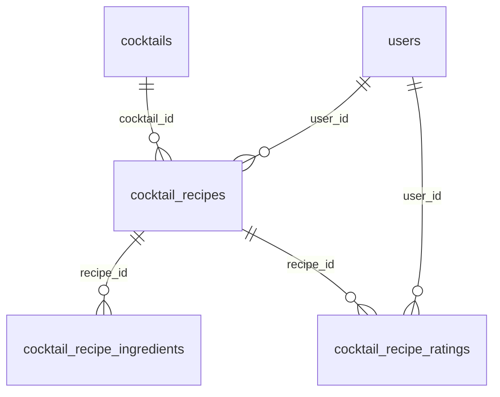

# カクテル親テーブル化リファクタリング

## 現状と方針

現在カクテルは `drinks`(category='cocktail')に3件あり、ユーザー作成の `cocktail_recipes` とは無関係。評価 `ratings` は drink 専用。

方針(確認済み):
- 新規 `cocktails` マスタテーブルを作成し、drinks からカクテルを撤去して移行
- レシピ専用の評価テーブル `cocktail_recipe_ratings` を新設

## 1. DB マイグレーション(新規 `supabase/migrations/xxxx_create_cocktails.sql`)

- `cocktails` マスタ: `id, slug UNIQUE, name, name_en, description, image_url, base_spirit, abv_range?, created_at, updated_at`。RLS: 公開 SELECT のみ(書込は service_role)。
- `cocktail_recipes` に `cocktail_id UUID NOT NULL REFERENCES cocktails(id) ON DELETE RESTRICT` を追加(ローカル開発のみのため `supabase db reset` 前提で NOT NULL)。
- `cocktail_recipe_ratings`: `id, user_id, recipe_id (FK CASCADE), rating 1-5, comment, UNIQUE(recipe_id, user_id)`。RLS は既存 `ratings` に準拠(SELECT 公開、INSERT/UPDATE/DELETE は本人のみ)。
- `drinks` から `category='cocktail'` の行を DELETE し、CHECK 制約から `'cocktail'` を除去(関連 ratings は FK CASCADE で消える)。
- 取得最適化用インデックス: `idx_cocktail_recipes_cocktail_id (cocktail_id, status)`、`idx_cocktail_recipe_ratings_recipe_id`。

## 2. シード修正([supabase/seed.sql](supabase/seed.sql))

- drinks の INSERT からカクテル3件(モヒート等)を削除。
- `cocktails` マスタを投入: レモンサワー、マンハッタン、モヒート、ジントニック、ネグローニ、オールドファッションド など8件程度。
- 既存デモユーザー(rater01–20)名義で各マスタに紐づく `cocktail_recipes`(published)+ ingredients を投入。
- `cocktail_recipe_ratings` をレシピ×複数ユーザーで投入。drinks 向け `ratings` のクロスジョインからカクテル分が消えることを確認。

## 3. Go API([apps/api](apps/api))

`internal/cocktail` を拡張(handler → service → repository の既存レイヤ踏襲):

- `GET /api/cocktails` — マスタ一覧。`LEFT JOIN LATERAL` で published レシピ数を1クエリで集計。
- `GET /api/cocktails/by-slug/{slug}` — マスタ詳細 + published レシピ一覧。レシピごとの平均評価・件数は `cocktail_recipe_ratings` をサブクエリ集計で1クエリ取得(N+1回避)。
- `GET /api/cocktail-recipes/{id}` — レシピ詳細。ingredients は `recipe_id = $1` で1回、評価集計はサブクエリ。
- 評価 API(`internal/review` のパターンを踏襲):
  - `GET /api/public/cocktail-recipe-ratings?recipe_id=`
  - `GET /api/auth/cocktail-recipe-ratings/mine?recipe_id=`
  - `POST /api/auth/cocktail-recipe-ratings`(ON CONFLICT upsert)/ `DELETE .../{id}`
- 既存 `POST /api/cocktail-recipes` のリクエストに `cocktail_id` を追加(存在検証込み)。

### 取得最適化の方針

- 一覧系はアプリ側ループでなく SQL 側で集計(AVG/COUNT サブクエリ or LATERAL)し、リクエストあたり1クエリに抑える。
- 複数レシピの ingredients が必要な場合は `recipe_id = ANY($1)` でバッチ取得。
- 上記インデックス(`(cocktail_id, status)` 複合、ratings の `recipe_id`)で一覧・集計をカバー。

## 4. Web([apps/web](apps/web))

- カテゴリフィルタ([config/drinks.ts](apps/web/src/config/drinks.ts)): `cocktail` チップは維持しつつ、選択時は drinks 一覧の代わりにカクテルマスタ一覧(ジャンルカード)を表示するよう [drink-list-client.tsx](apps/web/src/components/drinks/drink-list-client.tsx) を分岐。SWR フック `use-cocktails.ts` + Next BFF `app/api/cocktails/route.ts` を追加。
- 新規ページ:
  - `/cocktails/[slug]` — ジャンル詳細。RSC でマスタ + published レシピ一覧(平均評価つき)を取得。
  - `/cocktails/[slug]/recipes/[id]`(または `/cocktail-recipes/[id]`)— レシピ詳細 + 評価一覧 + 評価投稿ウィジェット。既存の [drink-review-widget.tsx](apps/web/src/components/drinks/drink-review-widget.tsx) / `star-rating.tsx` のパターンを流用し、Server Action で Go API を叩く。
- レシピ作成フォーム([cocktail-recipe-form.tsx](apps/web/src/app/my-cocktails/new/cocktail-recipe-form.tsx)): カクテル種別のセレクトを追加し、Server Action で `cocktail_id` を送信。
- データ取得は既存パターン踏襲: RSC で初期取得 → SWR fallbackData。詳細ページは `Promise.all` で並列取得。

## 5. 共有型([packages/types](packages/types))

- `cocktail.ts` 新設: `Cocktail`(マスタ)、`CocktailRecipeRating`。
- `cocktail-recipe.ts` に `cocktailId` を追加。`drink.ts` の `DRINK_CATEGORIES` から `'cocktail'` を除去し、影響箇所を修正。

## 6. 検証

- `supabase db reset` でマイグレーション + シード適用確認。
- `cd apps/api && go vet ./... && go test ./...`、`pnpm lint && pnpm type-check`。
- 画面フロー確認: 一覧で cocktail 選択 → ジャンル一覧 → レシピ一覧 → レシピ詳細で評価閲覧・投稿。