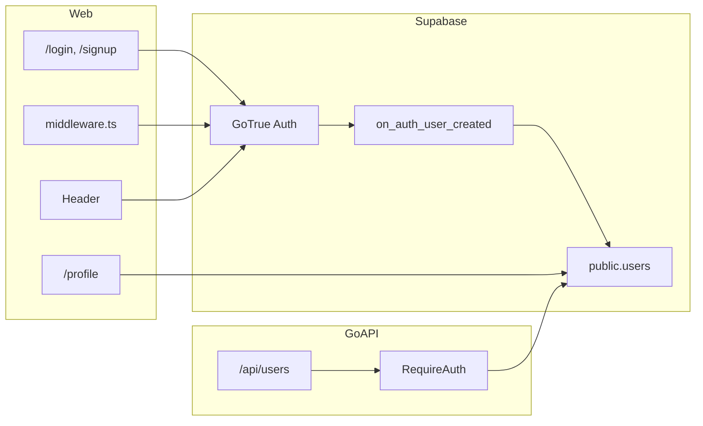

# Overview

This pull request introduces end-to-end user authentication for SakeHub using **Supabase Auth** (email/password) across the web app, database, and Go API. It adds a `public.users` profile table synced from `auth.users`, login/signup/sign-out flows on the web, a basic profile page, session-aware header UI, and JWT-protected user API routes.

**Related issues:** None linked (no GitHub issue references in commits or PR metadata).

**Scope:** 20 files changed (+770 / −14) across `apps/web`, `apps/api`, `packages/types`, and `supabase/migrations`.

---

# Details

## Database (`supabase/migrations/20260521220111_create_users.sql`)

- Creates `public.users` with columns: `id` (FK to `auth.users`), `email`, `display_name`, `avatar_url`, `login_type`, `created_at`, `updated_at`.
- `login_type` is constrained to `email`, `google`, `apple`, or `github` (default `email`).
- Enables RLS:
  - **SELECT**: any authenticated user can read profiles.
  - **UPDATE**: users can update only their own row.
  - No client INSERT/DELETE (rows are created by trigger).
- `handle_new_user()` trigger on `auth.users` INSERT auto-creates a `public.users` row and sets `login_type` from `raw_app_meta_data.provider`.
- Reuses existing `update_updated_at()` trigger function from the drinks migration.

## Web — session & route protection (`apps/web/src/middleware.ts`)

- Adds Next.js middleware using `@supabase/ssr` to refresh auth cookies on every request.
- Redirects unauthenticated users away from protected routes (currently `/profile` → `/login`).
- Excludes static assets (`_next/static`, images, `favicon.ico`, etc.).

## Web — auth flows (`apps/web/src/app/(auth)/`)

| File | Purpose |
|------|---------|
| `actions.ts` | Server Actions: `signIn`, `signUp`, `signOut` via Supabase server client; returns `{ ok, error }` on failure |
| `layout.tsx` | Centered auth layout; redirects logged-in users to `/` |
| `login/page.tsx` | Email/password login form with `useActionState` |
| `signup/page.tsx` | Signup with confirm-password validation (min 6 chars) |

## Web — profile & header

- **`/profile`**: Server Component loads `auth.getUser()` and `users` row; shows email, display name, login type, member since (ja-JP locale); includes sign-out button.
- **`header.tsx`**: Async Server Component — shows avatar link to `/profile` when logged in, or Login button to `/login` when logged out. Avatars use `ui-avatars.com`.
- **`next.config.ts`**: Allows remote images from `ui-avatars.com`.
- **`label.tsx`**: shadcn-style Label component for auth forms.

## Go API — auth middleware & user model

- **`internal/middleware/auth.go`**: `RequireAuth(jwtSecret)` validates `Authorization: Bearer` tokens with `golang-jwt/jwt/v5` (HS256); stores `user_id` and `role` in request context; `UserID(ctx)` helper.
- **`internal/router/router.go`**: Router now accepts `*config.Config`; `/api/users/*` routes are behind `RequireAuth`; `/api/drinks` and `/api/health` remain public.
- **`internal/user/model.go`**: Aligns with DB schema — `DisplayName`, `LoginType` (replaces prior `username`-style field).
- **`internal/user/repository.go`**: Queries `users` table with updated columns.
- **`cmd/server/main.go`**: Passes config into router for JWT secret injection.

## Shared types

- **`packages/types/src/user.ts`**: Adds `loginType` to the shared `User` type.

## Architecture flow



---

# Etc

## Local verification

```bash
# Apply migrations (local Supabase)
supabase db reset   # or supabase migration up

# Web
pnpm install
pnpm --filter web dev

# API (separate terminal)
cd apps/api && go run ./cmd/server

# Quality checks
pnpm lint && pnpm type-check
cd apps/api && go vet ./...
```

Manual smoke test:

1. Sign up at `/signup` → redirect to `/` with avatar in header.
2. Visit `/profile` → see user info from `users` table.
3. Sign out → redirect to `/login`; `/profile` redirects to login when unauthenticated.
4. Call `/api/users/{id}` with a valid Supabase access token → 200; without token → 401.

## Environment variables

Ensure `.env` includes (from `supabase status` for local dev):

- `NEXT_PUBLIC_SUPABASE_URL`, `NEXT_PUBLIC_SUPABASE_ANON_KEY`
- `SUPABASE_JWT_SECRET` (Go API JWT verification)
- `DATABASE_URL` (Go API)

## Out of scope / follow-ups

- OAuth providers (Google, Apple, GitHub) are schema-ready via `login_type` but not wired in UI yet.
- Profile editing (display name, avatar upload) is minimal — page is intentionally basic.
- Mobile app (`apps/mobile`) is unchanged.
- Email confirmation / password reset flows are not included.
- Implementation plan artifact: `.cursor/plans/authentication_implementation_b00e4f98.plan.md` (reference only).

## Reviewer notes

- `/api/drinks` stays public; only user routes require JWT — confirm this matches product intent.
- Avatar URLs are generated externally (`ui-avatars.com`); no stored `avatar_url` usage yet.
- Auth layout redirects authenticated users away from `/login` and `/signup`; middleware adds a second layer for `/profile`.
